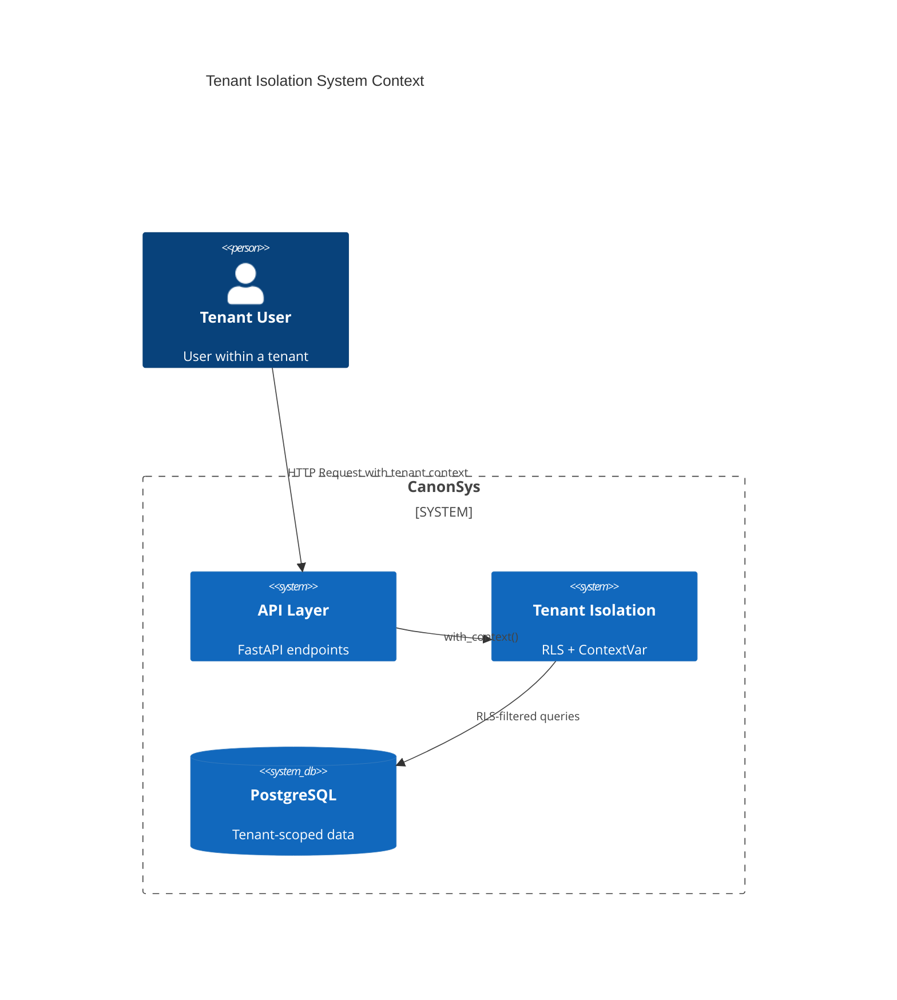
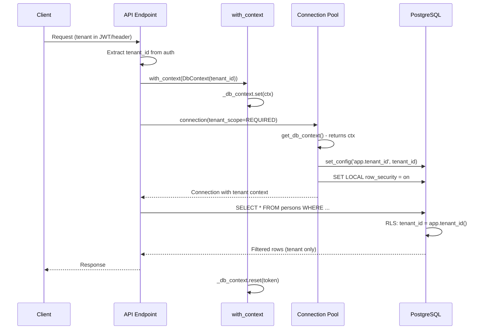
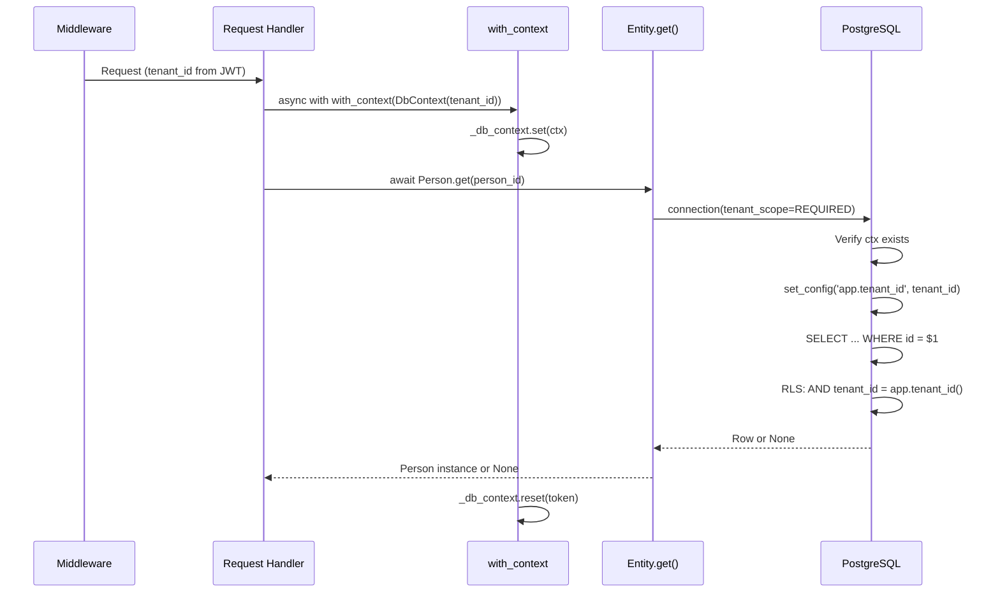
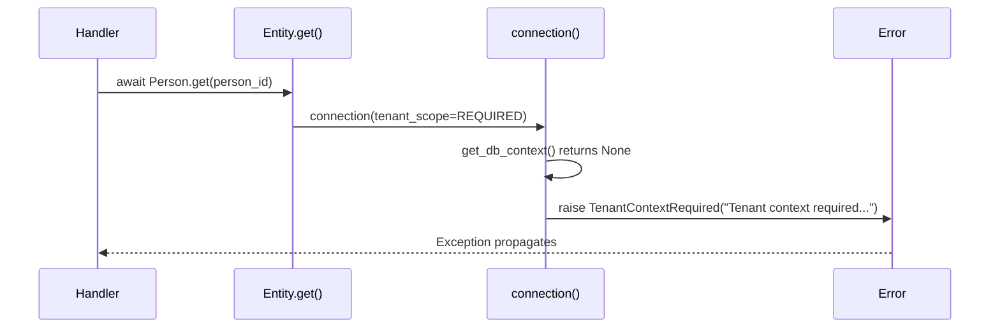
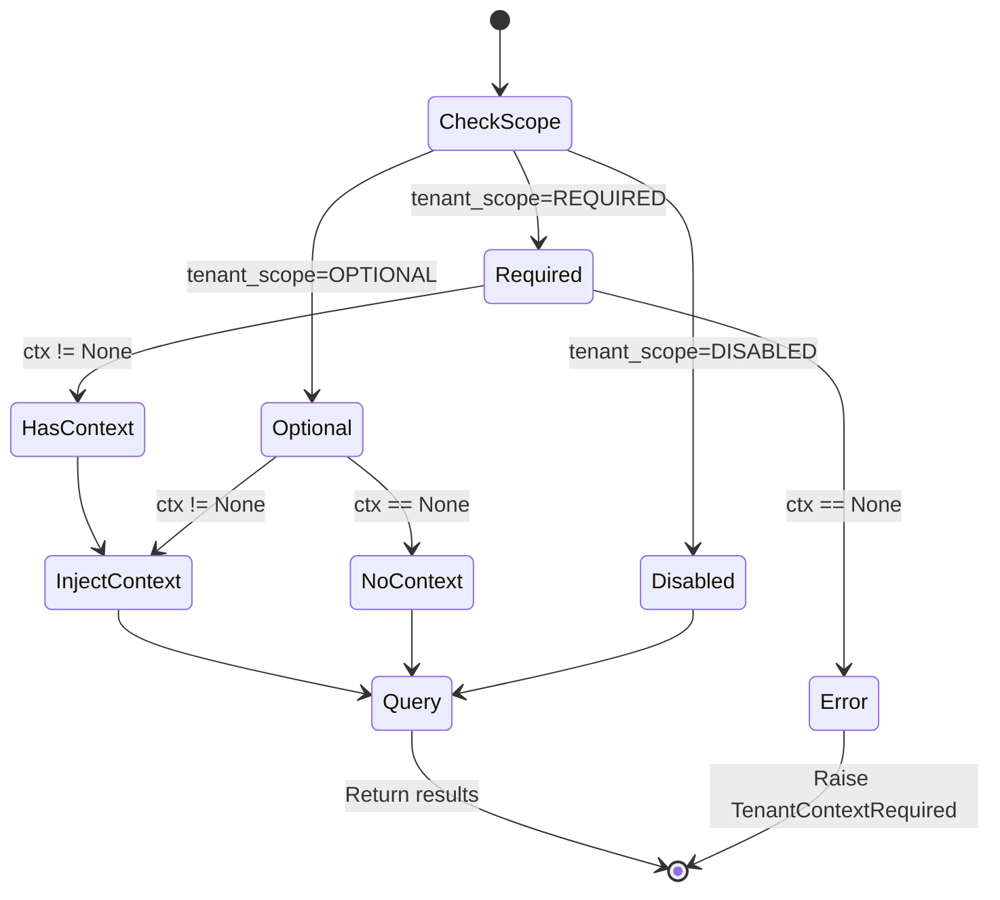

## 1. Overview

### 1.1 Purpose

Tenant isolation is the foundational security layer of CanonSys that ensures complete data
separation between tenants (companies/organizations using the platform). This component provides:

- **Row-Level Security (RLS)** at the PostgreSQL database level
- **ContextVar-based tenant propagation** for async-safe request handling
- **Composite foreign key enforcement** to prevent cross-tenant references
- **Fail-closed design** where missing tenant context blocks all operations

This is not optional middleware - it is the substrate upon which all other compliance features are
built. Every query, every mutation, every decision is tenant-scoped by design.

### 1.2 Scope

**In Scope**:

- `DbContext` dataclass for tenant/actor/request context
- `TenantScope` enum for enforcement modes (REQUIRED/OPTIONAL/DISABLED)
- ContextVar-based tenant propagation (`with_context`)
- PostgreSQL session variable injection (`app.tenant_id`)
- RLS policy generation for tenant-scoped tables
- Composite FK generation for cross-tenant protection
- Tenant entity definition

**Out of Scope**:

- Authentication/authorization (handled by separate auth module)
- User management within tenants
- Tenant provisioning/billing
- Break-glass access patterns (see 016-break-glass)
- Analytics role RLS bypass

### 1.3 Background

Multi-tenant SaaS applications require strict data isolation. Traditional approaches include:

1. **Database-per-tenant**: Expensive, operational burden at scale
2. **Schema-per-tenant**: Middle ground, but migration complexity
3. **Row-per-tenant with RLS**: Shared schema, database-enforced isolation

CanonSys uses approach 3 with defense-in-depth:

- PostgreSQL RLS policies filter rows automatically
- Application layer validation as secondary check
- Composite FKs prevent cross-tenant references at DB level

### 1.4 Design Goals

| Priority | Goal                         | Rationale                                                  |
| -------- | ---------------------------- | ---------------------------------------------------------- |
| P0       | Fail-closed isolation        | Missing tenant context must fail, never silently proceed   |
| P0       | Database-enforced boundaries | Security cannot depend solely on application code          |
| P1       | Async-safe propagation       | Context must flow correctly through asyncio task trees     |
| P1       | Single connection pool       | Avoid N pools for N tenants (memory/connection exhaustion) |
| P2       | Audit trail integration      | Actor and request IDs available for logging                |

### 1.5 Key Constraints

**Technical Constraints**:

- PostgreSQL 14+ required for RLS features
- asyncpg connection pool (not SQLAlchemy async)
- ContextVar for async task-local state (not thread-local)
- RLS cannot be bypassed by application code (only by superuser/BYPASSRLS roles)

**Business Constraints**:

- Zero-trust between tenants (even internal tools)
- Compliance with SOC2, GDPR data isolation requirements

**Security Constraints**:

- Application role must NOT have BYPASSRLS attribute
- Application role must NOT be superuser
- Application role must NOT own tables (separate admin role for DDL)
- Tenant function must fail-closed (raise exception, never return NULL)

---

## 2. Architecture

### 2.1 Component Diagram

```mermaid
graph TD
    subgraph "Application Layer"
        REQ[Request Handler]
        CTX[with_context]
        CVAR[ContextVar: _db_context]
    end

    subgraph "Database Layer"
        CONN[connection()]
        POOL[asyncpg Pool]
        SESS[Session Variables]
    end

    subgraph "PostgreSQL"
        FUNC[app.tenant_id()]
        RLS[RLS Policies]
        CFK[Composite FKs]
        DATA[(Tenant Data)]
    end

    REQ -->|1. Set context| CTX
    CTX -->|2. Store| CVAR
    REQ -->|3. Query| CONN
    CONN -->|4. Acquire| POOL
    CONN -->|5. set_config| SESS
    CONN -->|6. Query| DATA
    SESS -->|7. Read| FUNC
    FUNC -->|8. Filter| RLS
    RLS -->|9. Enforce| DATA
    CFK -->|10. Validate| DATA
```

### 2.2 System Context



### 2.3 Dependencies

**Internal Dependencies**:

| Component                  | Purpose                      | Version  |
| -------------------------- | ---------------------------- | -------- |
| `canon.db.connection` | TenantContextRequired        | Internal |
| `canon.config`        | Database connection settings | Internal |

**External Dependencies**:

| Library/Service | Purpose                   | Version |
| --------------- | ------------------------- | ------- |
| asyncpg         | PostgreSQL async driver   | ^0.29.0 |
| PostgreSQL      | Database with RLS support | 14+     |

### 2.4 Data Flow



---

## 3. Interface Definitions

### 3.1 DbContext - Tenant Context Container

```python
from dataclasses import dataclass
from uuid import UUID

@dataclass(frozen=True)
class DbContext:
    """Database context for tenant isolation.

    Set this before any database operations to ensure RLS policies
    filter data to the correct tenant.

    Attributes:
        tenant_id: Required. The tenant to scope all queries to.
        actor_id: Optional. The user performing the operation (for audit).
        request_id: Optional. Request correlation ID (for tracing).
    """

    tenant_id: UUID
    actor_id: UUID | None = None
    request_id: str | None = None
```

### 3.2 TenantScope - Enforcement Mode

```python
from enum import Enum

class TenantScope(Enum):
    """Tenant context enforcement mode.

    REQUIRED: Fail if no tenant context set (default for app queries)
    OPTIONAL: Set context if available, proceed without if not
    DISABLED: Skip tenant context entirely (migrations, admin)
    """

    REQUIRED = "required"
    OPTIONAL = "optional"
    DISABLED = "disabled"
```

### 3.3 Context Management Functions

```python
from contextlib import asynccontextmanager
from contextvars import ContextVar, Token

# Module-level ContextVar
_db_context: ContextVar[DbContext | None] = ContextVar("db_context", default=None)

def get_db_context() -> DbContext | None:
    """Get current database context (tenant, actor, request)."""
    return _db_context.get()

def set_db_context(ctx: DbContext | None) -> Token[DbContext | None]:
    """Set database context. Returns token for reset."""
    return _db_context.set(ctx)

@asynccontextmanager
async def with_context(ctx: DbContext):
    """Context manager to set tenant context for a scope.

    All database operations within this context will be scoped to
    the specified tenant via RLS policies.

    Usage:
        async with with_context(DbContext(tenant_id=tenant_id)):
            person = await Person.get(person_id)  # RLS-filtered
            await person.save()  # RLS-enforced
    """
    token = _db_context.set(ctx)
    try:
        yield
    finally:
        _db_context.reset(token)
```

### 3.4 Connection Functions

```python
@asynccontextmanager
async def connection(
    dsn: str | None = None,
    tenant_scope: TenantScope = TenantScope.REQUIRED,
):
    """Get a connection from the pool with tenant context injection.

    Args:
        dsn: Database connection string. Uses DATABASE_URL env if None.
        tenant_scope: How to handle tenant context:
            - REQUIRED (default): Fail if no DbContext set
            - OPTIONAL: Set context if available, proceed without if not
            - DISABLED: Skip context injection (migrations, admin)

    Raises:
        TenantContextRequired: If tenant_scope is REQUIRED and no DbContext set.

    Yields:
        asyncpg.Connection with tenant context configured.
    """
    ...

@asynccontextmanager
async def transaction(
    dsn: str | None = None,
    tenant_scope: TenantScope = TenantScope.REQUIRED,
):
    """Get a connection with transaction and tenant context.

    Same as connection() but wraps in a transaction block.
    """
    ...
```

### 3.5 RLS Generation Functions

```python
def is_tenant_scoped(entity_cls: type[Entity]) -> bool:
    """Check if an Entity class has tenant_id field (requires RLS)."""
    ...

def generate_tenant_function(app_role: str | None = None) -> str:
    """Generate the app.tenant_id() SQL function.

    This function retrieves the current tenant context from the session variable.
    It fails closed: if tenant context is not set, it raises an exception.
    """
    ...

def generate_rls_policy(entity_cls: type[Entity]) -> str:
    """Generate RLS policy for a tenant-scoped entity.

    Creates:
    1. ALTER TABLE ... ENABLE ROW LEVEL SECURITY
    2. ALTER TABLE ... FORCE ROW LEVEL SECURITY (removes table owner bypass)
    3. Policy for SELECT/INSERT/UPDATE/DELETE based on tenant_id = app.tenant_id()
    """
    ...

def generate_composite_fks(entity_cls: type[Entity]) -> str:
    """Generate composite FK constraints for tenant-scoped cross-references.

    For each FK field pointing to another tenant-scoped entity, creates:
    FOREIGN KEY (tenant_id, fk_field) REFERENCES target(tenant_id, id)
    """
    ...
```

---

## 4. Data Models

### 4.1 Tenant Entity

```python
from canon.entities.entity import ContentModel, Entity, register_entity
from canon.db import FK

class TenantContent(ContentModel):
    """A tenant (isolated workspace/account).

    Each tenant is an isolated environment with its own data.
    Typically represents a company or division using the platform.
    """

    name: str
    slug: str  # URL-safe identifier, unique
    organization_id: FK[Organization] | None = None
    status: str = "active"  # active, suspended
    settings: dict | None = None  # Extensible config

@register_entity("tenants")
class Tenant(Entity):
    """Entity representing a tenant."""

    content: TenantContent
```

### 4.2 Database Schema

```sql
-- Tenant table (root of isolation)
CREATE TABLE public.tenants (
    id UUID PRIMARY KEY DEFAULT gen_random_uuid(),
    name VARCHAR(255) NOT NULL,
    slug VARCHAR(63) NOT NULL UNIQUE,
    organization_id UUID REFERENCES public.organizations(id),
    status VARCHAR(20) NOT NULL DEFAULT 'active'
        CONSTRAINT chk_tenant_status CHECK (status IN ('active', 'suspended')),
    settings JSONB,
    metadata JSONB NOT NULL DEFAULT '{}'::jsonb
);

CREATE UNIQUE INDEX uq_tenants_slug ON public.tenants(slug);
```

### 4.3 Tenant Function Schema

```sql
-- Schema for tenant isolation functions
CREATE SCHEMA IF NOT EXISTS app;

-- Fail-closed tenant context function
CREATE OR REPLACE FUNCTION app.tenant_id()
RETURNS uuid
LANGUAGE plpgsql
STABLE
SECURITY DEFINER
AS $fn$
DECLARE
    v text;
BEGIN
    v := current_setting('app.tenant_id', true);
    IF v IS NULL OR v = '' THEN
        RAISE EXCEPTION 'tenant context not set (app.tenant_id)'
            USING ERRCODE = 'insufficient_privilege';
    END IF;
    RETURN v::uuid;
END;
$fn$;
```

### 4.4 RLS Policy Template

```sql
-- RLS policy for tenant-scoped tables (generated per entity)
ALTER TABLE "public"."persons" ENABLE ROW LEVEL SECURITY;
ALTER TABLE "public"."persons" FORCE ROW LEVEL SECURITY;

DROP POLICY IF EXISTS tenant_isolation_persons ON "public"."persons";
CREATE POLICY tenant_isolation_persons ON "public"."persons"
    USING (tenant_id = app.tenant_id())
    WITH CHECK (tenant_id = app.tenant_id());
```

### 4.5 Composite FK Template

```sql
-- Composite FK for cross-tenant protection (generated per FK field)
ALTER TABLE "public"."persons"
    ADD CONSTRAINT fk_persons_created_by_tenant
    FOREIGN KEY (tenant_id, "created_by")
    REFERENCES "public"."users"(tenant_id, id);
```

---

## 5. Behavior

### 5.1 Core Workflows

#### Workflow: Request with Tenant Context



**Steps**:

1. Middleware extracts tenant_id from JWT or header
2. Handler wraps business logic in `with_context(DbContext(tenant_id=...))`
3. ContextVar stores tenant context (async-safe, task-local)
4. Entity CRUD operations call `connection()` which requires context
5. Connection injects tenant_id into PostgreSQL session variable
6. RLS policies automatically filter queries by `tenant_id = app.tenant_id()`
7. Context manager resets ContextVar on exit (even on exception)

#### Workflow: Missing Tenant Context (Fail-Closed)



**Steps**:

1. Handler forgets to set tenant context
2. Entity CRUD calls `connection()` with default `tenant_scope=REQUIRED`
3. `get_db_context()` returns None
4. `TenantContextRequired` raised immediately - no database query executed
5. Error propagates to handler for proper error response

### 5.2 State Machine

Tenant isolation operates in three modes based on `TenantScope`:



### 5.3 Error Handling

**Error Hierarchy**:

```python
class TenantContextRequired(Exception):
    """Raised when tenant context is required but not set.

    Used for:
    - Missing tenant context when connection(tenant_scope=REQUIRED)
    """
    pass
```

**Error Scenarios**:

| Scenario                          | Error                               | Recovery                           |
| --------------------------------- | ----------------------------------- | ---------------------------------- |
| Missing tenant context (REQUIRED) | `TenantContextRequired`             | Caller must wrap in `with_context` |
| Tenant function not set (SQL)     | PostgreSQL `insufficient_privilege` | Connection not properly configured |
| Invalid tenant_id format          | `ValidationError`                   | Caller must provide valid UUID     |

### 5.4 Security Considerations

**Authentication**:

- Tenant context is derived from authenticated user's JWT claims
- `tenant_id` must be cryptographically verified, not user-supplied

**Authorization**:

- RLS policies enforce tenant boundaries at database level
- Application role has minimal privileges (SELECT/INSERT/UPDATE/DELETE on data tables)
- Application role does NOT have BYPASSRLS attribute
- DDL operations use separate admin role

**Data Protection**:

- `FORCE ROW LEVEL SECURITY` prevents table owner bypass
- Composite FKs prevent cross-tenant references at constraint level
- TenantAwareContent base class ensures consistent tenant_id field
- Session variables cleared automatically on connection release (asyncpg RESET ALL)

**Defense in Depth Layers**:

1. **ContextVar requirement**: `connection()` fails without context
2. **Session variable injection**: PostgreSQL session scoped to tenant
3. **RLS policies**: Database automatically filters all queries
4. **Composite FKs**: Database prevents cross-tenant FK references
5. **Type enforcement**: TenantAwareContent ensures consistent tenant_id field

---

## 6. Performance Considerations

### 6.1 Expected Load

| Metric                   | Expected | Peak   | Notes                       |
| ------------------------ | -------- | ------ | --------------------------- |
| Tenants                  | 1,000    | 10,000 | Single shared database      |
| Concurrent connections   | 100      | 500    | Single pool, not per-tenant |
| Queries/sec (per tenant) | 100      | 1,000  | RLS overhead ~5%            |

### 6.2 Scalability Approach

- **Horizontal scaling**: Read replicas with RLS policies
- **Single pool**: One asyncpg pool serves all tenants (session variable switching)
- **Index strategy**: `tenant_id` indexed on all tenant-scoped tables

### 6.3 Performance Targets

| Operation                      | P50   | P95   | P99  |
| ------------------------------ | ----- | ----- | ---- |
| Context injection (set_config) | 0.1ms | 0.5ms | 1ms  |
| RLS-filtered SELECT            | +5%   | +10%  | +15% |
| Composite FK validation        | 0ms   | 0ms   | 0ms  |

### 6.4 Index Requirements

```sql
-- Every tenant-scoped table requires tenant_id index
CREATE INDEX IF NOT EXISTS ix_{table}_tenant_id ON "{schema}"."{table}"(tenant_id);

-- Composite unique for FK targets
ALTER TABLE "{schema}"."{table}" ADD CONSTRAINT uq_{table}_tenant_id UNIQUE (tenant_id, id);
```

---

## 7. Testing Strategy

### 7.1 Unit Testing

**Coverage Target**: >= 90%

**Test Categories**:

- `DbContext` creation and field access
- `TenantScope` enum behavior
- ContextVar get/set/reset lifecycle
- `with_context` exception safety

### 7.2 Integration Testing

**Test Scenarios**:

- [ ] Connection with valid tenant context succeeds
- [ ] Connection without context raises `TenantContextRequired` (REQUIRED)
- [ ] Connection without context proceeds (OPTIONAL)
- [ ] Connection without context proceeds (DISABLED)
- [ ] RLS filters queries to correct tenant
- [ ] Cross-tenant INSERT fails (composite FK)
- [ ] Cross-tenant SELECT returns no rows (RLS)
- [ ] TenantAwareContent fields enforce tenant_id
- [ ] Concurrent requests maintain isolation (async safety)

### 7.3 Security Testing

- [ ] Verify app role cannot bypass RLS
- [ ] Verify tenant function raises on missing context
- [ ] Verify composite FK blocks cross-tenant references
- [ ] Verify session variables cleared on connection release

---

## 8. Open Questions

| # | Question                                  | Impact                 | Proposed Resolution                                      | Status   |
| - | ----------------------------------------- | ---------------------- | -------------------------------------------------------- | -------- |
| 1 | Break-glass access pattern                | Admin/support access   | Dedicated protocol in 016-break-glass                    | Deferred |
| 2 | Tenant hierarchy (Organization -> Tenant) | Multi-level isolation  | Organization entity relationship needs design            | Open     |
| 3 | Analytics role RLS bypass                 | Cross-tenant reporting | Separate read replica without RLS, or materialized views | Open     |

---

## 9. Appendices

### Appendix A: Alternative Designs Considered

**Alternative 1: Database-per-tenant**

- Description: Separate PostgreSQL database for each tenant
- Pros: Complete isolation, simpler security model
- Cons: Connection pool per tenant (memory exhaustion), migration complexity, backup complexity
- Why Not Chosen: Does not scale to thousands of tenants

**Alternative 2: Schema-per-tenant**

- Description: Separate schema within same database
- Pros: Good isolation, single database
- Cons: Migration per schema, search_path complexity, connection pool per schema
- Why Not Chosen: Middle ground but still has scaling issues

**Alternative 3: Thread-local instead of ContextVar**

- Description: Use `threading.local()` for tenant context
- Pros: Simpler API, widely understood
- Cons: Does NOT work with asyncio - tasks share thread-local state
- Why Not Chosen: Asyncio requires ContextVar for task-local state

### Appendix B: Glossary

| Term                     | Definition                                                          |
| ------------------------ | ------------------------------------------------------------------- |
| RLS                      | Row-Level Security - PostgreSQL feature for automatic row filtering |
| ContextVar               | Python 3.7+ feature for task-local state in asyncio                 |
| Composite FK             | Foreign key with multiple columns (tenant_id, fk_id)                |
| Fail-closed              | Security design where errors block access rather than allow         |
| BYPASSRLS                | PostgreSQL role attribute that bypasses RLS policies                |
| FORCE ROW LEVEL SECURITY | PostgreSQL setting that removes table owner RLS bypass              |

---

## 10. Related Surfaces

The following control surfaces use patterns from this design:

| Surface   | Description           | Key Integration                                                                                     |
| --------- | --------------------- | --------------------------------------------------------------------------------------------------- |
| All surfaces | Every control surface | Tenant isolation is the foundational security layer - all surfaces operate within tenant boundaries |

**Tenant Isolation is Universal**: Every control surface inherits tenant isolation via RLS:

| Domain               | Example Surfaces                                                    | Tenant Integration                                      |
| -------------------- | ------------------------------------------------------------------- | ------------------------------------------------------- |
| People/HR (17)       | PRD-01 LAYOFF_RIF_INCLUSION, PRD-02 PROMOTION_ELIGIBILITY           | All person records are tenant-scoped via `tenant_id` FK |
| Identity/Access (10) | PRD-03 PRIVILEGED_ROLE_ESCALATION, PRD-04 SERVICE_ACCOUNT_CREATION  | Access control operates within tenant boundaries        |
| Compliance (12)      | PRD-05 ADVERSE_ACTION_NOTICE, PRD-06 BIAS_AUDIT_INITIATION          | Compliance records isolated per tenant                  |
| Finance (8)          | PRD-07 MERIT_INCREASE, PRD-08 BONUS_ALLOCATION                      | Compensation data protected by RLS                      |
| Safety (6)           | PRD-09 WORKPLACE_VIOLENCE_RESPONSE, PRD-10 HARASSMENT_INVESTIGATION | Investigation data tenant-isolated                      |
| Operations (15)      | PRD-11 REMOTE_WORK_APPROVAL, PRD-12 SCHEDULING_OVERRIDE             | Operational records tenant-scoped                       |
| Learning (8)         | PRD-13 TRAINING_COMPLETION, PRD-14 CERTIFICATION_VERIFICATION       | Training records per tenant                             |
| Recruiting (16)      | PRD-15 CANDIDATE_ADVANCEMENT, PRD-16 OFFER_APPROVAL                 | Candidate data tenant-isolated                          |

**Key Patterns Used by Surfaces**:

- `DbContext(tenant_id)` - Request context for all surface operations
- `with_context()` - Async-safe tenant propagation
- RLS policies - Database-level enforcement (`tenant_id = app.tenant_id()`)
- Composite FKs - Cross-tenant reference prevention

---

## Validation Checklist

### Completeness

- [x] All required sections filled (Overview, Architecture, Interfaces, Data Models, Behavior)
- [x] Mermaid diagrams render correctly
- [x] All placeholders replaced with actual content
- [x] Code examples are syntactically correct

### Technical Quality

- [x] Interfaces are well-defined with types
- [x] Error cases are documented
- [x] Security considerations addressed
- [x] Performance targets specified

### Traceability

- [x] Related artifacts referenced (002-entity, 004, 005)
- [x] Open questions documented
- [x] Assumptions stated

### Readability

- [x] Purpose is clear
- [x] Diagrams aid understanding
- [x] Consistent formatting
- [x] No unexplained jargon
