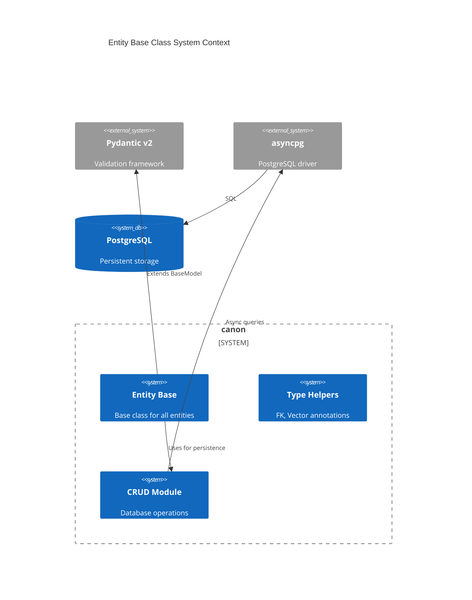
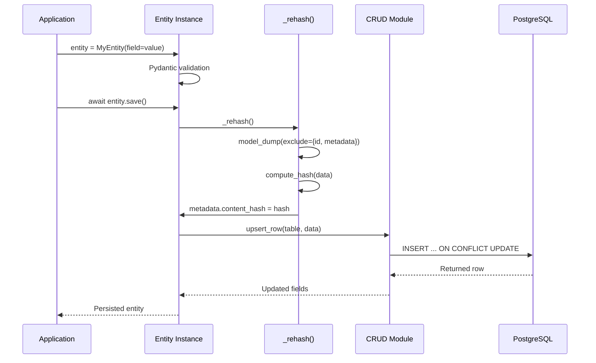
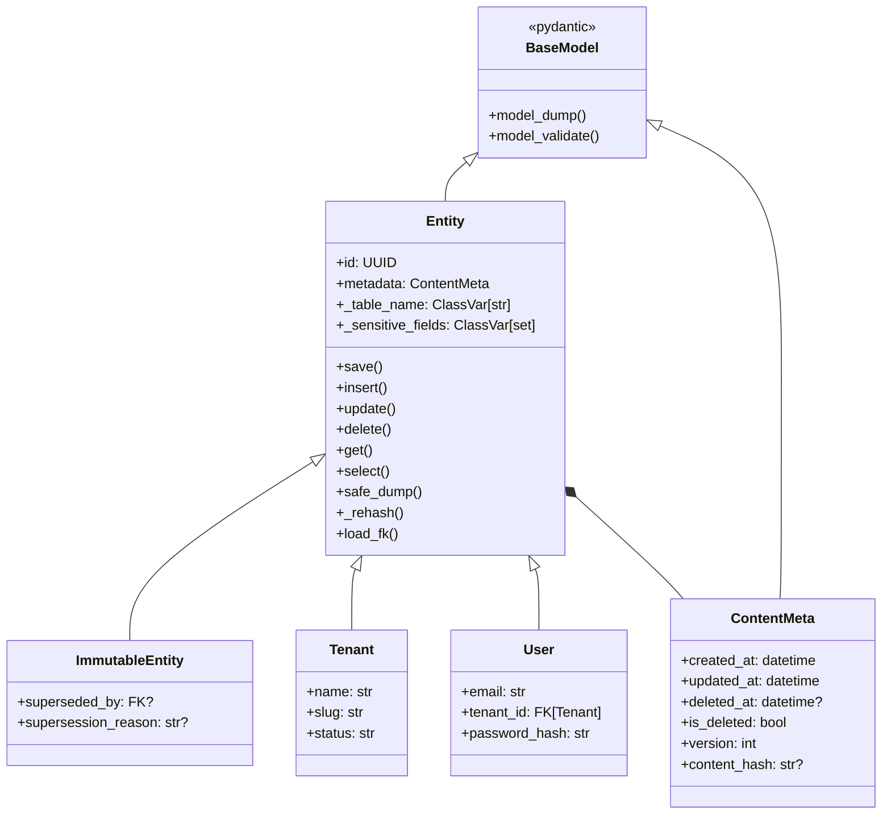
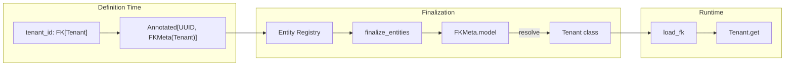
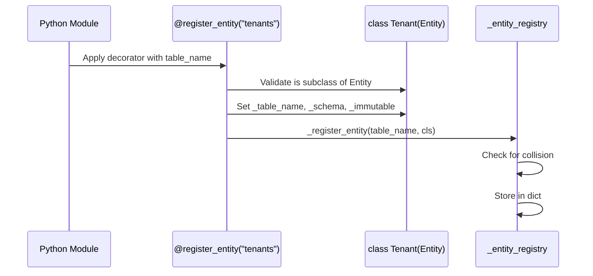
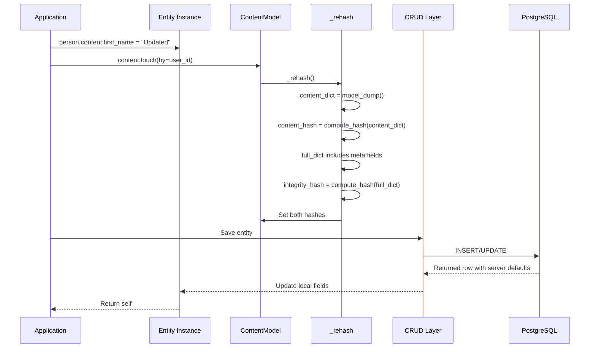
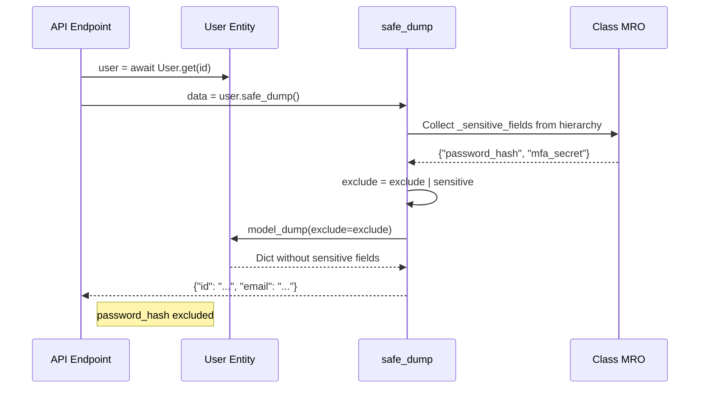
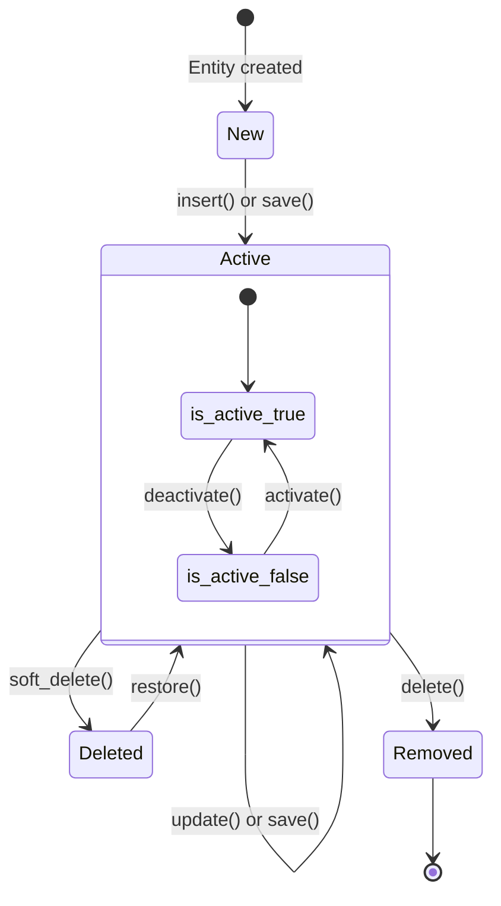

## 1. Overview

### 1.1 Purpose

The Entity base class is the foundational abstraction for all database-backed objects in CanonSys.
It provides:

- **Decorator-based registration** of entity subclasses for migration discovery
- **Type-safe foreign keys** via `FK[Model]` annotation pattern
- **ContentModel pattern** for domain fields with audit metadata
- **Dual hash strategy** for content and full-state integrity
- **Sensitive field protection** via `_sensitive_fields` ClassVar
- **Node integration** with kron for identity management

Every database table in CanonSys corresponds to exactly one Entity subclass. The entity is the
single source of truth for both schema definition and runtime operations.

### 1.2 Scope

**In Scope**:

- `Entity` base class extending kron Node
- `ContentModel` base class for domain fields
- `ContentMeta` audit metadata model
- `FK[Model]` type-safe foreign key annotation
- `Vector[dim]` embedding type annotation
- `@register_entity` decorator for registration
- `create_entity()` factory function
- Dual hashing (content_hash, integrity_hash)
- Lifecycle methods (soft_delete, restore, activate, deactivate)
- Sensitive field protection via ClassVar

**Out of Scope**:

- ImmutableEntity (see 003-immutability)
- Database connection management (see 001-tenant-isolation)
- Migration DDL generation (see 005-rls-migration)
- Evidence and Chain entities (see 006-evidence-chain-cep)

### 1.3 Background

CanonSys requires a data layer that:

1. Is type-safe and IDE-friendly
2. Auto-discovers entities for migration
3. Handles audit metadata consistently
4. Supports integrity verification
5. Never exposes secrets in API responses

Traditional ORMs (SQLAlchemy) provide some of these, but:

- Require separate model definition from validation
- Don't integrate well with Pydantic-first APIs
- Lack built-in integrity hashing
- Don't prevent sensitive field leakage

The Entity base class unifies these concerns into a single abstraction built on Pydantic v2.

### 1.4 Design Goals

| Priority | Goal                       | Rationale                                                 |
| -------- | -------------------------- | --------------------------------------------------------- |
| P0       | Type-safe FK references    | IDE autocompletion and mypy checking for relationships    |
| P0       | Auto-registration          | Zero-config migration discovery - define class, get table |
| P0       | Sensitive field protection | Prevent password hashes from appearing in API responses   |
| P1       | Audit metadata consistency | Every entity has timestamps, versioning, soft-delete      |
| P1       | Integrity hashing          | Tamper detection via content_hash                         |
| P2       | Forward reference support  | Allow circular FK references (User -> Tenant -> User)     |

### 1.5 Key Constraints

**Technical Constraints**:

- Built on Pydantic v2 (not v1)
- UUID primary keys (not auto-increment integers)
- JSONB for metadata (not separate columns)
- asyncpg for database operations (not sync drivers)

**Business Constraints**:

- All entities must support audit trail
- No raw `model_dump()` in API responses

**Security Constraints**:

- Sensitive fields (`password_hash`, `mfa_secret`, etc.) must never appear in logs or responses
- Only `_to_row()` includes sensitive fields (for DB persistence)
- `safe_dump()` is the only approved serialization for external use

---

## 2. Architecture

### 2.1 Component Diagram

```mermaid
graph TD
    subgraph "Entity Layer"
        CONTENT[ContentModel]
        BASE[Entity Base]
        META[ContentMeta]
        REG[Entity Registry]
        DEC[@register_entity]
    end

    subgraph "Type System"
        FK[FK Type Helper]
        FKMETA[FKMeta]
        VEC[Vector Type Helper]
        VECMETA[VectorMeta]
    end

    subgraph "Persistence"
        CRUD[CRUD Operations]
        CONN[connection]
        PG[(PostgreSQL)]
    end

    BASE --> CONTENT
    CONTENT --> META
    BASE --> FK
    BASE --> VEC
    BASE --> CRUD

    FK --> FKMETA
    VEC --> VECMETA

    CRUD --> CONN
    CONN --> PG

    DEC -->|registers| REG
    BASE -->|uses| DEC
```

### 2.2 System Context



### 2.3 Dependencies

**Internal Dependencies**:

| Component                       | Purpose                   | Version  |
| ------------------------------- | ------------------------- | -------- |
| `canon.db.base.crud`       | Database operations       | Internal |
| `canon.db.base.connection` | Tenant-scoped connections | Internal |
| `canon.exceptions`         | Error types               | Internal |
| `canon.utils.crypto`       | Hash computation          | Internal |

**External Dependencies**:

| Library/Service | Purpose                      | Version |
| --------------- | ---------------------------- | ------- |
| pydantic        | BaseModel, validation        | ^2.0.0  |
| kron            | `now_utc()` timestamp helper | ^1.0.0  |
| asyncpg         | PostgreSQL async driver      | ^0.29.0 |

### 2.4 Data Flow



---

## 3. Interface Definitions

### 3.1 Entity Base Class

```python
from typing import ClassVar
from kron.core.node import Node
from pydantic import ConfigDict

class ContentModel(BaseModel):
    """Base class for domain content models.

    Provides:
    - Audit metadata via content_meta
    - Lifecycle methods (soft_delete, restore, activate, deactivate)
    - Integrity hashing (content_hash, integrity_hash)

    Usage:
        class TenantContent(ContentModel):
            name: str
            slug: str
            settings: dict | None = None
    """

    model_config = ConfigDict(
        populate_by_name=True,
        validate_assignment=True,
        arbitrary_types_allowed=True,
        use_enum_values=True,
    )

    content_meta: ContentMeta = Field(default_factory=ContentMeta, exclude=True)

    def _rehash(self) -> None:
        """Recompute content_hash and integrity_hash."""
        content_dict = self.model_dump(mode="json")
        self._meta.content_hash = compute_hash(content_dict)
        # integrity_hash includes meta fields too
        full_dict = content_dict.copy()
        full_dict.update(self._meta.to_hash_dict())
        self._meta.integrity_hash = compute_hash(full_dict)


class Entity(Node):
    """Base entity combining Node identity with ContentModel.

    Entity = Node(Element) + ContentModel

    Provides:
    - id, created_at, metadata (from Element via Node)
    - content with audit, versioning, hashing (from ContentModel)

    Usage:
        @register_entity("tenants")
        class Tenant(Entity):
            content: TenantContent
    """

    content: ContentModel

    # Table configuration (set by @register_entity decorator)
    _table_name: ClassVar[str] = ""
    _schema: ClassVar[str] = "public"
    _immutable: ClassVar[bool] = False
```

### 3.2 ContentMeta - Audit Metadata

```python
from datetime import datetime
from pydantic import BaseModel, ConfigDict, Field
from kron import utils

class ContentMeta(BaseModel):
    """Audit metadata for content models.

    Tracks mutations, soft-delete state, versioning, and integrity hashes.
    Stored as flat columns in the database table.
    """

    model_config = ConfigDict(
        populate_by_name=True,
        validate_assignment=True,
        extra="forbid",
        arbitrary_types_allowed=True,
        use_enum_values=True,
    )

    # Audit timestamps
    updated_at: datetime = Field(default_factory=utils.now_utc)
    updated_by: str | None = None
    deleted_at: datetime | None = None

    # State flags
    is_deleted: bool = False
    is_active: bool = True

    # Versioning
    version: int = Field(default=1, ge=1)

    # Integrity (computed, not user-set)
    content_hash: str | None = None  # Hash of content fields only
    integrity_hash: str | None = None  # Hash of content + meta fields

    def touch(self, by: UUID | str | None = None) -> None:
        """Update timestamp and version."""
        self.updated_at = utils.now_utc()
        if by is not None:
            self.updated_by = str(by)
        self.version += 1
```

### 3.3 FK Type Helper

```python
from typing import Annotated, Any
from uuid import UUID

class FKMeta:
    """Metadata marker for foreign key fields.

    Carries information about the referenced model for:
    - DDL generation (REFERENCES clause)
    - Migration dependency ordering
    - Relationship loading

    After finalize_entities():
    - model is resolved from string to actual class
    - table_name raises UnresolvedFKError if model is still string
    """

    __slots__ = ("column", "model", "on_delete", "on_update")

    def __init__(
        self,
        model: type | str,
        column: str = "id",
        on_delete: str = "CASCADE",
        on_update: str = "CASCADE",
    ):
        self.model = model
        self.column = column
        self.on_delete = on_delete
        self.on_update = on_update

    @property
    def table_name(self) -> str:
        """Get the referenced table name."""
        ...

    def resolve(self, model_cls: type) -> None:
        """Resolve string reference to actual class."""
        self.model = model_cls


class _FK:
    """Foreign key type helper.

    Usage:
        tenant_id: FK[Tenant]
        organization_id: FK[Organization]
        created_by: FK["User"]  # Forward reference
    """

    def __class_getitem__(cls, model: type | str) -> Any:
        return Annotated[UUID, FKMeta(model)]


FK = _FK
```

### 3.4 Entity Methods

```python
class Entity(BaseModel):
    # ... fields ...

    # Serialization
    def _to_row(self) -> dict[str, Any]:
        """Convert entity to database row dict.

        Includes ALL fields including sensitive ones for DB persistence.
        For API responses or logging, use safe_dump() instead.
        """
        return self.model_dump(mode="json")

    @classmethod
    def _from_row(cls, row: dict[str, Any]) -> Self:
        """Create entity from database row."""
        return cls.model_validate(row)

    def safe_dump(self, **kwargs: Any) -> dict[str, Any]:
        """Safely serialize entity, excluding sensitive fields.

        Use this instead of model_dump() for API responses and logging.
        """
        ...

    # Integrity
    def _rehash(self) -> None:
        """Recompute sha256 over content + state fields."""
        ...

    def _touch(self) -> None:
        """Update timestamp and rehash."""
        ...

    # Lifecycle
    def soft_delete(self) -> None:
        """Mark as deleted with integrity protection."""
        ...

    def restore(self) -> None:
        """Restore soft-deleted entity."""
        ...

    def mark_updated_by(self, user_id: str | UUID) -> None:
        """Record who updated and bump version."""
        ...

    # CRUD Operations
    async def save(self, dsn: str | None = None) -> Self:
        """Insert or update (upsert) with integrity hash."""
        ...

    async def insert(self, dsn: str | None = None) -> Self:
        """Insert with integrity hash (fails on duplicate)."""
        ...

    async def update(self, dsn: str | None = None) -> Self:
        """Update with timestamp and integrity hash."""
        ...

    async def delete(self, dsn: str | None = None) -> bool:
        """Delete this entity by primary key."""
        ...

    # Query Operations
    @classmethod
    async def get(cls, pk: UUID | str, dsn: str | None = None) -> Self | None:
        """Get entity by primary key."""
        ...

    @classmethod
    async def select(
        cls,
        where: dict[str, Any] | None = None,
        order_by: str | None = None,
        limit: int | None = None,
        offset: int | None = None,
        dsn: str | None = None,
    ) -> list[Self]:
        """Query entities with optional filters."""
        ...

    # FK Loading
    async def load_fk(
        self,
        field_name: str,
        dsn: str | None = None,
        *,
        check_tenant: bool = True,
    ) -> Entity | None:
        """Load a foreign key relationship with cross-tenant protection."""
        ...
```

### 3.5 Registry Functions

```python
def get_entity_registry() -> dict[str, type[Entity]]:
    """Get the registry of all Entity classes (keyed by table name)."""
    return _entity_registry.copy()

def get_entity_by_table(table_name: str) -> type[Entity] | None:
    """Get Entity class by table name."""
    return _entity_registry.get(table_name)

def reset_entity_registry() -> None:
    """Reset the entity registry. For testing only."""
    _entity_registry.clear()

def register_entity(
    table_name: str,
    *,
    schema: str = "public",
    immutable: bool = False,
) -> Callable[[type[E]], type[E]]:
    """Decorator to register an Entity class.

    Usage:
        @register_entity("consent_tokens")
        class ConsentToken(Entity):
            content: ConsentTokenContent

        @register_entity("evidence", immutable=True)
        class Evidence(Entity):
            content: EvidenceContent
    """
    ...

def create_entity(
    name: str,
    content_type: type[ContentModel],
    *,
    table_name: str | None = None,
    schema: str = "public",
    immutable: bool = False,
) -> type[Entity]:
    """Create an Entity class bound to a ContentModel type.

    Args:
        name: Entity class name (e.g., "Tenant")
        content_type: ContentModel subclass defining domain fields
        table_name: Database table name (default: lowercase name + "s")
        schema: Database schema (default: "public")
        immutable: If True, entity is append-only (no updates/deletes)

    Returns:
        New Entity subclass with typed content field
    """
    ...
```

---

## 4. Data Models

### 4.1 Entity Class Hierarchy



### 4.2 FK Type Resolution



### 4.3 Database Schema Correspondence

| Entity Field          | Database Column | Type                        |
| --------------------- | --------------- | --------------------------- |
| `id`                  | `id`            | `UUID PRIMARY KEY`          |
| `metadata`            | `metadata`      | `JSONB NOT NULL`            |
| `field: str`          | `field`         | `VARCHAR(255)`              |
| `field: FK[Model]`    | `field`         | `UUID REFERENCES model(id)` |
| `field: Vector[1536]` | `field`         | `VECTOR(1536)`              |

### 4.4 ContentMeta JSONB Structure

```json
{
  "created_at": "2026-01-15T10:30:00Z",
  "updated_at": "2026-01-15T11:45:00Z",
  "deleted_at": null,
  "updated_by": "550e8400-e29b-41d4-a716-446655440000",
  "is_deleted": false,
  "is_active": true,
  "version": 3,
  "content_hash": "sha256:a1b2c3d4e5f6..."
}
```

---

## 5. Behavior

### 5.1 Core Workflows

#### Workflow: Entity Registration via Decorator



**Steps**:

1. Module defines Entity subclass with `@register_entity` decorator
2. Decorator validates class is Entity subclass
3. Decorator sets `_table_name`, `_schema`, `_immutable` class vars
4. `_register_entity()` checks for collision with existing registration
5. If no collision, class stored in `_entity_registry` dict
6. If collision with different class, `ValueError` raised

#### Workflow: Entity Save with Integrity Hash



**Steps**:

1. Application modifies entity fields
2. Application calls `await entity.save()`
3. `_rehash()` computes SHA-256 over domain fields + state fields
4. Hash stored in `metadata.content_hash`
5. `upsert_row()` persists with ON CONFLICT UPDATE
6. Server-generated values (if any) updated on entity instance

#### Workflow: Safe Dump (Sensitive Field Exclusion)



**Steps**:

1. API endpoint loads User entity
2. API calls `user.safe_dump()` for response
3. `safe_dump()` collects `_sensitive_fields` from entire class hierarchy
4. Sensitive fields merged with any explicit excludes
5. `model_dump(exclude=...)` called with combined exclusions
6. Returned dict is safe for API responses (no secrets)

### 5.2 State Machine

Entity lifecycle states:



### 5.3 Error Handling

**Error Hierarchy**:

```python
class RegistryCollisionError(Exception):
    """Two Entity classes registered with same table name."""

    def __init__(self, table_name: str, existing_class: str, new_class: str):
        ...

class RegistryError(ValueError):
    """Duplicate table name in entity registry."""
    ...
```

**Error Scenarios**:

| Scenario                          | Error        | Recovery                              |
| --------------------------------- | ------------ | ------------------------------------- |
| Duplicate table name registration | `ValueError` | Rename one entity's table_name        |
| Entity not subclass of Entity     | `TypeError`  | Ensure class extends Entity           |
| Invalid immutable state change    | `ValueError` | Immutable entities cannot be modified |

### 5.4 Security Considerations

**Sensitive Field Protection**:

- `_sensitive_fields` is a `ClassVar[set[str]]` defined in ContentModel subclasses
- Fields like `password_hash`, `mfa_secret` marked as sensitive
- API responses should exclude sensitive fields when serializing content

**Content Hash Integrity**:

- SHA-256 computed over domain fields + state fields
- Excludes volatile metadata (updated_at, version, content_hash)
- Enables tamper detection: rehash and compare
- Hash recomputed on every save/update

**FK Cross-Tenant Protection**:

- `load_fk()` verifies `tenant_id` matches between source and target
- Raises `AccessError` on cross-tenant FK access attempt
- Can be disabled with `check_tenant=False` for legitimate cross-tenant refs

---

## 6. Performance Considerations

### 6.1 Registry Performance

| Operation              | Complexity | Notes                     |
| ---------------------- | ---------- | ------------------------- |
| Entity registration    | O(1)       | Dict insertion            |
| Entity lookup by table | O(1)       | Dict lookup               |
| `finalize_entities()`  | O(N*M)     | N entities, M fields each |

### 6.2 Serialization Performance

| Operation     | Overhead | Notes                       |
| ------------- | -------- | --------------------------- |
| `_to_row()`   | ~100us   | Pydantic model_dump         |
| `_from_row()` | ~200us   | Pydantic model_validate     |
| `safe_dump()` | ~150us   | model_dump + set operations |
| `_rehash()`   | ~500us   | SHA-256 computation         |

### 6.3 Memory Considerations

- Entity registry: O(N) where N = number of entity classes (~50-100 typical)
- `ContentMeta` adds ~200 bytes per entity instance
- Sensitive field collection traverses MRO once per `safe_dump()` call

---

## 7. Testing Strategy

### 7.1 Unit Testing

**Coverage Target**: >= 90%

**Test Categories**:

- Entity field definition and validation
- ContentMeta serialization/deserialization
- FK type annotation parsing
- Registry collision detection
- Forward reference resolution
- Sensitive field collection from MRO
- Content hash computation

### 7.2 Integration Testing

**Test Scenarios**:

- [ ] Entity save/insert/update/delete roundtrip
- [ ] @register_entity decorator sets correct class vars
- [ ] create_entity() factory creates correct Entity subclass
- [ ] Registry collision raises ValueError
- [ ] content_hash changes when domain fields change
- [ ] content_hash unchanged when content_meta changes
- [ ] integrity_hash includes both content and meta
- [ ] Lifecycle methods (soft_delete, restore) update state correctly

### 7.3 Property Testing

- [ ] `_rehash()` produces same hash for same domain state
- [ ] `_rehash()` produces different hash for different domain state
- [ ] `integrity_hash` changes when `content_hash` changes
- [ ] `version` increments on each `touch()` call

---

## 8. Open Questions

| # | Question                            | Impact             | Proposed Resolution                          | Status   |
| - | ----------------------------------- | ------------------ | -------------------------------------------- | -------- |
| 1 | Registry cleanup in tests           | Test isolation     | `reset_entity_registry()` in pytest fixture  | Resolved |
| 2 | ContentMeta extra fields governance | Schema evolution   | `extra="forbid"` - no arbitrary extension    | Resolved |
| 3 | Vector indexing strategy            | Search performance | Index type defined in DDL layer              | Resolved |
| 4 | FKMeta on_delete defaults           | Data integrity     | CASCADE default, explicit override if needed | Resolved |

---

## 9. Appendices

### Appendix A: Alternative Designs Considered

**Alternative 1: SQLAlchemy ORM**

- Description: Use SQLAlchemy declarative base instead of Pydantic
- Pros: Mature ecosystem, relationship loading built-in
- Cons: Separate validation layer needed, async support is retrofit
- Why Not Chosen: Pydantic-first APIs require Pydantic models anyway

**Alternative 2: Metaclass-based Registration**

- Description: Use metaclass instead of `__init_subclass__` for registration
- Pros: More control over class creation
- Cons: Metaclass conflicts with Pydantic's metaclass, harder debugging
- Why Not Chosen: `@register_entity` decorator is explicit and visible

**Alternative 3: Audit as JSONB**

- Description: Store ContentMeta as single JSONB column
- Pros: Flexible, easy to extend
- Cons: Can't query audit fields directly without JSON operators
- Why Not Chosen: Flat columns better for SQL queries

**Alternative 4: Single Model (no ContentModel)**

- Description: Put domain fields directly on Entity class
- Pros: Simpler, less indirection
- Cons: No separation of identity vs domain
- Why Not Chosen: ContentModel pattern clearer, works with kron Node

### Appendix B: Glossary

| Term           | Definition                                               |
| -------------- | -------------------------------------------------------- |
| FK             | Foreign Key - reference to another entity by primary key |
| ContentModel   | Base class for domain content with audit metadata        |
| ContentMeta    | Audit metadata: timestamps, version, hashes              |
| content_hash   | SHA-256 hash over domain fields only                     |
| integrity_hash | SHA-256 hash over domain + meta fields                   |
| Soft Delete    | Mark as deleted without removing from database           |
| Node           | kron base class providing id, created_at                 |

### Appendix C: Usage Examples

**Defining an Entity**:

```python
from canon.entities.entity import ContentModel, Entity, register_entity
from canon.db import FK

class UserContent(ContentModel):
    _sensitive_fields: ClassVar[set[str]] = {"password_hash", "mfa_secret"}

    email: str
    tenant_id: FK[Tenant]
    password_hash: str
    mfa_secret: str | None = None

@register_entity("users")
class User(Entity):
    content: UserContent
```

**Using FK References**:

```python
class CommentContent(ContentModel):
    content_text: str
    author_id: FK[User]
    parent_id: FK["Comment"] | None = None  # Self-reference

@register_entity("comments")
class Comment(Entity):
    content: CommentContent
```

**Safe API Response**:

```python
@app.get("/users/{user_id}")
async def get_user(user_id: UUID):
    async with with_context(DbContext(tenant_id=tenant_id)):
        user = await User.get(user_id)
        if not user:
            raise HTTPException(404)
        return user.content.model_dump()  # Access domain via content
```

**Working with Content**:

```python
async with with_context(DbContext(tenant_id=tenant_id)):
    user = await User.get(user_id)
    # Access domain fields via content
    print(user.content.email)
    # Access audit metadata via content.content_meta
    print(user.content.content_meta.updated_at)
```

---

## 10. Related Surfaces

The following control surfaces use patterns from this design:

| Surface   | Description           | Key Integration                                                                |
| --------- | --------------------- | ------------------------------------------------------------------------------ |
| All surfaces | Every control surface | Entity is the foundational data abstraction - all domain objects extend Entity |

**Entity Patterns are Universal**: Every control surface uses Entity-based persistence:

| Domain               | Example Surfaces                                                    | Entity Patterns Used                                  |
| -------------------- | ------------------------------------------------------------------- | ----------------------------------------------------- |
| People/HR (17)       | PRD-01 LAYOFF_RIF_INCLUSION, PRD-02 PROMOTION_ELIGIBILITY           | `Person`, `Employee` entities with `ContentModel`     |
| Identity/Access (10) | PRD-03 PRIVILEGED_ROLE_ESCALATION, PRD-04 SERVICE_ACCOUNT_CREATION  | `User`, `Role`, `Permission` entities                 |
| Compliance (12)      | PRD-05 ADVERSE_ACTION_NOTICE, PRD-06 BIAS_AUDIT_INITIATION          | `ConsentToken`, `Notice` entities with audit metadata |
| Finance (8)          | PRD-07 MERIT_INCREASE, PRD-08 BONUS_ALLOCATION                      | Compensation entities with `ContentMeta` versioning   |
| Safety (6)           | PRD-09 WORKPLACE_VIOLENCE_RESPONSE, PRD-10 HARASSMENT_INVESTIGATION | Investigation entities with `_sensitive_fields`       |
| Operations (15)      | PRD-11 REMOTE_WORK_APPROVAL, PRD-12 SCHEDULING_OVERRIDE             | Operational entities with FK references               |
| Learning (8)         | PRD-13 TRAINING_COMPLETION, PRD-14 CERTIFICATION_VERIFICATION       | `Training`, `Certification` entities                  |
| Recruiting (16)      | PRD-15 CANDIDATE_ADVANCEMENT, PRD-16 OFFER_APPROVAL                 | `Candidate`, `Application`, `Offer` entities          |

**Key Patterns Used by Surfaces**:

- `@register_entity` - Auto-registration for migration discovery
- `FK[Model]` - Type-safe foreign key references
- `ContentModel` - Domain fields with audit metadata
- `ContentMeta` - Timestamps, versioning, content_hash
- `safe_dump()` - Sensitive field protection for API responses
- `_rehash()` - Content integrity verification

---

## Validation Checklist

### Completeness

- [x] All required sections filled (Overview, Architecture, Interfaces, Data Models, Behavior)
- [x] Mermaid diagrams render correctly
- [x] All placeholders replaced with actual content
- [x] Code examples are syntactically correct

### Technical Quality

- [x] Interfaces are well-defined with types
- [x] Error cases are documented
- [x] Security considerations addressed
- [x] Performance targets specified

### Traceability

- [x] Related artifacts referenced (001, 003, 004, 006)
- [x] Open questions documented
- [x] Assumptions stated

### Readability

- [x] Purpose is clear
- [x] Diagrams aid understanding
- [x] Consistent formatting
- [x] No unexplained jargon
