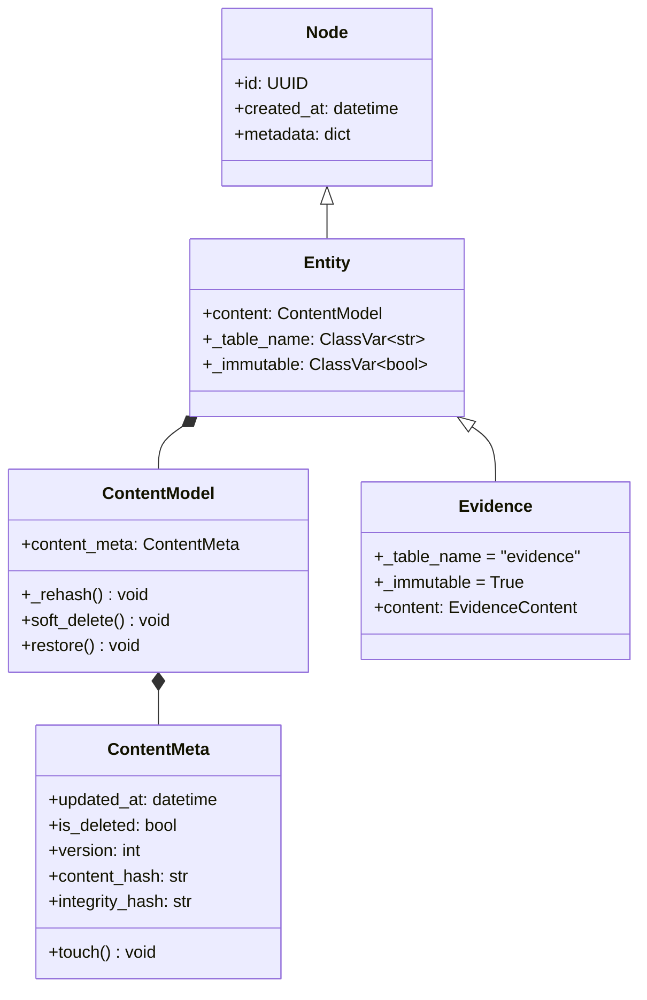
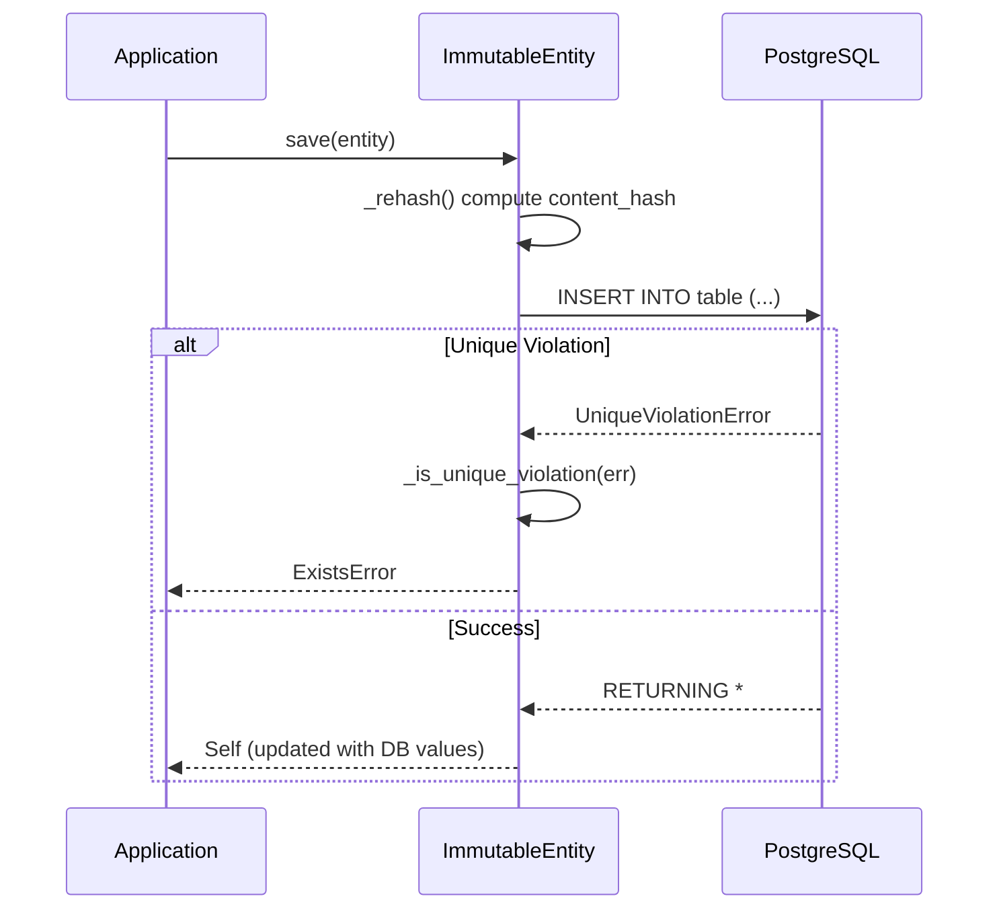
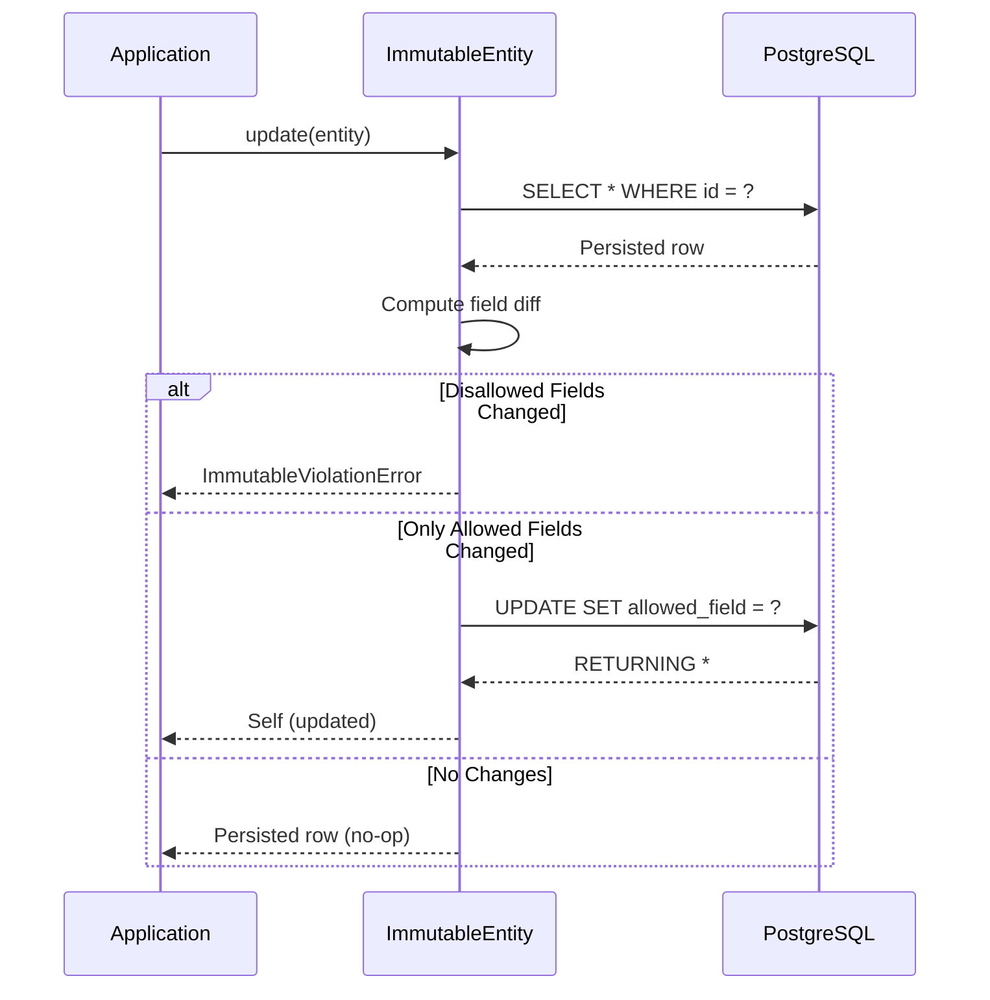
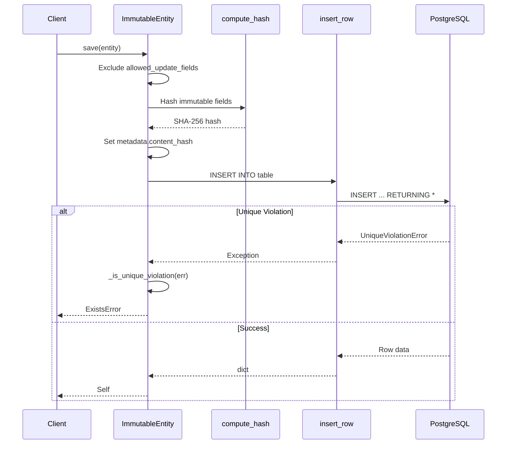
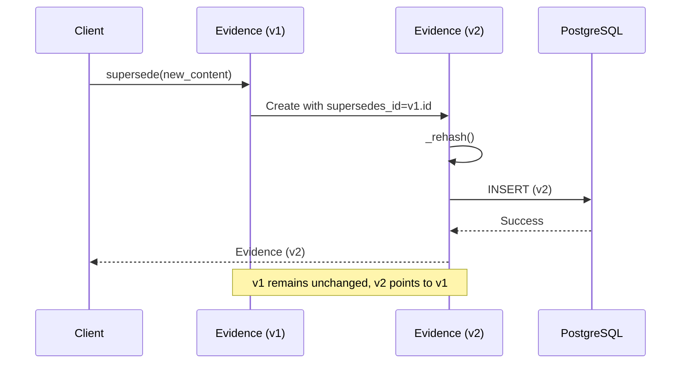
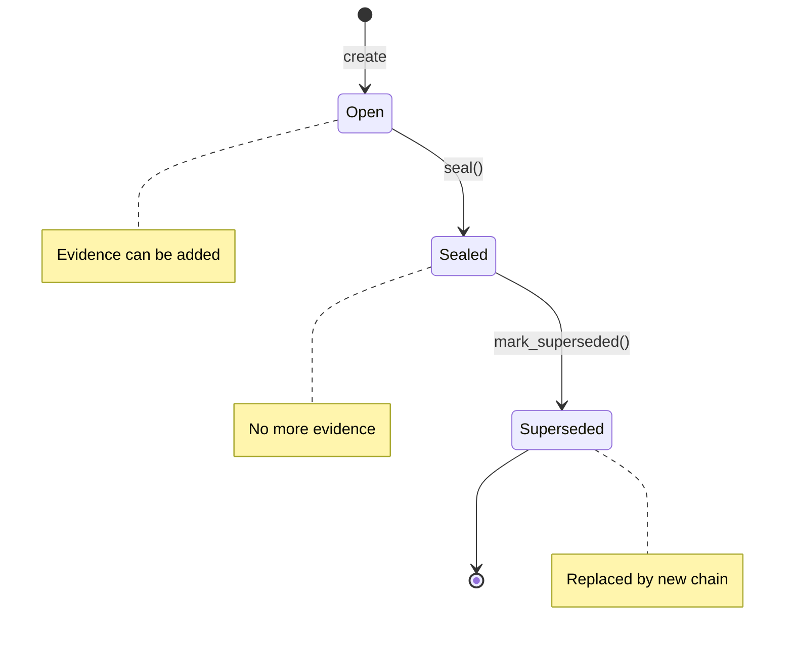
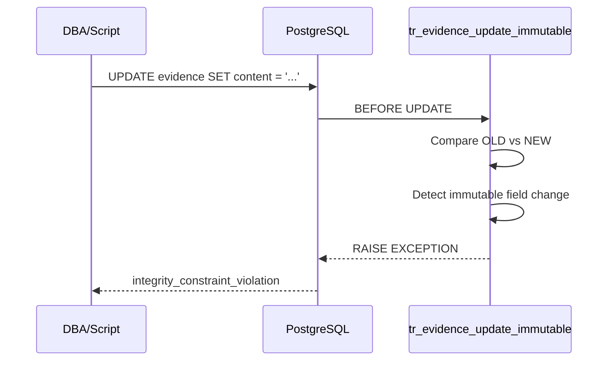

# Technical Design Specification: ImmutableEntity and Supersession Pattern

## 1. Overview

### 1.1 Purpose

ImmutableEntity provides a base class for compliance-critical records that must not be modified or
deleted after creation. This enforces audit-grade integrity for evidence artifacts, decision chains,
and compliance event packets (CEPs). The supersession pattern enables corrections without mutation
by creating new records that reference their predecessors.

### 1.2 Scope

**In Scope**:

- Insert-only persistence semantics via `save()` and `insert()`
- Blocked updates except for explicitly allowed fields
- Blocked deletes at both application and database level
- Content hash integrity verification
- Database trigger enforcement for direct SQL access
- Supersession pattern for corrections

**Out of Scope**:

- Soft delete behavior (inherited from Entity but semantically discouraged)
- Versioning strategies beyond supersession
- Time-travel queries for historical state
- Distributed consistency across databases

### 1.3 Background

In compliance domains (FCRA, GDPR, EU AI Act), evidence of decisions must be provably unmodified.
Traditional CRUD operations allow mutations that destroy audit trails. ImmutableEntity addresses
this by:

1. Making `save()` insert-only (never upsert)
2. Blocking `update()` unless only allowed fields change
3. Blocking `delete()` unconditionally
4. Computing content hashes for tamper detection
5. Generating database triggers as defense-in-depth

**Research References**:

- canon-core/core/content.py: Entity, ContentModel, `_immutable` flag, `@register_entity`
- canon-core/db/migration/migration.py: Trigger generation for immutable entities
- canon-core/exceptions.py: Error hierarchy

### 1.4 Design Goals

| Priority | Goal                           | Rationale                                           |
| -------- | ------------------------------ | --------------------------------------------------- |
| P0       | Insert-only semantics          | Regulatory compliance requires unmodifiable records |
| P0       | Tamper detection               | Content hash enables integrity verification         |
| P1       | Defense-in-depth               | DB triggers catch direct SQL bypass attempts        |
| P1       | Controlled updates for linking | Supersession requires forward pointers              |
| P2       | Cross-driver compatibility     | Support asyncpg, psycopg2, SQLite                   |

### 1.5 Key Constraints

**Technical Constraints**:

- Must extend Entity base class without breaking its CRUD interface
- Hash computation must exclude mutable linking fields
- Triggers must be idempotent for re-migration scenarios

**Business Constraints**:

- Corrections require creating new records (no in-place edits)
- Historical records must remain accessible for litigation
- Audit reports must be reproducible from stored hashes

**Security Constraints**:

- Content hash must use cryptographically secure algorithm (SHA-256)
- Database triggers must raise exceptions, not silently fail
- Integrity violations must be logged as security incidents

---

## 2. Architecture

### 2.1 Component Diagram

```mermaid
graph TD
    subgraph "Application Layer"
        A[Entity] --> B[Node from kron]
        A --> C[ContentModel]
        C --> D[ContentMeta]
        A --> E[_immutable flag]
    end

    subgraph "Database Layer"
        F[UPDATE Trigger] --> G[Block All Updates if immutable]
        H[DELETE Trigger] --> I[Block All Deletes if immutable]
    end

    subgraph "Utilities"
        J[compute_hash] --> K[SHA-256]
        L[@with_rehash] --> M[Hash after mutation]
    end

    E -->|triggers generated| F
    E -->|triggers generated| H
    D -->|content_hash, integrity_hash| J
```

### 2.2 Class Hierarchy



### 2.3 Dependencies

**Internal Dependencies**:

| Component    | Purpose                              | Location                  |
| ------------ | ------------------------------------ | ------------------------- |
| Node         | Base class with id/created_at        | `kron` (external)         |
| Entity       | Base entity combining Node + content | `canon.entities.entity` |
| ContentModel | Domain content with audit metadata   | `canon.entities.entity` |
| ContentMeta  | Audit metadata with hashes           | `canon.entities.entity` |
| compute_hash | SHA-256 hash computation             | `canon.utils`        |
| CRUD         | Low-level DB operations              | `canon.db.crud`      |

**External Dependencies**:

| Library   | Purpose                            | Version  |
| --------- | ---------------------------------- | -------- |
| kron      | Node base class, primitives        | >=1.0.0  |
| asyncpg   | PostgreSQL async driver            | >=0.28.0 |
| pydantic  | Model validation and serialization | >=2.0.0  |
| hashlib   | SHA-256 implementation             | stdlib   |

### 2.4 Data Flow: Insert-Only Save



### 2.5 Data Flow: Controlled Update



---

## 3. Interface Definitions

### 3.1 Entity with Immutability Flag

```python
from typing import ClassVar
from kron.core.node import Node
from pydantic import BaseModel, Field

# ContentMeta - See TDS-002-entity.md Section 3.4 for canonical definition
# Provides: id, created_at, updated_at, is_active, created_by, updated_by,
#           version, content_hash, integrity_hash, touch()

# ContentModel - See TDS-002-entity.md Section 3.3 for canonical definition
# Provides: content_meta, _rehash(), soft_delete(), restore()


class Entity(Node):
    """Base entity combining Node identity with ContentModel.

    Configuration:
    - _table_name: Database table name
    - _schema: Database schema (default: "public")
    - _immutable: If True, DB triggers block UPDATE/DELETE
    """
    content: ContentModel
    _table_name: ClassVar[str] = ""
    _schema: ClassVar[str] = "public"
    _immutable: ClassVar[bool] = False


def register_entity(
    table_name: str,
    *,
    schema: str = "public",
    immutable: bool = False,
) -> Callable[[type[E]], type[E]]:
    """Decorator to register an Entity class with configuration.

    Usage:
        @register_entity("evidence", immutable=True)
        class Evidence(Entity):
            content: EvidenceContent
    """
    ...


def create_entity(
    name: str,
    content_type: type[T],
    *,
    table_name: str | None = None,
    immutable: bool = False,
) -> type[Entity]:
    """Create an Entity class bound to a ContentModel type.

    Usage:
        Evidence = create_entity("Evidence", EvidenceContent, immutable=True)
    """
    ...
```

### 3.2 Error Types

```python
class ExistsError(CanonError):
    """Entity already exists."""
    default_message = "Already exists"
    default_retryable = False

    def __init__(
        self,
        message: str | None = None,
        *,
        entity_type: str | None = None,
        entity_id: str | None = None,
        **kwargs,
    ): ...


class ImmutableViolationError(OperationError):
    """Immutable entity modification attempted.

    Raised when attempting to modify or delete immutable entities.
    Corrections use supersession, not mutation.
    """
    default_message = "Immutable entity violation"

    def __init__(
        self,
        entity_type: str,
        operation: str,
        *,
        entity_id: str | None = None,
        detail: str = "",
        **kwargs,
    ): ...


class IntegrityViolationError(CanonError):
    """Content hash mismatch detected - possible tampering.

    This is a security incident that should be logged and investigated.
    """
    default_message = "Integrity verification failed"
    default_retryable = False

    def __init__(
        self,
        entity_type: str,
        entity_id: str,
        *,
        expected_hash: str | None = None,
        actual_hash: str | None = None,
        **kwargs,
    ): ...
```

### 3.3 Helper Functions

```python
def _is_unique_violation(err: Exception) -> bool:
    """Best-effort unique violation detection.

    Handles common patterns from:
    - PostgreSQL: "duplicate key value violates unique constraint"
    - SQLite: "UNIQUE constraint failed"
    - MySQL: "Duplicate entry"

    Args:
        err: Exception from database operation.

    Returns:
        True if error indicates unique constraint violation.
    """
    ...
```

---

## 4. Data Models

### 4.1 Example: Evidence Entity

```python
from uuid import UUID
from pydantic import Field
from canon.core import Entity, ContentModel, register_entity
from kron.types.db_types import FK

# EvidenceContent - See TDS-006-evidence-chain-cep.md Section 3.1 for canonical definition
# Full schema includes: tenant_id, subject_id, evidence_type, title, data, source,
# source_id, file_hash, collected_at, collected_by_id, expires_at, supersedes_id
class EvidenceContent(ContentModel):
    """Evidence domain content. See TDS-006 Section 3.1 for full field list."""
    tenant_id: FK[Tenant]
    subject_id: FK[Person] | None = None
    evidence_type: str
    # ... additional fields: title, data, source, source_id, file_hash,
    #     collected_at, collected_by_id, expires_at, supersedes_id
    supersedes_id: FK["Evidence"] | None = None  # Backward pointer


@register_entity("evidence", immutable=True)
class Evidence(Entity):
    """Immutable evidence artifact.

    True immutability: DB triggers block all UPDATE/DELETE.
    Corrections use supersession pattern (create new record).
    """
    content: EvidenceContent


# Usage: Create new evidence that supersedes old
# See TDS-006 Section 3.1 for canonical supersession pattern
async def supersede_evidence(
    old_evidence: Evidence,
    new_data: dict,
    ctx: RequestContext,
) -> Evidence:
    """Create a corrected version that supersedes the old one.

    Copies all fields from original, applies new_data, sets supersedes_id.
    See canon.enforcement.features.supersede_evidence for implementation.
    """
    new_content = EvidenceContent(
        tenant_id=old_evidence.content.tenant_id,
        subject_id=old_evidence.content.subject_id,
        evidence_type=old_evidence.content.evidence_type,
        # ... copy other fields from original
        data=new_data,
        supersedes_id=old_evidence.id,  # Backward pointer
    )
    new_evidence = Evidence(content=new_content)
    return await save_evidence(new_evidence, ctx)
```

### 4.2 Example: ChainEntry Entity

```python
from uuid import UUID
from enum import Enum
from canon.core import Entity, ContentModel, register_entity
from kron.types.db_types import FK

# ChainEntryContent - See TDS-006-evidence-chain-cep.md Section 3.2 for canonical definition
# Full schema includes: tenant_id, subject_id, actor_id, event_type, resource_type,
# resource_id, payload_hash, previous_hash, chain_hash, sequence, payload
class ChainEntryContent(ContentModel):
    """Chain entry domain content. See TDS-006 Section 3.2 for full field list."""
    tenant_id: FK[Tenant]
    subject_id: FK[Person] | None = None
    event_type: str
    # ... additional fields: actor_id, resource_type, resource_id,
    #     payload_hash, previous_hash, chain_hash, sequence, payload
    sequence: int = 0


@register_entity("chain_entries", immutable=True)
class ChainEntry(Entity):
    """Immutable chain entry in evidence chain.

    Chain entries are always immutable - they form an
    append-only log of evidence additions.
    """
    content: ChainEntryContent
```

**Note**: With flag-based immutability, there is no `_allowed_update_fields`. Immutable entities
cannot have ANY fields updated - the DB triggers block all UPDATE operations. Supersession is
handled by creating new records that reference old ones via `supersedes_id`.

### 4.3 Database Schema

```sql
-- Evidence table (true immutability)
CREATE TABLE IF NOT EXISTS "public"."evidence" (
    "id" UUID PRIMARY KEY,
    "tenant_id" UUID NOT NULL,
    "evidence_type" TEXT NOT NULL,
    "content" JSONB NOT NULL,
    "supersedes_id" UUID,
    "metadata" JSONB NOT NULL,
    FOREIGN KEY ("tenant_id") REFERENCES "tenants"("id") ON DELETE CASCADE,
    FOREIGN KEY ("supersedes_id") REFERENCES "evidence"("id") ON DELETE RESTRICT
);

-- Chain table (status updates allowed)
CREATE TABLE IF NOT EXISTS "public"."chains" (
    "id" UUID PRIMARY KEY,
    "tenant_id" UUID NOT NULL,
    "chain_type" TEXT NOT NULL,
    "status" TEXT NOT NULL DEFAULT 'open',
    "superseded_by_id" UUID,
    "metadata" JSONB NOT NULL,
    FOREIGN KEY ("tenant_id") REFERENCES "tenants"("id") ON DELETE CASCADE,
    FOREIGN KEY ("superseded_by_id") REFERENCES "chains"("id") ON DELETE RESTRICT
);

-- Indexes
CREATE INDEX ix_evidence_tenant_id ON evidence(tenant_id);
CREATE INDEX ix_evidence_supersedes_id ON evidence(supersedes_id);
CREATE INDEX ix_chains_tenant_id ON chains(tenant_id);
CREATE INDEX ix_chains_status ON chains(status);
```

---

## 5. Behavior

### 5.1 Core Workflow: Insert-Only Save



**Steps**:

1. Client calls `save()` on ImmutableEntity instance
2. `_rehash()` computes SHA-256 over immutable fields (excludes id, metadata, allowed_update_fields)
3. Hash stored in `metadata.content_hash`
4. `insert_row()` attempts INSERT (not upsert)
5. On unique violation, convert to `ExistsError`
6. On success, update instance with DB-returned values

### 5.2 Core Workflow: Supersession Pattern



**Key Properties**:

- Original record (v1) is never modified
- New record (v2) contains corrected data
- `supersedes_id` creates audit chain
- Both records remain queryable
- Active view filters superseded records

### 5.3 State Machine: Chain Status



### 5.4 Error Handling

**Error Hierarchy**:

```python
CanonError (base)
├── ExistsError
│   └── Entity already exists (save() on existing PK)
├── OperationError
│   └── ImmutableViolationError
│       ├── Update attempted on empty _allowed_update_fields
│       ├── Update attempted on disallowed field
│       └── Delete attempted
└── IntegrityViolationError
    └── Content hash mismatch detected
```

**Error Response Examples**:

```python
# ExistsError
ExistsError(
    entity_type="Evidence",
    entity_id="550e8400-e29b-41d4-a716-446655440000"
)
# Message: "Evidence already exists: 550e8400-e29b-41d4-a716-446655440000"

# ImmutableViolationError (update blocked)
ImmutableViolationError(
    entity_type="Evidence",
    operation="update",
    detail="attempted to update disallowed fields: ['content', 'evidence_type']"
)
# Message: "Evidence is immutable: cannot update (attempted to update disallowed fields: ['content', 'evidence_type'])"

# IntegrityViolationError
IntegrityViolationError(
    entity_type="Evidence",
    entity_id="550e8400-e29b-41d4-a716-446655440000",
    expected_hash="abc123...",
    actual_hash="def456..."
)
# Message: "Integrity check failed for Evidence 550e8400-e29b-41d4-a716-446655440000: content hash mismatch"
```

### 5.5 Database Trigger Enforcement



**Generated Trigger Function**:

```sql
CREATE OR REPLACE FUNCTION tr_evidence_update_immutable()
RETURNS TRIGGER AS $$
DECLARE
    immutable_fields TEXT[] := ARRAY['content', 'evidence_type', 'metadata', 'supersedes_id', 'tenant_id'];
    changed_fields TEXT[] := '{}';
    field TEXT;
BEGIN
    FOREACH field IN ARRAY immutable_fields LOOP
        IF (row_to_json(OLD)->>field) IS DISTINCT FROM (row_to_json(NEW)->>field) THEN
            changed_fields := array_append(changed_fields, field);
        END IF;
    END LOOP;

    IF array_length(changed_fields, 1) > 0 THEN
        RAISE EXCEPTION 'evidence is immutable. Attempted to modify fields: %', changed_fields
            USING ERRCODE = 'integrity_constraint_violation';
    END IF;

    RETURN NEW;
END;
$$ LANGUAGE plpgsql;
```

**Generated Delete Trigger**:

```sql
CREATE OR REPLACE FUNCTION tr_evidence_delete_immutable()
RETURNS TRIGGER AS $$
BEGIN
    RAISE EXCEPTION 'evidence is immutable and cannot be deleted (id=%)', OLD.id
        USING ERRCODE = 'integrity_constraint_violation';
    RETURN NULL;
END;
$$ LANGUAGE plpgsql;
```

### 5.6 Security Considerations

**Integrity Verification**:

- `verify_integrity()` returns bool for conditional checks
- `verify_or_raise()` raises `IntegrityViolationError` for fail-fast
- Use on-demand for sensitive operations (litigation export, audit reports)
- Background verification job can detect tampering early

**Hash Algorithm**:

- SHA-256 via `hashlib` standard library
- JSON serialization before hashing for deterministic output
- Excludes volatile fields (id, metadata except state fields)

**Defense-in-Depth**:

- Application layer: `update()` and `delete()` methods blocked
- Database layer: Triggers prevent direct SQL bypass
- Both layers use consistent error codes for monitoring

---

## 6. Performance Considerations

### 6.1 Hash Computation Cost

| Operation          | Cost              | Notes                     |
| ------------------ | ----------------- | ------------------------- |
| SHA-256 hash       | ~1ms for 10KB     | Computed on every insert  |
| JSON serialization | ~0.5ms for 10KB   | `model_dump(mode="json")` |
| Integrity check    | ~1.5ms per record | On-demand only            |

**Recommendation**: Batch integrity verification for large exports rather than verifying every read.

### 6.2 Trigger Overhead

| Operation        | Without Trigger | With Trigger | Overhead                             |
| ---------------- | --------------- | ------------ | ------------------------------------ |
| UPDATE (blocked) | N/A             | ~0.1ms       | Constant (fail-fast)                 |
| DELETE (blocked) | N/A             | ~0.1ms       | Constant (fail-fast)                 |
| INSERT           | ~2ms            | ~2ms         | None (trigger only on UPDATE/DELETE) |

---

## 7. Open Questions

| # | Question                            | Impact                                               | Proposed Resolution                                  | Status   |
| - | ----------------------------------- | ---------------------------------------------------- | ---------------------------------------------------- | -------- |
| 1 | Soft delete interaction             | ImmutableEntity inherits `soft_delete()` from Entity | Block `soft_delete()` for ImmutableEntity subclasses | Open     |
| 2 | Background verification cadence     | How often to run integrity checks?                   | Configurable per-tenant, default daily               | Open     |
| 3 | Trigger idempotency on re-migration | Existing tables may already have triggers            | Use `DROP TRIGGER IF EXISTS` before `CREATE TRIGGER` | Resolved |
| 4 | `_update_allowed_fields` exposure   | Internal helper could be misused by subclasses       | Consider truly private (`__update_allowed_fields`)   | Open     |

---

## 8. Appendices

### Appendix A: Alternative Designs Considered

**Alternative 1: Separate Linking Table**

- Description: Store supersession links in a separate `evidence_links` table
- Pros: Evidence table stays truly immutable (zero allowed updates)
- Cons: Extra join for every query, more complex queries
- Why Not Chosen: `supersedes_id` on Evidence is simpler and sufficient

**Alternative 2: Event Sourcing**

- Description: Store all changes as events, derive current state
- Pros: Full history of all operations, not just supersessions
- Cons: Significant complexity, not needed for compliance use case
- Why Not Chosen: Over-engineering for the requirement

### Appendix B: Content Hash Computation

```python
def _rehash(self) -> None:
    """Hash only the immutable domain fields.

    Excludes id, metadata, and any allowed-update fields so that
    linking fields don't change the content hash.
    """
    exclude = {"id", "metadata"} | set(self._allowed_update_fields)
    data = self.model_dump(mode="json", exclude=exclude)
    self.metadata.content_hash = compute_hash(data)
```

**Why Exclude `id`**: System identifier, not content.

**Why Exclude `metadata`**: Contains volatile audit fields (timestamps, version).

**Why Exclude `_allowed_update_fields`**: These fields can change without invalidating content
integrity.

### Appendix C: Glossary

| Term             | Definition                                                            |
| ---------------- | --------------------------------------------------------------------- |
| Immutability     | Property of records that cannot be modified after creation            |
| Supersession     | Pattern where corrections create new records pointing to predecessors |
| Content Hash     | SHA-256 hash of immutable content for tamper detection                |
| Defense-in-Depth | Multiple layers of enforcement (app + DB triggers)                    |
| Forward Pointer  | `superseded_by_id` field pointing from old to new record              |

---

## 9. Related Surfaces

The following control surfaces use patterns from this design:

| Surface                    | Description                    | Key Integration                                         |
| -------------------------- | ------------------------------ | ------------------------------------------------------- |
| Evidence surfaces          | Evidence surfaces              | Evidence entities use ImmutableEntity with supersession |
| Timestamp attestation surfaces | Timestamp attestation surfaces | RFC 3161 attestations are immutable records         |

**Immutability Pattern Usage by Domain**:

| Domain            | Surfaces Using Immutability                      | Key Use Case                                                         |
| ----------------- | ------------------------------------------------ | -------------------------------------------------------------------- |
| Evidence (12)     | evidence-collection, chain-entry                 | Evidence artifacts cannot be modified - corrections use supersession |
| Certification (8) | timestamp-attestation, cep-sealing               | CEPs and attestations are sealed and immutable                       |
| Audit (6)         | CS-audit-log-entry, CS-chain-verification        | Audit entries form immutable hash chains                             |
| Compliance (4)    | CS-adverse-action-notice, CS-consent-record      | Compliance records preserved for litigation                          |

**Key Patterns Used by Surfaces**:

- `immutable=True` via `@register_entity("table", immutable=True)`
- DB triggers block UPDATE/DELETE operations
- `supersedes_id` backward pointer for corrections
- `get_successor()` derived forward pointer lookup
- `evidence_active` view filters superseded records
- `content_hash` for tamper detection

**Why These Surfaces Require Immutability**:

1. **Regulatory Requirements**: FCRA, GDPR, EU AI Act require unmodified evidence trails
2. **Litigation Hold**: Evidence must be provably unmodified for legal proceedings
3. **Audit Integrity**: Hash chains prove "this existed at this time in this order"
4. **Compliance Proof**: Corrections via supersession preserve complete history
