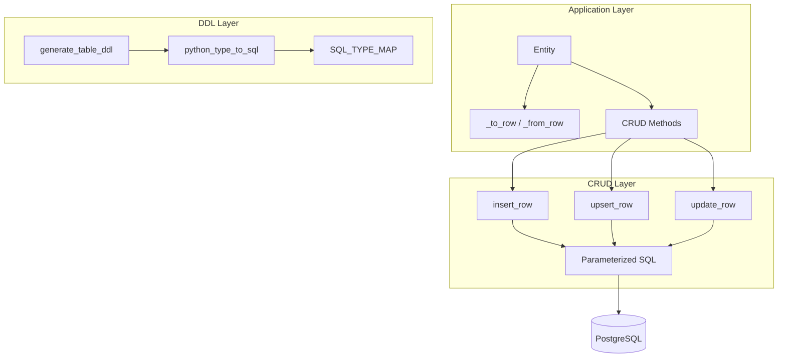

# Technical Design Specification: Entity-Database Correspondence

## 1. Overview

### 1.1 Purpose

Entity-Database Correspondence defines the mapping between Pydantic Entity models and PostgreSQL
tables. This is **infrastructure** that enables phrase persistence - it does not define vocabulary
itself.

### 1.2 Scope

**In Scope**: `_to_row()` / `_from_row()` conversion, type mapping, CRUD operations, DDL generation,
FK[Model] and Vector[dim] annotations, index specification.

**Out of Scope**: Complex query building, ORM-style relationship loading, connection pooling,
multi-database support.

### 1.3 Key Constraints

- Must use asyncpg for PostgreSQL operations
- Column names must be quoted to handle reserved words
- All values must be parameterized ($1, $2, ...)
- Tenant isolation enforceable at CRUD level

## 2. Architecture



## 3. Type Mapping

```python
TYPE_MAP: dict[type, str] = {
    str: "TEXT",
    int: "INTEGER",
    float: "DOUBLE PRECISION",
    bool: "BOOLEAN",
    bytes: "BYTEA",
    datetime: "TIMESTAMP WITH TIME ZONE",
    date: "DATE",
    UUID: "UUID",
    dict: "JSONB",
    list: "JSONB",
}
```

**Additional**: `Enum` -> TEXT, `BaseModel` subclass -> JSONB, `FK[Model]` -> UUID with REFERENCES,
`Vector[dim]` -> VECTOR(dim), `T | None` -> nullable.

## 4. CRUD Operations

```python
async def insert(table: str, data: dict, *, returning: bool = True, conn=None) -> dict | None:
    """Insert row with RETURNING * for audit capture."""

async def upsert(table: str, data: dict, *, conflict_column: str = "id", conn=None) -> dict | None:
    """INSERT ON CONFLICT DO UPDATE - idempotent saves."""

async def select(table: str, *, where: dict = None, order_by: str = None, limit: int = None) -> list[dict]:
    """Select with tenant-scoped filtering."""
```

**Implementation**: `libs/canon/src/canon/db/crud.py`

## 5. SQL Injection Prevention

```python
def validate_identifier(name: str, kind: str = "identifier") -> None:
    """Validate SQL identifier against injection patterns.

    Rejects: quotes, semicolons, comments, non-alphanumeric
    Allows: alphanumeric, underscore, starting with letter
    """
    if not re.match(r'^[a-zA-Z_][a-zA-Z0-9_]*$', name):
        raise ValidationError(f"Invalid {kind}: {name}")
```

## 6. NOT NULL Logic

```
Field Annotation --> Primary Key? --> NOT NULL implicit
                |
                +--> Optional Type? --> Allow NULL
                |
                +--> Non-Optional --> NOT NULL

Key: Default values do NOT affect nullability.
     status: str = "pending" is NOT NULL (str does not include None)
```

## 7. Key Files

| File                          | Purpose                   |
| ----------------------------- | ------------------------- |
| `libs/canon/src/canon/entities/entity.py`  | Entity, ContentModel      |
| `libs/canon/src/canon/db/crud.py`       | CRUD operations           |
| `libs/canon/src/canon/db/ddl.py`        | DDL generation            |
| `libs/canon/src/canon/db/types.py`      | FK and Vector annotations |
| `libs/canon/src/canon/db/validation.py` | Identifier validation     |

## 8. Infrastructure Role

This TDS provides **infrastructure for all vocabulary packages**:

| Capability      | How Used                                                   |
| --------------- | ---------------------------------------------------------- |
| Type Mapping    | Python types map to PostgreSQL for domain entities         |
| CRUD Operations | `insert()`, `upsert()`, `update()`, `select()` for phrases |
| FK[Model]       | Type-safe foreign key references                           |
| DDL Generation  | Entity definitions generate database schema                |

## 9. References

- **ADR**: ADR-004-entity-db-correspondence
- **Implementation**: `libs/canon/src/canon/db/`
- **Downstream**: TDS-005-rls-migration, TDS-006-evidence-chain-cep
