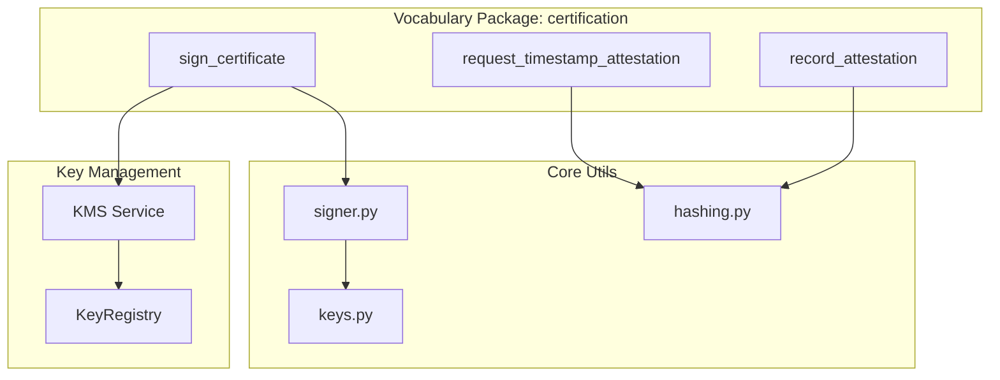
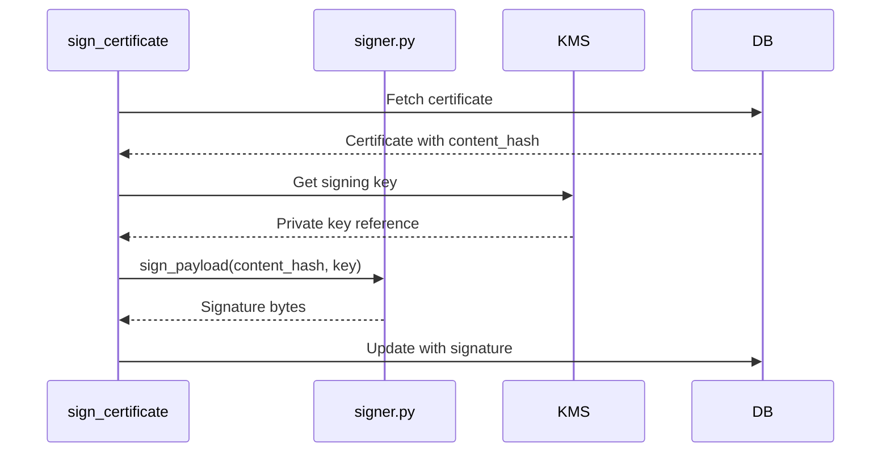

---
# Core Fields (REQUIRED)
doc_type: TDS
title: "Technical Design Specification: Cryptography - Hashing and RSA Signing"
version: "2.0.0"
status: active
created: "2026-01-15"
updated: "2026-01-29"
by: "architect"
owner: "alpha[implementer]"
output_subdir: tds
phase: design
scope: L3

# Chain Fields
predecessors: ["ADR-018-cryptography-rsa"]
successors: []
supersedes: null
superseded_by: null

# Context Fields
tags:
  - cryptography
  - security
  - certification
related: ["TDS-003-immutability", "TDS-006-evidence-chain-cep"]
pr: null

# Quality Metrics
quality:
  confidence: 0.95
  sources: 4
  docs: full
---

# Technical Design Specification: Cryptography - Hashing and RSA Signing

## 1. Overview (REQUIRED)

### 1.1 Purpose

This specification covers the cryptographic primitives used throughout CanonSys for content
integrity, evidence chains, and digital signatures. The system uses SHA-256 for hashing and RSA-4096
with PKCS#1 v1.5 padding for signing.

### 1.2 Scope

**In Scope**:

- Deterministic SHA-256 hashing via `compute_hash()`
- Chain hash computation for evidence integrity
- RSA-4096 key pair generation and signing
- Vocabulary phrases for certificate signing and timestamp attestation

**Out of Scope**:

- Encryption at rest (handled by database/storage layer)
- TLS/network encryption (handled by infrastructure)
- User authentication cryptography (handled by identity provider)

### 1.3 Background

**Research References**:

- `ADR-018-cryptography-rsa`: Algorithm selection rationale

### 1.4 Design Goals

| Priority | Goal                     | Rationale                                |
| -------- | ------------------------ | ---------------------------------------- |
| P0       | Deterministic hashing    | Same input must always produce same hash |
| P0       | Fail-closed verification | Errors must not leak information         |
| P1       | Prospective revocation   | Pre-revocation signatures remain valid   |
| P2       | 10 MB input limit        | DoS prevention per SOC2 CC7.1            |

### 1.5 Key Constraints

**Technical Constraints**:

- Private keys never stored in database (KMS/env only)
- Hash input limited to 10 MB maximum
- Deterministic JSON serialization required for reproducible hashes

**Security Constraints**:

- Fail-closed: Any verification error returns False
- No exception propagation from verification functions

---

## 2. Architecture (REQUIRED)

### 2.1 Component Diagram



### 2.2 Dependencies

**Internal Dependencies**:

| Component       | Purpose                          | Version |
| --------------- | -------------------------------- | ------- |
| `kron.utils`    | Deterministic JSON serialization | Current |
| `canon.db` | Certificate persistence          | Current |

**External Dependencies**:

| Library        | Purpose                  | Version |
| -------------- | ------------------------ | ------- |
| `cryptography` | RSA signing/verification | 41.0+   |
| OpenSSL        | TSA verification         | 1.1.1+  |

### 2.3 Data Flow



---

## 3. Interface Definitions (REQUIRED)

### 3.1 Vocabulary Phrases

#### `sign_certificate`

**Purpose**: Sign a decision certificate with RSA-4096

**Package**: `hub/foundation/packages/certification/phrases/sign_certificate.py`

**Inputs**:

| Field            | Type   | Required | Description         |
| ---------------- | ------ | -------- | ------------------- |
| `certificate_id` | `UUID` | Yes      | Certificate to sign |

**Outputs**:

| Field            | Type       | Description              |
| ---------------- | ---------- | ------------------------ |
| `certificate_id` | `UUID`     | Signed certificate ID    |
| `signing_key_id` | `str`      | Key used for signing     |
| `signature`      | `str`      | Base64-encoded signature |
| `signed_at`      | `datetime` | Signing timestamp        |

#### `request_timestamp_attestation`

**Purpose**: Request RFC 3161 timestamp for content hash

**Package**:
`hub/foundation/packages/certification/phrases/request_timestamp_attestation.py`

**Inputs**:

| Field          | Type   | Required | Description                |
| -------------- | ------ | -------- | -------------------------- |
| `content_hash` | `str`  | Yes      | SHA-256 hash to timestamp  |
| `target_type`  | `str`  | No       | evidence, cep, certificate |
| `target_id`    | `UUID` | No       | Target entity ID           |
| `tsa_name`     | `str`  | No       | TSA preset name            |

**Outputs**:

| Field        | Type       | Description             |
| ------------ | ---------- | ----------------------- |
| `id`         | `UUID`     | Attestation record ID   |
| `token_hash` | `str`      | TSA response token hash |
| `gen_time`   | `datetime` | TSA generation time     |

### 3.2 Internal Interfaces

#### Hashing (`libs/canon/src/canon/utils/hashing.py`)

```python
MAX_HASH_INPUT_BYTES = 10 * 1024 * 1024  # 10 MB (SOC2 CC7.1)
GENESIS_HASH: str = "GENESIS"

def compute_hash(
    obj: dict | str | bytes | Any,
    algorithm: HashAlgorithm = HashAlgorithm.SHA256,
) -> str:
    """Compute cryptographic hash with deterministic serialization.

    Uses json_dumpb(sort_keys=True, deterministic_sets=True).

    Raises:
        ValueError: If payload exceeds MAX_HASH_INPUT_BYTES
    """

def compute_chain_hash(
    payload_hash: str,
    previous_hash: str | None,
    algorithm: HashAlgorithm = HashAlgorithm.SHA256,
) -> str:
    """Compute chain hash: HASH("{payload_hash}:{previous_hash or 'GENESIS'}")"""
```

#### Signing (`libs/canon/src/canon/utils/security/signer.py`)

```python
def generate_key_pair() -> tuple[str, str]:
    """Generate RSA-4096 key pair.

    Returns:
        (private_key_pem, public_key_pem) tuple
    """

def sign_payload(payload: bytes, private_key_pem: str) -> bytes:
    """Sign with RSA-4096 + PKCS1v15 + SHA-256.

    Returns:
        Raw signature bytes (512 bytes for RSA-4096)
    """

def verify_signature(
    payload: bytes,
    signature: bytes,
    public_key_pem: str
) -> bool:
    """Verify signature with fail-closed semantics.

    Returns:
        True if valid, False on ANY error (fail-closed)
    """
```

---

## 4. Data Models (REQUIRED)

### 4.1 SigningKey

```python
@dataclass(frozen=True, slots=True)
class SigningKey:
    """Immutable signing key metadata."""

    key_id: str
    version: int
    valid_from: datetime
    valid_until: datetime
    public_key_pem: str
    revoked_at: datetime | None = None  # Prospective revocation
```

### 4.2 KeyRegistry

```python
class KeyRegistry:
    """Manages signing keys with versioning and validity checks."""

    def get_key(self, key_id: str, version: int | None = None) -> SigningKey | None
    def get_current_key(self) -> SigningKey | None
    def is_key_valid_at(self, key: SigningKey, timestamp: datetime) -> bool
```

### 4.3 Key Lifecycle (NIST SP 800-57)

```python
class KeyLifecycle(str, Enum):
    PENDING_ACTIVATION = "pending_activation"
    ACTIVE = "active"
    DEACTIVATED = "deactivated"
    DESTROYED = "destroyed"
```

---

## 5. Behavior (REQUIRED)

### 5.1 Chain Hash Computation

```
Evidence 1 (Genesis)     Evidence 2           Evidence 3
├── payload_hash_1       ├── payload_hash_2   ├── payload_hash_3
├── GENESIS              ├── chain_hash_1     ├── chain_hash_2
└── chain_hash_1         └── chain_hash_2     └── chain_hash_3
```

Modifying any entry invalidates all subsequent chain_hashes.

### 5.2 Prospective Revocation

```python
def is_key_valid_at(self, key: SigningKey, timestamp: datetime) -> bool:
    """Signatures made BEFORE revocation remain valid."""
    if not (key.valid_from <= timestamp <= key.valid_until):
        return False
    return key.revoked_at is None or timestamp < key.revoked_at
```

### 5.3 Error Handling

**Fail-Closed Verification**:

```python
def verify_signature(payload, signature, public_key_pem) -> bool:
    try:
        loaded_key.verify(signature, payload, padding.PKCS1v15(), hashes.SHA256())
        return True
    except Exception:
        return False  # Fail-closed: any error = invalid
```

No exceptions propagate. Attackers cannot distinguish error types.

### 5.4 Security Considerations

**DoS Prevention**:

```python
if len(payload) > MAX_HASH_INPUT_BYTES:
    raise ValueError(f"Payload {len(payload):,}B > {MAX_HASH_INPUT_BYTES:,}B limit")
```

**Private Key Handling**:

- Never store private keys in database
- Never commit private keys to git
- Never log private keys
- Load from KMS or environment variables at runtime

---

## 6. External Interactions

### 6.1 KMS Integration

| Service         | Operations Used               | SLA    | Fallback        |
| --------------- | ----------------------------- | ------ | --------------- |
| AWS KMS         | GenerateDataKey, Sign, Verify | 99.99% | Local key cache |
| Azure Key Vault | Sign, Verify                  | 99.99% | Local key cache |
| GCP Cloud KMS   | Sign, Verify                  | 99.99% | Local key cache |
| HashiCorp Vault | Transit sign, Transit verify  | SLA    | Local key cache |

### 6.2 HSM Abstraction

```python
class HSMProvider(Protocol):
    async def generate_kek(self, key_spec: KeySpec) -> str
    async def encrypt(self, kek_id: str, plaintext: bytes) -> bytes
    async def decrypt(self, kek_id: str, ciphertext: bytes) -> bytes
    async def destroy_key(self, key_id: str) -> None
```

---

## 7. Performance Considerations

### 7.1 Expected Load

| Metric            | Expected | Peak   | Notes                       |
| ----------------- | -------- | ------ | --------------------------- |
| Signatures/day    | 10,000   | 50,000 | Decision certificates       |
| Hash ops/second   | 1,000    | 5,000  | Entity content hashing      |
| Verifications/day | 1,000    | 10,000 | Audit and compliance checks |

### 7.2 Performance Targets

| Operation          | P50  | P95   | P99   |
| ------------------ | ---- | ----- | ----- |
| compute_hash()     | 1ms  | 5ms   | 10ms  |
| sign_payload()     | 20ms | 50ms  | 100ms |
| verify_signature() | 5ms  | 15ms  | 30ms  |
| KMS sign (remote)  | 50ms | 100ms | 200ms |

---

## 8. Compliance Implications

| Regulation           | Algorithm Status                                  |
| -------------------- | ------------------------------------------------- |
| **NIST SP 800-131A** | RSA-4096 approved through 2030+                   |
| **SOC2 CC7.1**       | SHA-256 meets integrity requirements              |
| **GDPR Art. 32**     | Cryptographic integrity satisfies data protection |
| **PCI DSS**          | RSA-2048 minimum, 4096 exceeds requirement        |

---

## 9. Testing Strategy

### 9.1 Unit Testing

**Coverage Target**: >= 90%

**Test Categories**:

- Deterministic hash verification (same input = same output)
- Fail-closed verification (all error cases return False)
- Chain hash integrity (modification detection)
- Key lifecycle transitions

### 9.2 Test Locations

```
canon/tests/utils/test_hashing.py
canon/tests/utils/security/test_signer.py
canon/tests/utils/security/test_keys.py
hub/tests/packages/certification/test_sign_certificate.py
```

---

## 10. References

- **ADR**: `docs-shared/canonsys/01_design/018-cryptography-rsa/ADR-018-cryptography-rsa.md`
- **Vocabulary Package**: `hub/foundation/packages/certification/`
- **Core Utils**: `libs/canon/src/canon/utils/hashing.py`, `libs/canon/src/canon/utils/security/`
- **KMS Module**: `libs/canon/src/canon/utils/kms/`
- **NIST SP 800-131A**: Transitioning Cryptographic Algorithms
- **RFC 3447**: PKCS #1: RSA Cryptography Specifications
