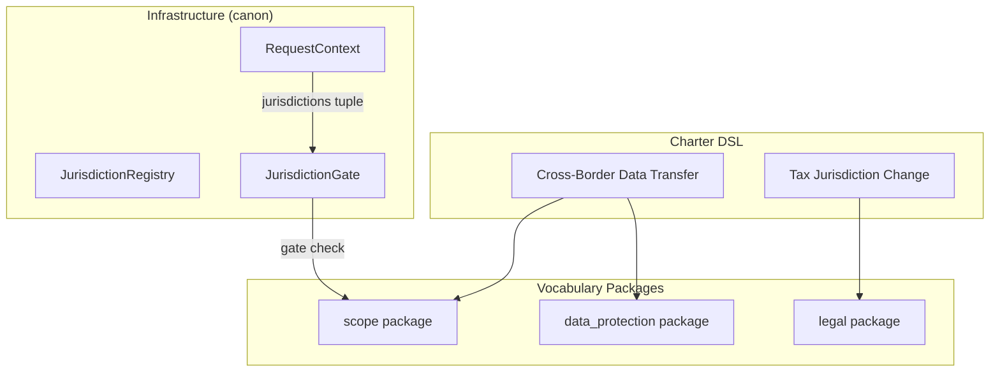
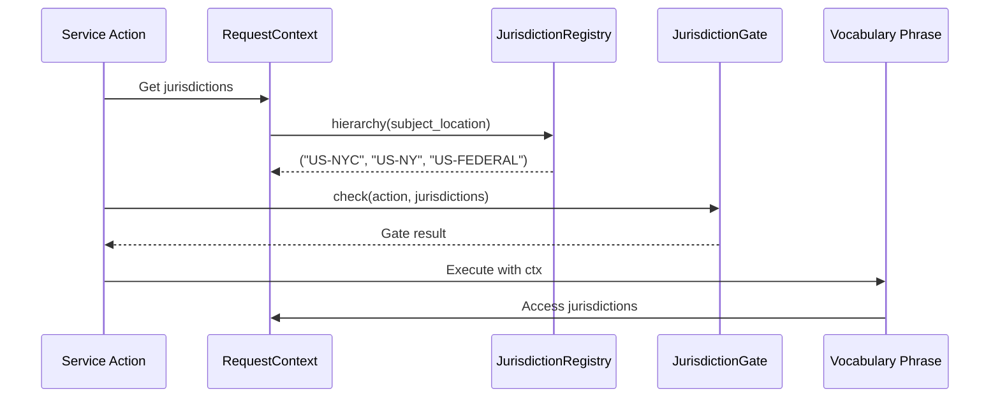

---
# Core Fields (REQUIRED)
doc_type: TDS
title: "Technical Design Specification: Jurisdiction Routing"
version: "2.0.0"
status: active
created: "2026-01-15"
updated: "2026-01-29"
by: "architect"
owner: "alpha[implementer]"
output_subdir: tds
phase: design
scope: L3

# Chain Fields
predecessors: ["ADR-019-jurisdiction"]
successors: []
supersedes: null
superseded_by: null

# Context Fields
tags:
  - jurisdiction
  - compliance
  - routing
related: ["TDS-008-policy-gates"]
pr: null

# Quality Metrics
quality:
  confidence: 0.90
  sources: 4
  docs: full
---

# Technical Design Specification: Jurisdiction Routing

## 1. Overview (REQUIRED)

### 1.1 Purpose

Jurisdiction routing provides **geographic compliance scoping** for CanonSys. Different
jurisdictions (US-NYC, EU-GDPR, US-FEDERAL) have different compliance requirements. The jurisdiction
system determines which rules apply to each action based on where the subject is located or where
the employment action occurs.

### 1.2 Scope

**In Scope**:

- Jurisdiction hierarchy traversal (most-specific-first)
- Data-driven configuration via TOML files
- ANY-match gate semantics for RequestContext jurisdictions
- Integration with vocabulary phrases via RequestContext

**Out of Scope**:

- Tax calculation logic (jurisdiction determines which tax rules, not amounts)
- Labor law specifics (jurisdiction determines which laws apply, not interpretation)

### 1.3 Background

**Research References**:

- `ADR-019-jurisdiction`: Decision rationale for hierarchy and ANY-match semantics

### 1.4 Design Goals

| Priority | Goal                      | Rationale                              |
| -------- | ------------------------- | -------------------------------------- |
| P0       | O(1) lookup performance   | Gate checks on hot path                |
| P0       | Hierarchy inheritance     | NYC must include NY and FEDERAL rules  |
| P1       | Data-driven configuration | Compliance team self-service           |
| P2       | International coverage    | Support US, EU, UK, and future regions |

### 1.5 Key Constraints

**Technical Constraints**:

- Pre-computed hierarchy for O(1) lookup
- Immutable JurisdictionConfig after registry initialization

**Business Constraints**:

- TOML configuration changes require validation but not code deploy

---

## 2. Architecture (REQUIRED)

### 2.1 Component Diagram



### 2.2 Dependencies

**Internal Dependencies**:

| Component                | Purpose                   | Version |
| ------------------------ | ------------------------- | ------- |
| `canon.enforcement` | RequestContext, Gate base | Current |

**External Dependencies**:

| Library | Purpose      | Version |
| ------- | ------------ | ------- |
| `tomli` | TOML parsing | 2.0+    |

### 2.3 Data Flow



---

## 3. Interface Definitions (REQUIRED)

### 3.1 Vocabulary Phrases

Jurisdiction-aware phrases are distributed across multiple packages:

```
hub/foundation/packages/scope/                         # Destination/channel validation
└── phrases/
    ├── verify_destination_allowed.py
    └── verify_channel_allowed.py

hub/domains/governance/packages/data_protection/       # Cross-border transfer controls
└── phrases/
    ├── require_encrypted_transmission.py
    └── require_classification.py

hub/domains/governance/packages/legal/                 # Legal review gates
└── phrases/
    ├── require_legal_review_complete.py
    └── verify_appeal_channel_available.py

hub/domains/employee/packages/hr/                      # HR-specific jurisdiction patterns
└── phrases/
    └── derive_visa_termination_pattern.py
```

#### `verify_destination_allowed`

**Purpose**: Validate data transfer destination is permitted

**Pattern**: verify **Regulatory Basis**: GDPR Art. 45-46 **Package**: `scope`

**Inputs**:

| Field                | Type  | Required | Description              |
| -------------------- | ----- | -------- | ------------------------ |
| `destination`        | `str` | Yes      | Target jurisdiction code |
| `transfer_mechanism` | `str` | No       | SCCs, BCRs, consent      |

**Outputs**:

| Field      | Type   | Description                    |
| ---------- | ------ | ------------------------------ |
| `verified` | `bool` | Whether destination is allowed |

**Usage in Charter**:

```canon
phase export_control_screening:
    require verify_destination_allowed()
```

#### `require_encrypted_transmission`

**Purpose**: Require encryption for cross-border data transfer

**Pattern**: require **Regulatory Basis**: GDPR Art. 32, HIPAA 164.312 **Package**:
`data_protection`

**Inputs**:

| Field                 | Type  | Required | Description          |
| --------------------- | ----- | -------- | -------------------- |
| `data_classification` | `str` | Yes      | Classification level |

**Outputs**:

| Field       | Type   | Description                        |
| ----------- | ------ | ---------------------------------- |
| `satisfied` | `bool` | Whether encryption requirement met |

### 3.2 Internal Interfaces

#### JurisdictionConfig

```python
@dataclass(frozen=True)
class JurisdictionConfig:
    """Immutable jurisdiction configuration."""

    code: str              # e.g., "US-NYC"
    display_name: str      # e.g., "New York City"
    country: str           # e.g., "US"
    parent: str | None     # e.g., "US-NY"
    calendar: str          # Business day calendar ID
    aliases: frozenset[str]
```

#### JurisdictionRegistry

```python
class JurisdictionRegistry:
    """O(1) jurisdiction lookup with pre-computed hierarchy."""

    def get(self, code: str) -> JurisdictionConfig | None
    def hierarchy(self, code: str) -> tuple[str, ...]
    def normalize(self, code_or_alias: str) -> str | None
    def all_codes(self) -> frozenset[str]
```

#### JurisdictionGate

```python
class JurisdictionGate:
    """Vocabulary-based enforcement that checks if action is permitted in ANY context jurisdiction."""

    allowed_jurisdictions: frozenset[str]

    async def check(self, ctx: RequestContext) -> PhraseResult:
        """ANY-match: passes if action allowed in at least one jurisdiction."""
        context_jurisdictions = set(ctx.jurisdictions)
        return bool(context_jurisdictions & self.allowed_jurisdictions)
```

---

## 4. Data Models (REQUIRED)

### 4.1 Jurisdiction Hierarchy

```
                +------------------+
                |   US-FEDERAL     |
                +--------+---------+
                         |
      +------------------+------------------+
      |                  |                  |
+-----+-----+      +-----+-----+      +-----+-----+
|   US-NY   |      |   US-CA   |      |   US-IL   |
+-----+-----+      +-----+-----+      +-----+-----+
      |                  |                  |
+-----+-----+      +-----+-----+      +-----+-----+
|  US-NYC   |      |  US-SFO   |      |  US-CHI   |
+-----------+      +-----------+      +-----------+
```

**Key Property**: `hierarchy("US-NYC")` returns `("US-NYC", "US-NY", "US-FEDERAL")`.

### 4.2 TOML Configuration

```toml
# policies/jurisdictions/us-nyc.toml
[jurisdiction]
code = "US-NYC"
display_name = "New York City"
country = "US"
parent = "US-NY"
calendar = "NYSE"
aliases = ["nyc", "new-york-city"]
```

---

## 5. Behavior (REQUIRED)

### 5.1 Hierarchy Traversal

```python
def hierarchy(self, code: str) -> tuple[str, ...]:
    """Return hierarchy most-specific-first.

    >>> hierarchy("US-NYC")
    ("US-NYC", "US-NY", "US-FEDERAL")
    """
    result = []
    current = self.get(code)
    while current:
        result.append(current.code)
        current = self.get(current.parent) if current.parent else None
    return tuple(result)
```

### 5.2 ANY-Match Gate Semantics

```python
async def check(self, ctx: RequestContext) -> PhraseResult:
    """Pass if action allowed in at least one context jurisdiction."""
    context_set = set(ctx.jurisdictions)
    allowed_set = self.allowed_jurisdictions

    # ANY-match: intersection must be non-empty
    if context_set & allowed_set:
        return PhraseResult(passed=True)

    return PhraseResult(
        passed=False,
        reason=f"No jurisdiction match: context={context_set}, allowed={allowed_set}"
    )
```

### 5.3 Error Handling

```python
class JurisdictionError(Exception):
    """Base error for jurisdiction operations."""

class UnknownJurisdictionError(JurisdictionError):
    """Jurisdiction code not found in registry."""

class CircularHierarchyError(JurisdictionError):
    """Circular parent reference detected."""
```

---

## 6. Control Surface Integration

This design is used by the following control surfaces:

| Surface                    | Key Phrases                                                                             |
| -------------------------- | --------------------------------------------------------------------------------------- |
| Cross-Border Data Transfer | `verify_destination_allowed`, `require_encrypted_transmission`, `verify_ofac_clearance` |
| Tax Jurisdiction Change    | `require_legal_review_complete`, `verify_approval_chain_complete`                       |

**Example Charter** (`surfaces/data/cross_border_transfer.canon`):

```canon
charter "Cross Border Data Transfer" v2.0

packages:
    - data_protection
    - export_control
    - scope

workflow cross_border_transfer:
    phase export_control_screening:
        require verify_ofac_clearance()
        require verify_destination_allowed()
```

---

## 7. Performance Considerations

### 7.1 Expected Load

| Metric              | Expected | Peak   | Notes                  |
| ------------------- | -------- | ------ | ---------------------- |
| Hierarchy lookups/s | 10,000   | 50,000 | Every gate check       |
| Registry size       | ~200     | ~500   | Jurisdictions globally |

### 7.2 Performance Targets

| Operation   | P50  | P95  | P99  |
| ----------- | ---- | ---- | ---- |
| hierarchy() | <1ms | <1ms | <2ms |
| normalize() | <1ms | <1ms | <1ms |
| Gate check  | <1ms | <2ms | <5ms |

### 7.3 Optimization

- Pre-computed hierarchy on registry load
- Frozen dataclasses for immutability
- Hash-based lookup for O(1) access

---

## 8. Regulatory Compliance

| Regulation | Section        | Requirement                | Phrase                            |
| ---------- | -------------- | -------------------------- | --------------------------------- |
| GDPR       | Art. 45-46     | Cross-border adequacy      | `verify_destination_allowed`      |
| GDPR       | Art. 32        | Security of processing     | `require_encrypted_transmission`  |
| NYC LL144  | section 20-871 | Bias audit scope           | JurisdictionGate (infrastructure) |
| IRS Regs   | Various        | Tax jurisdiction substance | `require_legal_review_complete`   |

---

## 9. Testing Strategy

### 9.1 Unit Testing

**Coverage Target**: >= 90%

**Test Categories**:

- Hierarchy computation correctness
- ANY-match vs ALL-match semantics
- Circular hierarchy detection
- Alias normalization

### 9.2 Test Locations

```
hub/tests/packages/
├── scope/test_verify_destination_allowed.py
├── data_protection/test_require_encrypted_transmission.py
└── legal/test_require_legal_review_complete.py

canon/tests/utils/test_loader.py
canon/tests/enforcement/catalog/test_jurisdiction.py
```

---

## 10. References

- **ADR**: `docs-shared/canonsys/01_design/019-jurisdiction/ADR-019-jurisdiction.md`
- **Vocabulary Packages**: `hub/foundation/packages/scope/`, `hub/domains/governance/packages/data_protection/`, `hub/domains/governance/packages/legal/`
- **Infrastructure**: `libs/canon/src/canon/utils/loader.py`
- **Charters**: `hub/charters/surfaces/`
