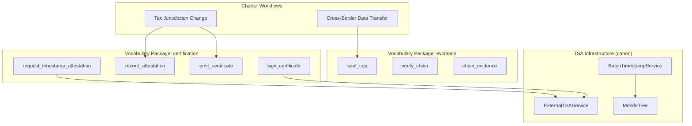
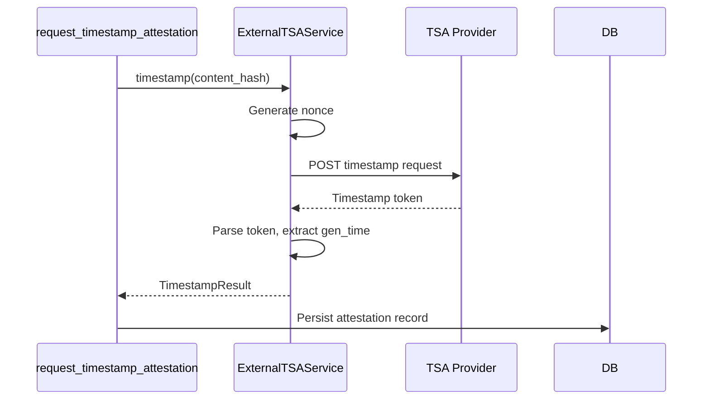

---
# Core Fields (REQUIRED)
doc_type: TDS
title: "Technical Design Specification: RFC 3161 Timestamp Attestation"
version: "2.0.0"
status: active
created: "2026-01-15"
updated: "2026-01-29"
by: "architect"
owner: "alpha[implementer]"
output_subdir: tds
phase: design
scope: L3

# Chain Fields
predecessors: ["ADR-020-timestamp-tsa"]
successors: []
supersedes: null
superseded_by: null

# Context Fields
tags:
  - timestamp
  - attestation
  - certification
  - evidence
related: ["TDS-018-cryptography-rsa", "TDS-006-evidence-chain-cep"]
pr: null

# Quality Metrics
quality:
  confidence: 0.95
  sources: 5
  docs: full
---

# Technical Design Specification: RFC 3161 Timestamp Attestation

## 1. Overview (REQUIRED)

### 1.1 Purpose

Timestamp Authority (TSA) integration provides **cryptographic proof of existence** for CanonSys
evidence. By obtaining RFC 3161 timestamps from trusted third-party authorities, CanonSys proves
that evidence existed at a specific point in time, independent of internal clocks.

Critical for compliance:

- **FCRA**: Prove adverse action notices sent within required timeframes
- **Audit Defense**: Demonstrate evidence was not backdated
- **Legal Proceedings**: Tamper-evident timestamps from neutral third parties
- **FRE 902(13)**: Self-authentication of electronic records

### 1.2 Scope

**In Scope**:

- RFC 3161 timestamp request and response handling
- Two verification modes: hash-only and full OpenSSL
- Vocabulary phrases for attestation management
- Batch timestamping via Merkle trees

**Out of Scope**:

- TSA certificate management (handled by TSA providers)
- Long-term archive formats (handled by separate archival system)

### 1.3 Background

**Research References**:

- `ADR-020-timestamp-tsa`: Decision to use OpenSSL verification

### 1.4 Design Goals

| Priority | Goal                   | Rationale                                |
| -------- | ---------------------- | ---------------------------------------- |
| P0       | Honest verification    | `signature_valid` reflects actual status |
| P0       | Legal defensibility    | Cryptographic proof accepted in court    |
| P1       | Anti-replay protection | Nonce prevents timestamp reuse           |
| P2       | Batch efficiency       | Merkle tree reduces TSA API calls        |

### 1.5 Key Constraints

**Technical Constraints**:

- OpenSSL binary required for full verification
- Nonce enabled by default (128-bit)

**Security Constraints**:

- Independent circuit breakers for primary/backup TSA
- Separate attestation entity preserves Evidence immutability

---

## 2. Architecture (REQUIRED)

### 2.1 Component Diagram



### 2.2 Dependencies

**Internal Dependencies**:

| Component                  | Purpose                  | Version |
| -------------------------- | ------------------------ | ------- |
| `kron.utils`          | SHA-256 for content hash | Current |
| `canon.db`            | Attestation persistence  | Current |

**External Dependencies**:

| Library/Binary | Purpose                     | Version |
| -------------- | --------------------------- | ------- |
| OpenSSL        | `ts -verify` command        | 1.1.1+  |
| `httpx`        | Async HTTP for TSA requests | 0.25+   |

### 2.3 Data Flow



---

## 3. Interface Definitions (REQUIRED)

### 3.1 Vocabulary Phrases

#### `request_timestamp_attestation`

**Purpose**: Request RFC 3161 timestamp for content hash

**Pattern**: action **Regulatory Basis**: RFC 3161 **Package**: `certification`

**Inputs**:

| Field          | Type   | Required | Description                         |
| -------------- | ------ | -------- | ----------------------------------- |
| `content_hash` | `str`  | Yes      | SHA-256 hash to timestamp           |
| `target_type`  | `str`  | No       | evidence, cep, certificate          |
| `target_id`    | `UUID` | No       | Target entity ID                    |
| `tsa_name`     | `str`  | No       | TSA preset name (default: internal) |

**Outputs**:

| Field        | Type       | Description             |
| ------------ | ---------- | ----------------------- |
| `id`         | `UUID`     | Attestation record ID   |
| `token_hash` | `str`      | TSA response token hash |
| `gen_time`   | `datetime` | TSA generation time     |

**Usage in Charter**:

```canon
phase certification:
    action request_timestamp_attestation()
```

#### `record_attestation`

**Purpose**: Record typed process attestation

**Pattern**: action **Regulatory Basis**: SOX 302/404, FRE 901 **Package**: `certification`

**Inputs**:

| Field              | Type              | Required | Description                            |
| ------------------ | ----------------- | -------- | -------------------------------------- |
| `target_type`      | `str`             | Yes      | certificate, workflow, cep             |
| `target_id`        | `UUID`            | Yes      | Target entity ID                       |
| `attestation_type` | `AttestationType` | Yes      | Type of attestation                    |
| `attestation_text` | `str`             | Yes      | Substantive attestation (min 20 chars) |
| `attester_role`    | `str`             | Yes      | Role of attester                       |

**Outputs**:

| Field              | Type       | Description                 |
| ------------------ | ---------- | --------------------------- |
| `id`               | `UUID`     | Attestation record ID       |
| `attestation_hash` | `str`      | Hash of attestation content |
| `attested_at`      | `datetime` | Attestation timestamp       |

**Attestation Types**:

```python
class AttestationType(str, Enum):
    PROCESS_ADHERENCE = "process_adherence"      # Process was followed
    PARITY_CONFIRMATION = "parity_confirmation"  # Similar treatment
    ER_CLEARANCE = "er_clearance"                # ER review complete
    EXECUTIVE_OVERRIDE = "executive_override"    # Risk acceptance
    WITNESS = "witness"                          # Presence at event
```

### 3.2 Internal Interfaces

#### ExternalTSAService

```python
class ExternalTSAService:
    """RFC 3161 timestamp service client."""

    async def timestamp(self, data: bytes) -> TimestampResult:
        """Request timestamp for data."""

    async def verify(self, token: bytes, data: bytes) -> TimestampVerificationResult:
        """Hash-only verification (signature_valid=False)."""

    async def verify_with_openssl(
        self,
        token: bytes,
        data: bytes,
        ca_bundle: str | None = None
    ) -> TimestampVerificationResult:
        """Full OpenSSL verification (signature_valid=True if valid)."""
```

#### TimestampVerificationResult

```python
@dataclass(frozen=True)
class TimestampVerificationResult:
    is_valid: bool           # Hash matches
    signature_valid: bool    # CMS signature verified (OpenSSL only)
    chain_validated: bool    # Certificate chain to CA verified
    gen_time: datetime       # TSA generation time
    error: str | None        # Error message if any
```

---

## 4. Data Models (REQUIRED)

### 4.1 TimestampToken

```python
@dataclass(frozen=True)
class TimestampToken:
    """Parsed RFC 3161 timestamp token."""

    gen_time: datetime           # TSA generation time
    message_imprint: bytes       # Hash that was timestamped
    policy_id: str               # TSA policy OID
    nonce: int | None            # Anti-replay nonce
    serial_number: int           # TSA serial number
    tsa_name: str | None         # TSA distinguished name
    raw_token: bytes             # Original DER-encoded token
```

### 4.2 TSA Configuration

```python
@dataclass(frozen=True)
class TSAConfig:
    """TSA endpoint configuration."""

    name: str                    # Preset name
    url: str                     # TSA endpoint URL
    hash_algorithm: str          # SHA256, SHA512
    timeout_seconds: float       # Request timeout
    cert_path: str | None        # TSA certificate for verification
```

### 4.3 Attestation Entity

```python
# Separate from Evidence to maintain immutability
class TimestampAttestation(Entity):
    """Timestamp attestation record."""

    content: TimestampAttestationContent

@dataclass
class TimestampAttestationContent(ContentModel):
    target_type: str             # evidence, cep, certificate
    target_id: UUID
    content_hash: str            # Hash that was timestamped
    token_hash: str              # Hash of TSA response
    gen_time: datetime           # TSA generation time
    tsa_name: str                # Which TSA was used
    verification_status: str     # pending, verified, failed
```

---

## 5. Behavior (REQUIRED)

### 5.1 Verification Modes

| Method                               | signature_valid | chain_validated | Use Case                      |
| ------------------------------------ | --------------- | --------------- | ----------------------------- |
| `verify()`                           | False (honest)  | False           | Quick hash check, development |
| `verify_with_openssl()`              | True            | False           | Signature verified, no CA     |
| `verify_with_openssl(ca_bundle=...)` | True            | True            | Full legal defensibility      |

### 5.2 Hash-Only Verification

```python
async def verify(self, token: bytes, data: bytes) -> TimestampVerificationResult:
    """Fast verification that checks hash but NOT signature."""
    parsed = parse_timestamp_token(token)
    data_hash = hashlib.sha256(data).digest()

    return TimestampVerificationResult(
        is_valid=(parsed.message_imprint == data_hash),
        signature_valid=False,  # HONEST: we did NOT verify signature
        chain_validated=False,
        gen_time=parsed.gen_time,
        error=None,
    )
```

### 5.3 Full OpenSSL Verification

```python
async def verify_with_openssl(
    self,
    token: bytes,
    data: bytes,
    ca_bundle: str | None = None
) -> TimestampVerificationResult:
    """Legally defensible verification via OpenSSL."""
    cmd = ["openssl", "ts", "-verify", "-data", data_path, "-in", token_path]
    if ca_bundle:
        cmd.extend(["-CAfile", ca_bundle])

    result = await asyncio.create_subprocess_exec(*cmd, ...)
    return TimestampVerificationResult(
        is_valid=True,
        signature_valid=(result.returncode == 0),
        chain_validated=(ca_bundle is not None and result.returncode == 0),
        gen_time=parsed.gen_time,
        error=None if result.returncode == 0 else stderr,
    )
```

### 5.4 Error Handling

```python
class TSAError(Exception):
    """Base TSA error."""

class TSAConnectionError(TSAError):
    """Cannot reach TSA endpoint."""

class TSAResponseError(TSAError):
    """Invalid TSA response."""

class TSAVerificationError(TSAError):
    """Timestamp verification failed."""
```

---

## 6. Control Surface Integration

| Surface                    | Key Phrases                              |
| -------------------------- | ---------------------------------------- |
| Tax Jurisdiction Change    | `record_attestation`, `emit_certificate` |
| Cross-Border Data Transfer | `seal_cep`, `verify_cep_sealed`          |

**Example Charter** (`surfaces/finance/tax_jurisdiction_change.canon`):

```canon
charter "Tax Jurisdiction Change Authorization" v1.0

packages:
    - certification
    - evidence

workflow tax_jurisdiction_change:
    phase certification:
        require policy_evaluation.passed
        await change_executed
        action verify_case_integrity()
        action emit_certificate()
        action record_attestation()
        certify immutable
        evidence tax_jurisdiction_change_certificate
```

---

## 7. Performance Considerations

### 7.1 Expected Load

| Metric            | Expected | Peak   | Notes                        |
| ----------------- | -------- | ------ | ---------------------------- |
| Timestamps/day    | 10,000   | 50,000 | Evidence, CEPs, certificates |
| Verifications/day | 1,000    | 10,000 | Audit and compliance checks  |
| Batch size        | 100-1000 | 5000   | Merkle tree efficiency       |

### 7.2 Performance Targets

| Operation             | P50   | P95   | P99    |
| --------------------- | ----- | ----- | ------ |
| TSA request (network) | 200ms | 500ms | 1000ms |
| verify() (hash-only)  | 1ms   | 5ms   | 10ms   |
| verify_with_openssl() | 50ms  | 100ms | 200ms  |
| Batch timestamp (100) | 250ms | 600ms | 1200ms |

### 7.3 Batch Timestamping

```mermaid
graph TB
    subgraph "Individual Hashes"
        H1[hash_1]
        H2[hash_2]
        H3[hash_3]
        H4[hash_4]
    end

    subgraph "Merkle Tree"
        L1[H12 = hash(H1+H2)]
        L2[H34 = hash(H3+H4)]
        Root[Root = hash(H12+H34)]
    end

    H1 --> L1
    H2 --> L1
    H3 --> L2
    H4 --> L2
    L1 --> Root
    L2 --> Root
    Root --> TSA[Single TSA Request]
```

One TSA request timestamps many hashes. Merkle proof verifies individual hash membership.

---

## 8. Regulatory Compliance

| Regulation  | Section   | Requirement                        | Phrase                          |
| ----------- | --------- | ---------------------------------- | ------------------------------- |
| RFC 3161    | Full      | Timestamp protocol                 | `request_timestamp_attestation` |
| FRE 902(13) | Self-auth | Electronic record authentication   | `record_attestation`            |
| eIDAS       | Art. 41   | Qualified electronic time stamps   | `sign_certificate`              |
| SOX         | 302/404   | Certification of internal controls | `emit_certificate`              |

---

## 9. Testing Strategy

### 9.1 Unit Testing

**Coverage Target**: >= 90%

**Test Categories**:

- Hash-only verification returns `signature_valid=False`
- OpenSSL verification returns `signature_valid=True` when valid
- Nonce generation and validation
- Merkle tree construction and proof verification

### 9.2 Test Locations

```
hub/tests/packages/certification/
├── test_request_timestamp_attestation.py
├── test_record_attestation.py
├── test_emit_certificate.py
└── conftest.py

canon/tests/utils/tsa/
├── test_external_tsa.py
├── test_batch.py
└── test_merkle.py
```

---

## 10. TSA Infrastructure

### 10.1 Module Structure

| File              | Purpose                          |
| ----------------- | -------------------------------- |
| `external_tsa.py` | RFC 3161 client + OpenSSL verify |
| `types.py`        | TSAConfig, TimestampToken        |
| `config.py`       | TSA_PRESETS configuration        |
| `batch.py`        | BatchTimestampService            |
| `merkle.py`       | MerkleTree implementation        |

### 10.2 Pre-configured TSA Endpoints

```python
TSA_PRESETS = {
    "digicert": TSAConfig(
        name="digicert",
        url="http://timestamp.digicert.com",
        hash_algorithm="sha256",
        timeout_seconds=30.0,
    ),
    "sectigo": TSAConfig(
        name="sectigo",
        url="http://timestamp.sectigo.com",
        hash_algorithm="sha256",
        timeout_seconds=30.0,
    ),
    # ... more presets
}
```

---

## 11. Migration Notes

**From Previous Architecture**:

| Legacy Path                                                                  | New Path                                                                    |
| ---------------------------------------------------------------------------- | --------------------------------------------------------------------------- |
| `hub/foundation/packages/certification/actions/request_timestamp_attestation.py` | `hub/foundation/packages/certification/phrases/request_timestamp_attestation.py` |
| `hub/foundation/packages/certification/actions/record_attestation.py`            | `hub/foundation/packages/certification/phrases/record_attestation.py`            |
| `libs/canon/src/canon/entities/evidence/evidence.py`                                             | `hub/foundation/packages/certification/types/certificate.py`                     |

The phrase implementation follows the new `@canon_phrase` decorator pattern with Operable specs.

---

## 12. References

- **ADR**: `docs-shared/canonsys/01_design/020-timestamp-tsa/ADR-020-timestamp-tsa.md`
- **Vocabulary Package**: `hub/foundation/packages/certification/`
- **TSA Infrastructure**: `libs/canon/src/canon/utils/tsa/`
- **RFC 3161**: Time-Stamp Protocol
- **eIDAS Article 41**: Qualified electronic time stamps
