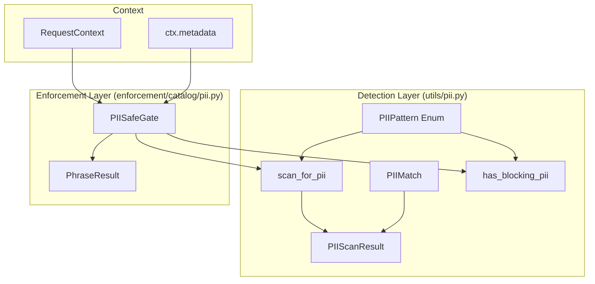
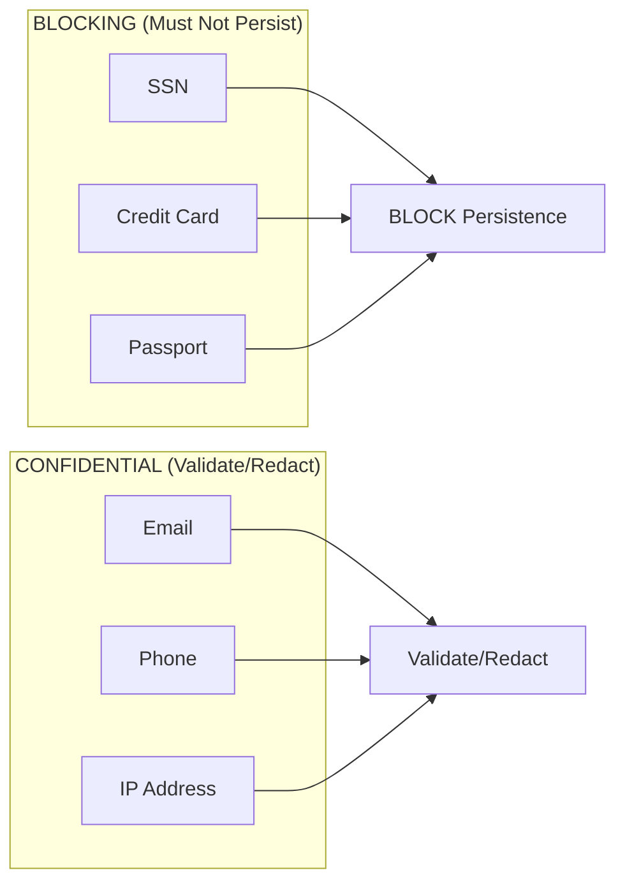
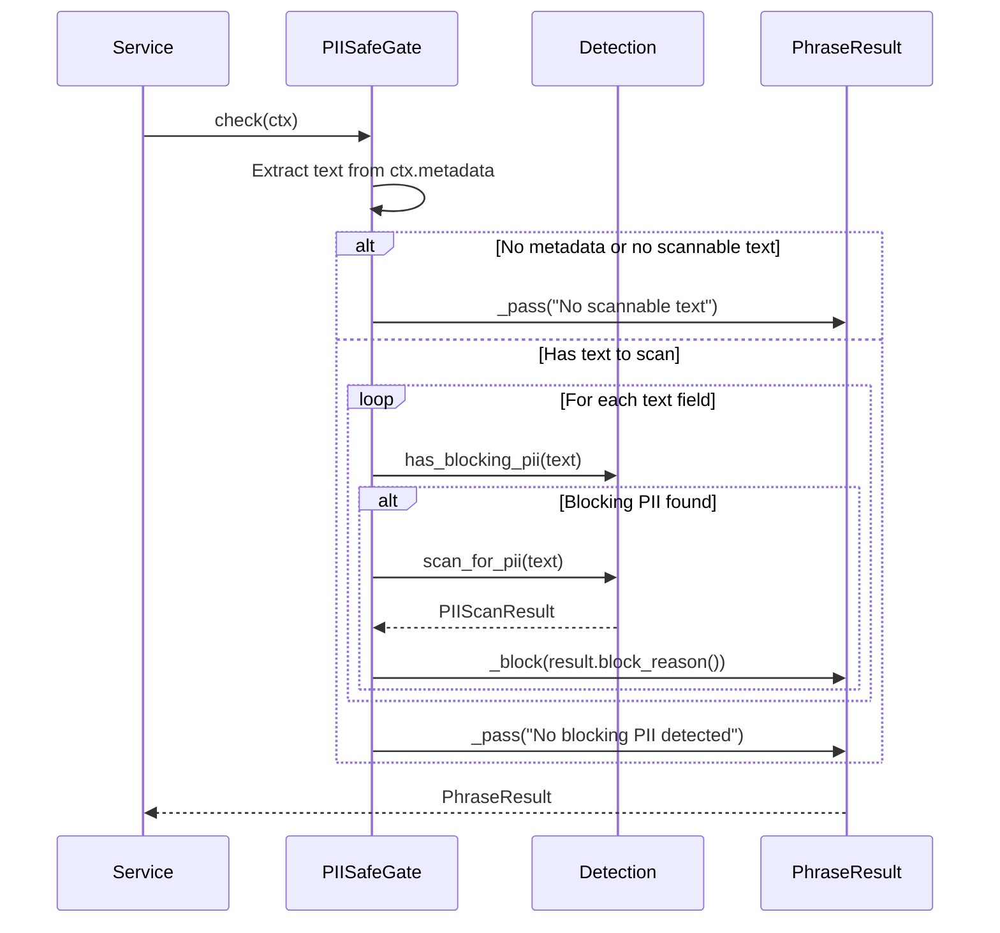

# Technical Design Specification: Privacy - PII Detection and Blocking

## 1. Overview

### 1.1 Purpose

PII detection provides the **last line of defense** before data persistence in CanonSys. The system
prevents highly sensitive personally identifiable information (SSN, credit card numbers, passports)
from ever being stored, while flagging confidential data (email, phone, IP) for validation and
potential redaction.

### 1.2 Scope

This specification covers:

- PII pattern definitions and categorization
- Regex-based detection algorithms
- Two-layer architecture (detection utilities + enforcement gates)
- PIIScanResult evidence structure
- PIISafeGate integration with the Decision Kill Chain
- Fast-path optimization for blocking detection

### 1.3 Design Principles

1. **Blocking is Non-Negotiable**: SSN, credit card, passport patterns MUST block - no override
2. **Position-Only Storage**: Never store the matched PII value, only positions
3. **Two-Layer Separation**: Detection (reusable) is separate from enforcement (gate)
4. **Fast Path First**: Use quick boolean check before detailed scan
5. **Evidence-Grade Results**: Scan results suitable for compliance audit

## 2. Architecture

### 2.1 Two-Layer Design



### 2.2 Module Structure

| Module                       | Purpose                                           |
| ---------------------------- | ------------------------------------------------- |
| `utils/pii.py`               | Detection utilities - patterns, scanning, results |
| `enforcement/catalog/pii.py` | PIISafeGate - enforcement boundary                |

### 2.3 Pattern Categories



## 3. PII Pattern Definitions

### 3.1 PIIPattern Enum

```python
class PIIPattern(StrEnum):
    """PII patterns with regex and sensitivity level."""

    # Highly sensitive - BLOCK persistence
    SSN = "ssn"
    CREDIT_CARD = "credit_card"
    PASSPORT = "passport"

    # Confidential - validate/redact
    EMAIL = "email"
    PHONE = "phone"
    IP_ADDRESS = "ip_address"

    @property
    def regex(self) -> re.Pattern[str]:
        """Compiled regex pattern for this PII type."""
        return _REGEX_MAP[self]

    @property
    def is_blocking(self) -> bool:
        """True if this pattern should block persistence."""
        return self in _BLOCKING

    @classmethod
    def blocking(cls) -> frozenset[PIIPattern]:
        """All blocking patterns."""
        return _BLOCKING

    @classmethod
    def all_patterns(cls) -> frozenset[PIIPattern]:
        """All available patterns."""
        return frozenset(cls)
```

### 3.2 Regex Patterns

| Pattern     | Regex                                                    | Format Examples                          |
| ----------- | -------------------------------------------------------- | ---------------------------------------- |
| SSN         | `\b\d{3}-\d{2}-\d{4}\b`                                  | 123-45-6789                              |
| Credit Card | `\b(?:\d{4}[-\s]?){3}\d{4}\b`                            | 1234-5678-9012-3456, 1234 5678 9012 3456 |
| Passport    | `\b[A-Z]{1,2}\d{6,9}\b`                                  | A12345678, AB123456789                   |
| Email       | `\b[A-Za-z0-9._%+-]+@[A-Za-z0-9.-]+\.[A-Z\|a-z]{2,}\b`   | user@example.com                         |
| Phone       | `\b(?:\+1[-.\s]?)?\(?\d{3}\)?[-.\s]?\d{3}[-.\s]?\d{4}\b` | (555) 123-4567, +1-555-123-4567          |
| IP Address  | `\b(?:\d{1,3}\.){3}\d{1,3}\b`                            | 192.168.1.1                              |

### 3.3 Blocking vs Confidential

| Category         | Patterns                   | Treatment              | Rationale                                        |
| ---------------- | -------------------------- | ---------------------- | ------------------------------------------------ |
| **Blocking**     | SSN, Credit Card, Passport | Hard block, no storage | Identity theft, financial fraud, legal liability |
| **Confidential** | Email, Phone, IP Address   | Validate, may redact   | Contact info, may be necessary for business      |

**Key Decision**: Blocking patterns are non-negotiable. There is no override, no soft enforcement,
no "justified bypass" for SSN/CC/Passport storage. This is core compliance posture.

## 4. Detection Data Structures

### 4.1 PIIMatch - Position-Only Record

```python
@dataclass(frozen=True, slots=True)
class PIIMatch:
    """A single PII match. Stores position only, never the matched value."""

    pattern: PIIPattern
    start: int
    end: int
```

**Critical Design**: PIIMatch stores character positions (`start`, `end`) but **never** the matched
value. This prevents PII leakage through scan results. The original text can be used with positions
to locate the PII if needed, but results themselves contain no sensitive data.

### 4.2 PIIScanResult - Audit-Ready Structure

```python
@dataclass(frozen=True, slots=True)
class PIIScanResult:
    """Result of PII scan."""

    matches: list[PIIMatch] = field(default_factory=list)
    text_length: int = 0

    @property
    def blocking_count(self) -> int:
        """Count of blocking matches."""
        return sum(1 for m in self.matches if m.pattern.is_blocking)

    @property
    def safe_to_persist(self) -> bool:
        """True if no blocking PII was detected."""
        return self.blocking_count == 0

    @property
    def blocking_types(self) -> list[PIIPattern]:
        """Blocking patterns that were detected."""
        return [m.pattern for m in self.matches if m.pattern.is_blocking]

    def block_reason(self) -> str | None:
        """Human-readable reason for blocking, or None if safe."""
        if self.safe_to_persist:
            return None
        types = sorted({t.value for t in self.blocking_types})
        return f"Blocking PII detected: {', '.join(types)}"
```

### 4.3 Properties Summary

| Property          | Type               | Purpose                                     |
| ----------------- | ------------------ | ------------------------------------------- |
| `matches`         | `list[PIIMatch]`   | All detected PII matches                    |
| `text_length`     | `int`              | Length of scanned text                      |
| `blocking_count`  | `int`              | Count of blocking (SSN/CC/Passport) matches |
| `safe_to_persist` | `bool`             | True if no blocking PII                     |
| `blocking_types`  | `list[PIIPattern]` | Which blocking patterns were found          |
| `block_reason()`  | `str \| None`      | Human-readable blocking reason              |

## 5. Detection Functions

### 5.1 Full Scan - scan_for_pii()

```python
def scan_for_pii(text: str, *, blocking_only: bool = True) -> PIIScanResult:
    """Scan text for PII patterns. Returns PIIScanResult.

    Args:
        text: Text to scan
        blocking_only: If True, only scan for blocking patterns (default)

    Returns:
        PIIScanResult with all matches sorted by position
    """
    if not text:
        return PIIScanResult(text_length=0)

    patterns = PIIPattern.blocking() if blocking_only else PIIPattern.all_patterns()
    matches: list[PIIMatch] = []

    for pii in patterns:
        for match in pii.regex.finditer(text):
            matches.append(PIIMatch(pattern=pii, start=match.start(), end=match.end()))

    matches.sort(key=lambda m: m.start)
    return PIIScanResult(matches=matches, text_length=len(text))
```

### 5.2 Quick Check - has_blocking_pii()

```python
def has_blocking_pii(text: str) -> bool:
    """Quick check if text contains blocking PII.

    Uses regex.search() for early termination - faster than full scan.
    """
    if not text:
        return False
    return any(pii.regex.search(text) for pii in PIIPattern.blocking())
```

### 5.3 Performance Optimization

| Function                            | Use Case               | Performance                          |
| ----------------------------------- | ---------------------- | ------------------------------------ |
| `has_blocking_pii()`                | Quick boolean check    | O(n) with early termination          |
| `scan_for_pii(blocking_only=True)`  | Full scan for blocking | O(n * k) where k = blocking patterns |
| `scan_for_pii(blocking_only=False)` | Full scan all patterns | O(n * p) where p = all patterns      |

**Fast Path Strategy**: Always call `has_blocking_pii()` first. Only invoke `scan_for_pii()` if
blocking is detected and details are needed for the failure message.

## 6. PIISafeGate - Enforcement Boundary

### 6.1 Gate Specification

```python
class PIISafeGate(gate_id="pii.safe_to_persist"):
    """Block persistence if highly sensitive PII is detected.

    STATIC gate (fixed gate_id) - infrastructure-level safety net.

    This is the LAST LINE OF DEFENSE before data persistence.
    """

    description = "Block persistence of data containing highly sensitive PII"
    failure_reason = "Highly sensitive PII detected - data cannot be persisted"
    required_evidence = ["pii_scan_result"]

    # Default metadata keys to scan
    DEFAULT_METADATA_KEYS = ("data", "text", "content", "payload")

    def __init__(self, metadata_keys: tuple[str, ...] | None = None):
        self.metadata_keys = metadata_keys or self.DEFAULT_METADATA_KEYS
```

### 6.2 Gate Check Flow



### 6.3 Metadata Key Scanning

The gate scans specific keys in `ctx.metadata`:

| Key       | Typical Source           |
| --------- | ------------------------ |
| `data`    | Evidence.data field      |
| `text`    | Raw text content         |
| `content` | Document/message content |
| `payload` | API request payload      |

### 6.4 Value Type Handling

```python
# String - scan directly
if isinstance(value, str):
    texts_to_scan.append((key, value))

# Dict - JSON serialize to catch nested PII
elif isinstance(value, dict):
    texts_to_scan.append((key, json.dumps(value)))

# List - scan each string element
elif isinstance(value, (list, tuple)):
    for i, item in enumerate(value):
        if isinstance(item, str):
            texts_to_scan.append((f"{key}[{i}]", item))
```

### 6.5 Usage Patterns

```python
# Via @action decorator (recommended)
@action(hard_gates=["pii.safe_to_persist"])
async def _handle_persist(self, req, ctx):
    # ctx.metadata["data"] will be scanned automatically
    ...

# Manual check before Evidence.save()
gate = PIISafeGate()
ctx = ctx.model_copy(update={"metadata": {"data": evidence.data}})
result = await gate.check(ctx)
if not result.passed:
    raise PIIDetected(result.message)
```

## 7. Integration Points

### 7.1 Decision Kill Chain Position

```
Generator → Normalizer → Verifier → Authority Gate → [PIISafeGate] → Evidence Vault → Action
                                                          ↑
                                                   LAST LINE OF DEFENSE
```

PIISafeGate sits at the Evidence Vault boundary - after all business logic, before persistence.

### 7.2 Dependencies

| Component                                 | Purpose                |
| ----------------------------------------- | ---------------------- |
| `canon.enforcement.vocabulary`            | Vocabulary-based enforcement |
| `canon.service.types.RequestContext` | Context with metadata  |
| `re` (stdlib)                             | Regex pattern matching |

### 7.3 Dependents

| Component                | Integration                            |
| ------------------------ | -------------------------------------- |
| Evidence persistence     | hard_gates=["pii.safe_to_persist"]     |
| Any text storage service | PIISafeGate before persist             |
| Audit logging            | May need confidential pattern scanning |

## 8. Evidence Production

### 8.1 PIIScanResult as Evidence

When PIISafeGate blocks, the scan result becomes part of the evidence:

```python
{
    "gate": "pii.safe_to_persist",
    "passed": false,
    "message": "[data] Blocking PII detected: credit_card, ssn",
    "checked_at": "2026-01-15T10:30:00Z",
    "evidence": {
        "pii_scan_result": {
            "matches_count": 2,
            "blocking_count": 2,
            "blocking_types": ["ssn", "credit_card"],
            "text_length": 1024
            # Note: positions and values NOT included
        }
    }
}
```

### 8.2 Evidence Security

Evidence records include:

- Count of matches
- Types of PII found
- Text length (for context)

Evidence records **exclude**:

- Match positions (could enable extraction)
- Matched values (PII leakage)
- Original text (contains PII)

## 9. Anti-Patterns

### 9.1 Do NOT

- Store PII match values in logs, evidence, or databases
- Allow overrides for blocking patterns (SSN/CC/Passport)
- Skip PIISafeGate for "trusted" data sources
- Use confidential patterns (email/phone) to block persistence
- Scan inside the gate check (use detection layer)

### 9.2 Correct Patterns

- Store only positions and pattern types in PIIMatch
- Use has_blocking_pii() for fast path
- Apply PIISafeGate to ALL persistence paths
- Separate blocking (hard enforcement) from confidential (validation)
- Compose detection + gate cleanly

## 10. Testing Requirements

| Test Category                  | Coverage Target |
| ------------------------------ | --------------- |
| All blocking patterns detected | 100%            |
| Confidential patterns detected | 100%            |
| Position-only storage verified | 100%            |
| Fast path optimization         | Benchmark       |
| Gate blocking on PII           | 100%            |
| Gate passing clean data        | 100%            |
| JSON serialization for dicts   | 100%            |
| List element scanning          | 100%            |

## 11. Open Questions

1. **Redaction**: Current implementation only detects. Should there be a companion redaction
   function that masks PII before storage for confidential patterns?

2. **False Positives**: How to handle edge cases like phone numbers that match SSN pattern (e.g.,
   555-12-3456)? Context-aware detection?

3. **International Formats**: Extend to EU VAT numbers, UK National Insurance numbers, Canadian SIN,
   etc.?

4. **ML-Based Detection**: For higher accuracy, should there be an optional ML model for PII
   detection alongside regex? Trade-off: speed vs accuracy.

5. **Streaming Detection**: For large documents, should there be a streaming API that processes
   chunks?

## 12. Related Surfaces

The following control surfaces use patterns from this design:

| Surface                         | Key Integration                                                                                 |
| ------------------------------- | ----------------------------------------------------------------------------------------------- |
| PII Export Authorization        | PII detection validates `minimization_verified` fact; blocks exports containing SSN/CC/Passport |
| Cross-Border Transfer           | PII scanning determines data sensitivity for transfer restrictions                              |
| Anonymization Exemption         | PII detection identifies fields requiring anonymization                                         |
| Dataset External Publish        | PIISafeGate blocks publication of datasets with blocking PII                                    |
| Data Lake Access Grant          | PII category detection drives access control decisions                                          |
| External Sensitive Data Sharing | PII patterns determine sensitivity classification                                               |

## 13. References

- Detection utilities: `libs/canon/src/canon/utils/pii.py`
- PIISafeGate: `libs/canon/src/canon/enforcement/catalog/pii.py`
- Vocabulary enforcement: `libs/canon/src/canon/enforcement/vocabulary.py`
- Related: TDS-008-policy-gates (gate protocol)
- Related: TDS-006-evidence-chain-cep (evidence structure)
