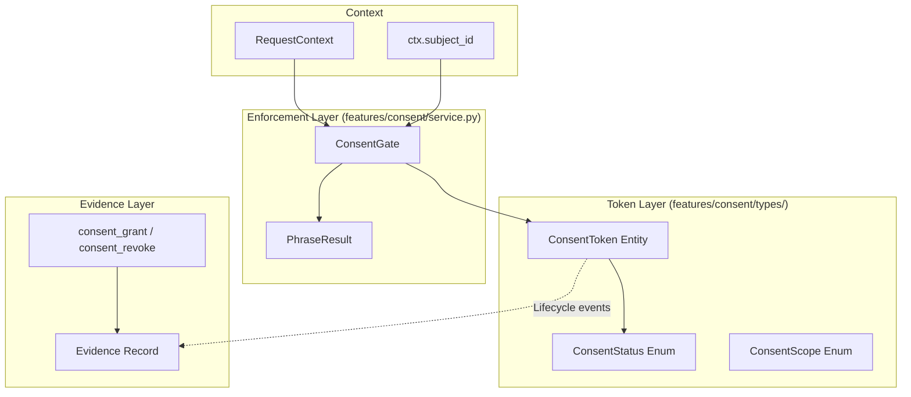
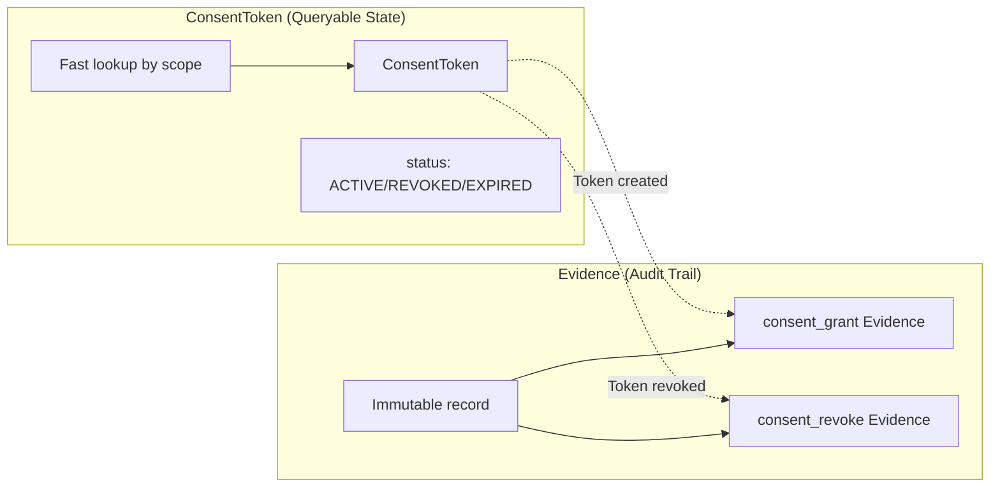
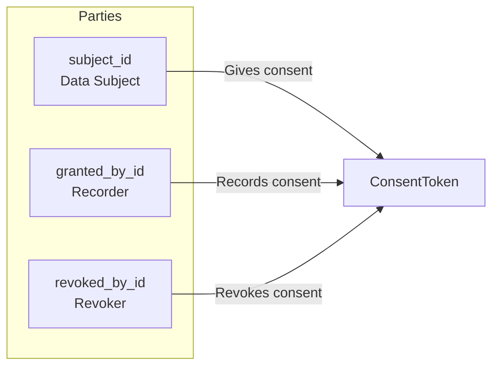
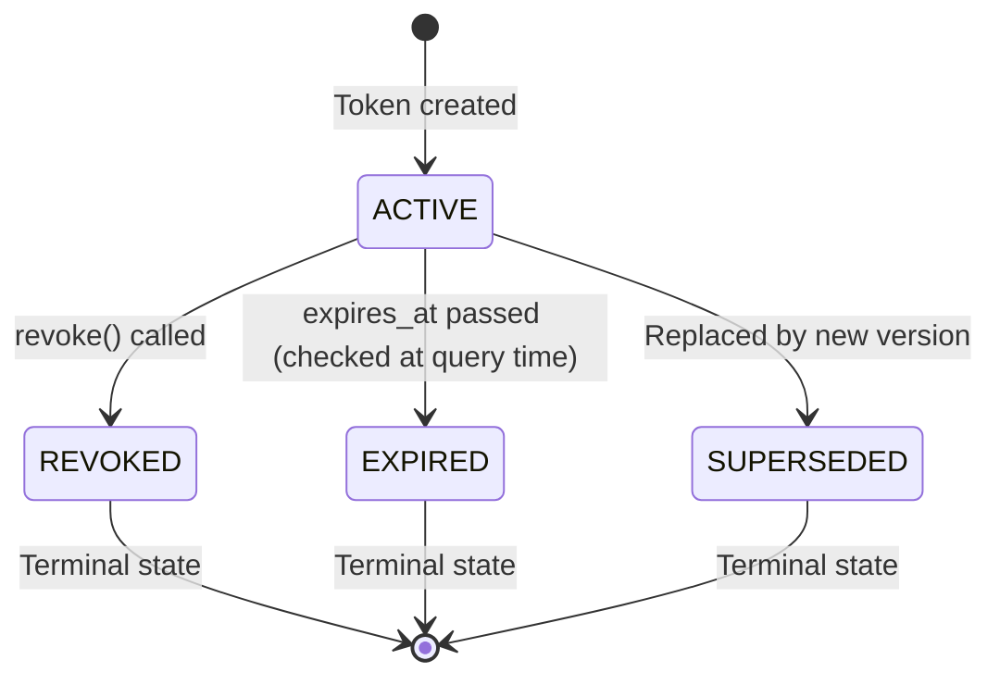
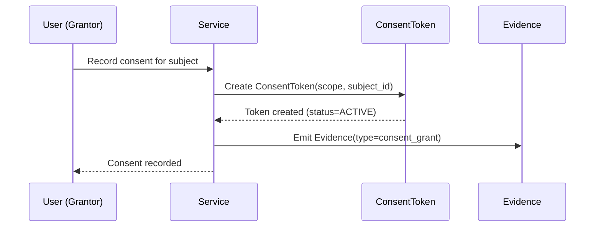
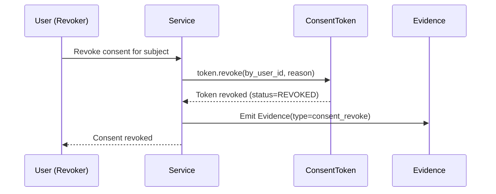
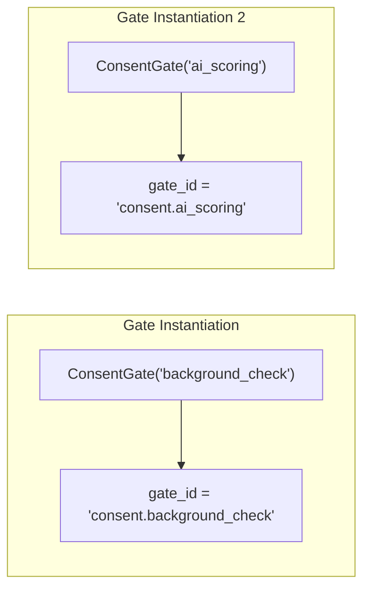
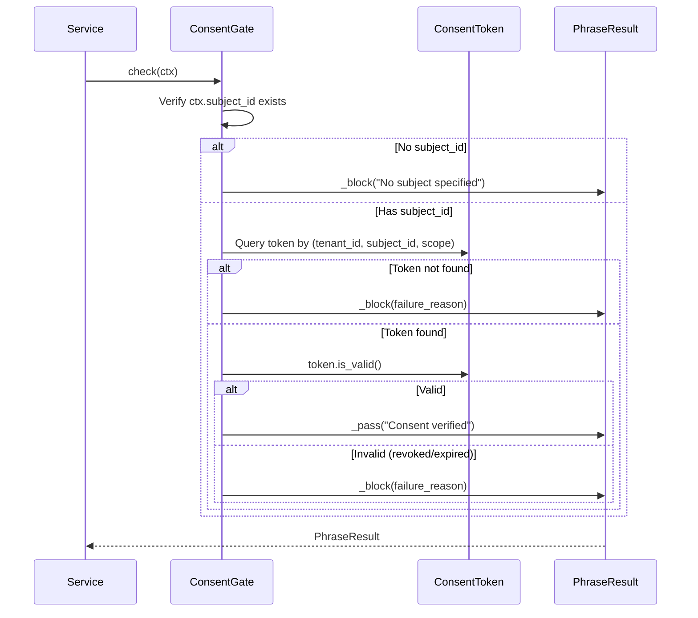

# Technical Design Specification: Consent Management

## 1. Overview

### 1.1 Purpose

Consent management provides **verifiable consent tracking** for data processing in CanonSys. The
ConsentToken entity represents a capability (permission) that gates query to verify consent exists
before processing. This is a foundational compliance requirement for GDPR, FCRA, and emerging AI
regulations.

### 1.2 Scope

This specification covers:

- ConsentToken entity design and lifecycle
- Consent status states and transitions
- ConsentGate parameterized enforcement
- Multi-party consent model (subject, grantor, revoker)
- Integration with Evidence for audit trail
- GDPR and FCRA compliance considerations

### 1.3 Design Principles

1. **Token as Capability**: ConsentToken IS the permission, not just audit evidence
2. **Separate from Evidence**: Token is queryable state; Evidence is historical record
3. **Scope-Based Model**: Consent is per-scope (background_check, ai_scoring), not per-action
4. **Parameterized Gates**: Single ConsentGate implementation, multiple scopes via gate_id
5. **Revocation Audit**: Full audit trail for who, when, and why consent was revoked

## 2. Architecture

### 2.1 Consent System Overview



### 2.2 Module Structure

| Module                             | Purpose                                                   |
| ---------------------------------- | --------------------------------------------------------- |
| `features/consent/types/token.py`  | ConsentToken entity, ConsentTokenContent                  |
| `features/consent/types/status.py` | ConsentStatus enum (ACTIVE, REVOKED, EXPIRED, SUPERSEDED) |
| `features/consent/types/scope.py`  | ConsentScope enum with primary/dependency model           |
| `features/consent/service.py`      | ConsentService and ConsentGate implementation             |
| `features/consent/actions/`        | Action functions: grant, revoke, verify, find, list       |

### 2.3 Token vs Evidence Separation



**Key Design**: ConsentToken is designed for **fast queries** (verify consent exists). Evidence
records are for **audit compliance** (prove consent was given/revoked). They serve different
purposes and are not redundant.

## 3. ConsentToken Entity

### 3.1 Entity Definition

```python
class ConsentTokenContent(ContentModel):  # includes tenant_id, subject_id via consent vocabulary
    """Content for consent tokens.

    ConsentToken is the capability that gates check.
    Evidence records the audit trail separately.

    Lifecycle:
        Token created (ACTIVE) -> Evidence emitted
        Token revoked (REVOKED) -> Evidence emitted (new event, not update)
        Token expires -> checked at query time

    Immutability Note:
        Revocation does NOT update existing record. Create new revocation
        event and update status. For full append-only, use supersession.
    """

    # Consent details
    scope: ConsentScope  # What this permits: background_check, ai_scoring, etc.
    version: str | None = None  # Consent form/policy version

    # Grant info
    granted_at: datetime = Field(default_factory=ln.now_utc)
    granted_by_id: FK[User] | None = None  # Who recorded (may differ from subject)

    # Status
    status: ConsentStatus = ConsentStatus.ACTIVE
    expires_at: datetime | None = None

    # Revocation (creates new evidence event)
    revoked_at: datetime | None = None
    revoked_by_id: FK[User] | None = None
    revocation_reason: str | None = None


@register_entity("consent_tokens")
class ConsentToken(Entity):
    """Entity representing a consent token."""

    content: ConsentTokenContent
```

**Note**: ConsentTokenContent extends `ContentModel` with `tenant_id` and
`subject_id` fields provided by the consent vocabulary package. The entity is registered to the `consent_tokens` table.

### 3.2 Field Reference

| Field               | Type               | Purpose                                                         |
| ------------------- | ------------------ | --------------------------------------------------------------- |
| `tenant_id`         | `FK[Tenant]`       | Tenant isolation (from ContentModel)                            |
| `subject_id`        | `FK[DataSubject]`  | Data subject who granted consent (from ContentModel)            |
| `scope`             | `ConsentScope`     | Processing scope enum (BACKGROUND_CHECK, AI_SCORING, etc)       |
| `version`           | `str \| None`      | Consent form version                                            |
| `granted_at`        | `datetime`         | When consent was granted (defaults to now)                      |
| `granted_by_id`     | `FK[User] \| None` | User who recorded consent                                       |
| `status`            | `ConsentStatus`    | Current state (ACTIVE, REVOKED, EXPIRED, SUPERSEDED)            |
| `expires_at`        | `datetime \| None` | When consent expires                                            |
| `revoked_at`        | `datetime \| None` | When consent was revoked                                        |
| `revoked_by_id`     | `FK[User] \| None` | Who revoked consent                                             |
| `revocation_reason` | `str \| None`      | Why consent was revoked                                         |

### 3.3 Multi-Party Model



| Party            | Field           | Role                                               |
| ---------------- | --------------- | -------------------------------------------------- |
| **Data Subject** | `subject_id`    | The person whose data is processed                 |
| **Grantor**      | `granted_by_id` | User who recorded the consent (HR, recruiter)      |
| **Revoker**      | `revoked_by_id` | User who revoked consent (may be subject or admin) |

This model supports scenarios where:

- Subject grants consent directly (self-service portal)
- HR records consent on behalf of subject (paper form)
- Admin revokes consent on subject's request

## 4. Consent Status

### 4.1 Status Enum

```python
class ConsentStatus(Enum):
    """Consent token lifecycle states."""

    ACTIVE = "active"
    REVOKED = "revoked"
    EXPIRED = "expired"
    SUPERSEDED = "superseded"
```

**Note**: `SUPERSEDED` status is used when a consent token is replaced by a newer version (e.g.,
when consent terms change and require re-consent).

### 4.2 State Transitions



### 4.3 Expiration Behavior

**Design Decision**: Token status remains `ACTIVE` even after `expires_at` passes. Expiration is
checked **at query time** via `is_valid()`:

```python
def is_valid(self, as_of: datetime | None = None) -> bool:
    """Check if this consent token is currently valid.

    A token is valid if:
    - Status is ACTIVE
    - Not expired (if expires_at is set)
    """
    if self.status != ConsentStatus.ACTIVE:
        return False

    check_time = as_of or now_utc()
    if self.expires_at and check_time >= self.expires_at:
        return False

    return True
```

**Rationale**: This avoids background jobs to update status. The database query for valid tokens is:
`status = ACTIVE AND (expires_at IS NULL OR expires_at > now())`.

## 5. Consent Lifecycle

### 5.1 Token Creation



### 5.2 Token Revocation

```python
def revoke(self, by_user_id: FK[User] | None = None, reason: str | None = None) -> None:
    """Revoke this consent token.

    Args:
        by_user_id: User performing the revocation
        reason: Why consent is being revoked
    """
    self.status = ConsentStatus.REVOKED
    self.revoked_at = now_utc()
    self.revoked_by_id = by_user_id
    self.revocation_reason = reason
```



### 5.3 Lifecycle Events Summary

| Event           | Token Change                  | Evidence Emitted           |
| --------------- | ----------------------------- | -------------------------- |
| Consent granted | Create token (status=ACTIVE)  | consent_grant              |
| Consent revoked | Update token (status=REVOKED) | consent_revoke             |
| Consent expired | No change (checked at query)  | consent_expired (optional) |

## 6. ConsentGate - Parameterized Enforcement

### 6.1 Gate Definition

```python
class ConsentGate:
    """Parameterized consent gate.

    Gate ID format: consent.{scope}
    Examples: consent.background_check, consent.ai_scoring

    Usage:
        @gates(hard=["consent.background_check"])
        async def _handle_initiate(self, req, ctx):
            ...
    """

    description: ClassVar[str] = "Verify required consent exists and is valid"

    def __init__(self, scope: str):
        """Create consent gate for a scope."""
        self.scope = scope

    @property
    def gate_id(self) -> str:
        """Dynamic gate ID based on scope."""
        return f"consent.{self.scope}"

    async def check(self, ctx: RequestContext) -> PhraseResult:
        """Check if consent exists for the subject."""
        if ctx.subject_id is None:
            return self._not_applicable("No subject specified for consent check")

        options = VerifyOptions(scope=ConsentScope(self.scope))
        result = await verify_consent_token(options, ctx)

        if result.has_consent:
            return PhraseResult(
                gate=self.gate_id,
                passed=True,
                message=f"Consent verified: {self.scope}",
                checked_at=now_utc(),
                evidence_refs=[str(result.token_id)] if result.token_id else None,
            )

        return PhraseResult(
            gate=self.gate_id,
            passed=False,
            message=f"Consent required: {self.scope}",
            checked_at=now_utc(),
            remediation=f"Obtain {self.scope} consent before proceeding",
        )
```

**Note**: The ConsentGate is fully implemented - it uses `verify_consent_token` action to check
consent and returns evidence refs when consent is found.

### 6.2 Dynamic gate_id Pattern



This allows a single gate implementation to serve multiple consent scopes:

| Scope              | gate_id                    | Use Case                  |
| ------------------ | -------------------------- | ------------------------- |
| `background_check` | `consent.background_check` | FCRA background checks    |
| `ai_scoring`       | `consent.ai_scoring`       | Automated decision-making |
| `data_sharing`     | `consent.data_sharing`     | Third-party data sharing  |
| `marketing`        | `consent.marketing`        | Marketing communications  |

### 6.3 Gate Check Flow



### 6.4 Current Implementation Status

The ConsentGate is **fully implemented** and integrated with the consent service:

```python
# ConsentGate uses verify_consent_token action
options = VerifyOptions(scope=ConsentScope(self.scope))
result = await verify_consent_token(options, ctx)

if result.has_consent:
    return PhraseResult(passed=True, evidence_refs=[str(result.token_id)])
return PhraseResult(passed=False, remediation=f"Obtain {self.scope} consent")
```

The implementation:

1. Uses `verify_consent_token` action for token lookup
2. Checks token validity (status=ACTIVE, not expired)
3. Returns evidence references when consent is found
4. Provides remediation guidance when consent is missing

## 7. Consent Scopes

### 7.1 Standard Scopes

The `ConsentScope` enum defines the standard scopes with a primary/dependency model:

| Scope                         | Regulation           | Processing Type            | Primary |
| ----------------------------- | -------------------- | -------------------------- | ------- |
| `CONSIDERATION_AUTHORIZATION` | FCRA, GDPR           | Primary employment consent | Yes     |
| `AI_SCORING`                  | EU AI Act, NYC LL144 | Automated decision-making  | No      |
| `INTERVIEW_RECORDING`         | Various              | Interview capture          | No      |
| `BACKGROUND_CHECK`            | FCRA                 | Consumer report access     | No      |
| `DATA_PROCESSING`             | GDPR                 | General data processing    | No      |
| `COMMUNICATIONS`              | CAN-SPAM, GDPR       | Marketing communications   | No      |
| `THIRD_PARTY_SHARING`         | GDPR                 | Third-party data transfer  | No      |

**Primary Consent**: `CONSIDERATION_AUTHORIZATION` is the primary consent - must be granted before
any other consent can be granted. Revoking it cascades to all dependent scopes.

### 7.2 Scope Dependencies

**Design Decision**: The system uses a **primary/dependency model** rather than hierarchical
consent. The primary scope (`CONSIDERATION_AUTHORIZATION`) gates all other scopes.

```python
# Primary scope - must be granted first
_PRIMARY_SCOPE = frozenset({
    ConsentScope.CONSIDERATION_AUTHORIZATION,
})

# Dependencies - revoking primary cascades to these
_SCOPE_DEPENDENCIES = {
    ConsentScope.CONSIDERATION_AUTHORIZATION: frozenset({
        ConsentScope.AI_SCORING,
        ConsentScope.INTERVIEW_RECORDING,
        ConsentScope.BACKGROUND_CHECK,
        ConsentScope.DATA_PROCESSING,
        ConsentScope.COMMUNICATIONS,
        ConsentScope.THIRD_PARTY_SHARING,
    }),
}
```

**Cascade Revocation**: When primary consent is revoked, all dependent scopes are automatically
revoked via `cascade_revoke_consent_token` action. Each scope still requires explicit consent, but
the dependency model ensures no orphaned consents.

## 8. Regulatory Compliance

### 8.1 GDPR Requirements

| GDPR Article | Requirement             | Implementation                     |
| ------------ | ----------------------- | ---------------------------------- |
| Art. 7(1)    | Demonstrate consent     | Evidence with consent_grant        |
| Art. 7(2)    | Distinguishable request | Separate scope per processing type |
| Art. 7(3)    | Easy withdrawal         | revoke() method, UI integration    |
| Art. 7(4)    | Freely given            | No service dependency on consent   |

### 8.2 FCRA Requirements

| FCRA Section | Requirement                         | Implementation                           |
| ------------ | ----------------------------------- | ---------------------------------------- |
| 604(b)(2)(A) | Written consent for consumer report | ConsentToken with scope=background_check |
| -            | Before procurement                  | ConsentGate blocks processing            |
| -            | Standalone document                 | Consent form version tracking            |

### 8.3 Consent Form Version Tracking

The `version` field tracks which consent form/terms were agreed to:

```python
token = ConsentToken(
    tenant_id=tenant_id,
    subject_id=person_id,
    scope="background_check",
    version="2026-01-v2",  # Consent form version
    granted_at=now_utc(),
)
```

**Use Case**: When consent terms change, new tokens are required. Old tokens can be audited to show
which terms applied at time of consent.

## 9. Integration Points

### 9.1 Dependencies

| Component                                        | Purpose                               |
| ------------------------------------------------ | ------------------------------------- |
| `canon.entities.entity.Entity`                 | Base entity with persistence          |
| Consent vocabulary (`hub/foundation/packages/consent/`) | Content with tenant_id and subject_id |
| `kron.types.db_types.FK`                         | Type-safe foreign keys                |
| `canon.enforcement.vocabulary`                   | Vocabulary-based enforcement (verify_*/require_* phrases) |
| `canon.enforcement.service.CanonService`    | Service base with gates and evidence  |
| `canon.enforcement.service.RequestContext`  | Context with subject_id               |
| `kron.utils.now_utc()`                            | Timestamp generation                  |

### 9.2 Dependents

| Component                  | Integration                       |
| -------------------------- | --------------------------------- |
| Background check workflows | `ConsentGate("background_check")` |
| AI scoring operations      | `ConsentGate("ai_scoring")`       |
| Evidence creation          | consent_grant evidence type       |
| Data subject rights        | Consent status query              |

### 9.3 Evidence Integration

When consent events occur, Evidence records are emitted:

```python
# Consent grant evidence
Evidence(
    tenant_id=tenant_id,
    evidence_type="consent_grant",
    data={
        "token_id": str(token.id),
        "subject_id": str(token.subject_id),
        "scope": token.scope,
        "version": token.version,
        "granted_at": token.granted_at.isoformat(),
        "granted_by_id": str(token.granted_by_id),
    }
)

# Consent revoke evidence
Evidence(
    tenant_id=tenant_id,
    evidence_type="consent_revoke",
    data={
        "token_id": str(token.id),
        "subject_id": str(token.subject_id),
        "scope": token.scope,
        "revoked_at": token.revoked_at.isoformat(),
        "revoked_by_id": str(token.revoked_by_id),
        "revocation_reason": token.revocation_reason,
    }
)
```

## 10. Usage Patterns

### 10.1 Via @action Decorator

```python
@action(hard_gates=["consent.background_check"])
async def _handle_run_background_check(self, req: RunBackgroundCheckRequest, ctx: RequestContext):
    # Gate automatically checks consent before this runs
    ...
```

### 10.2 Manual Gate Check

```python
gate = ConsentGate("ai_scoring")
result = await gate.check(ctx)
if not result.passed:
    raise ConsentRequired(result.message)
```

### 10.3 Factory-Based Creation

```python
# Register factory (done at module load)
register_gate_factory("consent", ConsentGate, param_count=1)

# Create via factory
gate = create_gate("consent.background_check")  # -> ConsentGate("background_check")
```

## 11. Anti-Patterns

### 11.1 Do NOT

- Store consent as boolean flag on Person entity
- Allow processing without ConsentGate verification
- Assume consent for "similar" scopes
- Skip Evidence emission on consent events
- Hard-delete ConsentTokens (use revocation)

### 11.2 Correct Patterns

- Use ConsentToken as queryable state
- Emit Evidence for all consent lifecycle events
- Require explicit consent per scope
- Track consent form version for audit
- Support multi-party model (subject, grantor, revoker)

## 12. Testing Requirements

| Test Category                   | Coverage Target |
| ------------------------------- | --------------- |
| Token creation                  | 100%            |
| Token revocation                | 100%            |
| is_valid() logic                | 100%            |
| Expiration handling             | 100%            |
| Gate blocking without consent   | 100%            |
| Gate passing with valid consent | 100%            |
| Multi-party scenarios           | 100%            |
| Scope parameterization          | 100%            |

## 13. Open Questions

1. **Consent Service Integration**: How will ConsentGate query ConsentToken? Direct DB query or
   service abstraction? Service abstraction allows caching and cross-service consent checks.

2. **Renewal Flow**: When consent expires, is automatic renewal possible? GDPR suggests "freely
   given" consent should require explicit re-grant.

3. **Hierarchical Consent**: Should `data_processing` consent cover all sub-scopes? Current design
   requires explicit per-scope consent.

4. **Withdrawal Impact**: When consent is revoked, what happens to in-flight operations? Should
   there be a grace period? Processing should stop, but how to handle partial results?

5. **Consent Receipt**: Should there be a ConsentReceipt entity for giving subjects proof of their
   consent?

## 14. Related Surfaces

The following control surfaces use patterns from this design:

| Surface                         | Key Integration                                                                        |
| ------------------------------- | -------------------------------------------------------------------------------------- |
| PII Export Authorization        | `consent_status` fact derived from ConsentToken; consent_age_hours validates freshness |
| Cross-Border Transfer           | ConsentGate verifies data_sharing consent before cross-border transfer                 |
| Biometric Enrollment Bypass     | Identity verification evidence related to consent acknowledgment patterns              |
| Training Data Inclusion         | ConsentScope.AI_SCORING validates consent for AI training data use                     |
| External Sensitive Data Sharing | Consent verification required before external data sharing                             |
| Anonymization Exemption         | Consent scope determines when anonymization can be bypassed                            |

## 15. References

- Consent feature: `hub/foundation/packages/consent/`
- ConsentToken entity: `hub/foundation/packages/consent/types/token.py`
- ConsentScope enum: `hub/foundation/packages/consent/types/scope.py`
- ConsentStatus enum: `hub/foundation/packages/consent/types/status.py`
- ConsentGate: `hub/foundation/packages/consent/service.py`
- ConsentService: `hub/foundation/packages/consent/service.py`
- Actions: `hub/foundation/packages/consent/actions/`
  - `grant_consent_token` - Grant consent for a scope
  - `verify_consent_token` - Verify consent exists and is valid
  - `revoke_consent_token` - Revoke consent with reason
  - `cascade_revoke_consent_token` - Cascade revoke to dependent scopes
  - `find_consent_token` - Find specific consent token
  - `list_consent_tokens` - List tokens for subject
  - `require_valid_consent` - Requirement action for valid consent
  - `require_active_consent` - Requirement action for active consent
- Vocabulary enforcement: `libs/canon/src/canon/enforcement/vocabulary.py`
- CanonService base: `libs/canon/src/canon/enforcement/service.py`
- Related: TDS-008-policy-gates (gate protocol)
- Related: TDS-006-evidence-chain-cep (evidence structure)
