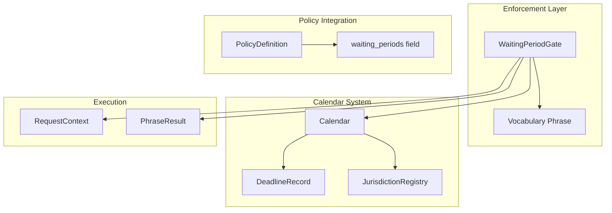
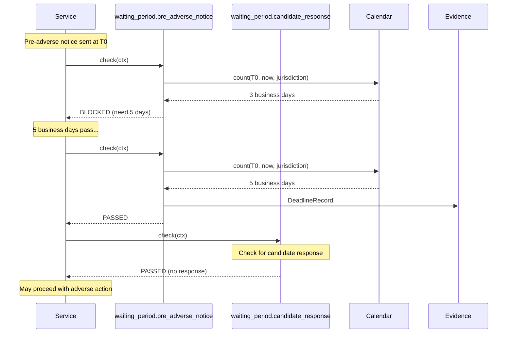
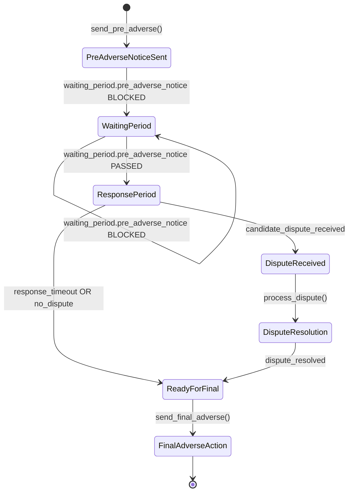

# Technical Design Specification: Waiting Period Enforcement

## 1. Overview

### 1.1 Purpose

Waiting periods are **mandatory delays** between events required by regulatory compliance. The
waiting period system provides the time-based enforcement mechanism for the Decision Kill Chain,
ensuring actions cannot proceed until required waiting periods have elapsed.

### 1.2 Scope

This specification covers:

- WaitingPeriodGate with parameterized gate_id
- Calendar integration for business day calculations
- DeadlineRecord for audit trail
- FCRA adverse action waiting period patterns
- Jurisdiction-aware holiday handling

### 1.3 Design Principles

1. **Business Days, Not Calendar Days**: Regulatory waiting periods use business days
2. **Parameterized**: Single gate class, multiple event types via parameters
3. **Evidence-Grade**: Every calculation produces auditable DeadlineRecord
4. **Jurisdiction-Aware**: Holidays vary by jurisdiction, not hardcoded

## 2. Architecture

### 2.1 Component Relationships



### 2.2 Module Structure

| Module                                  | Purpose                                |
| --------------------------------------- | -------------------------------------- |
| `enforcement/catalog/waiting_period.py` | WaitingPeriodGate implementation       |
| `utils/calendar.py`                     | Business day calculations              |
| `utils/loader.py`                       | JurisdictionRegistry with holidays     |
| `core/policy.py`                        | PolicyDefinition.waiting_periods field |

## 3. WaitingPeriodGate - Parameterized Enforcement

### 3.1 Gate Design

WaitingPeriodGate is **parameterized** by event type and duration, not a static gate:

```python
class WaitingPeriodGate:
    """Enforce mandatory waiting periods between events.

    PARAMETERIZED: event_type and days set at instantiation.

    Per architecture/gate.md Section 4.3:
        predicate: waiting_period_elapsed(event_type, event_time)
        failure_reason: "Mandatory waiting period has not elapsed"
        required_evidence: ["timing_evidence"]
    """

    description = "Enforce mandatory waiting periods"
    required_evidence = ["timing_evidence", "gate_evaluation"]

    def __init__(
        self,
        event_type: str,
        required_days: int,
        reference_time: datetime | None = None,
    ):
        """Initialize with event type and waiting period.

        Args:
            event_type: Type of event (e.g., "adverse_action_notice")
            required_days: Business days to wait
            reference_time: When the waiting period started
        """
        self.event_type = event_type
        self.required_days = required_days
        self.reference_time = reference_time
```

### 3.2 Dynamic gate_id

Unlike static gates, WaitingPeriodGate computes gate_id from parameters:

```python
@property
def gate_id(self) -> str:
    return f"waiting_period.{self.event_type}"

@property
def failure_reason(self) -> str:
    return f"Mandatory {self.required_days} day waiting period has not elapsed"
```

**Examples**:

- `waiting_period.pre_adverse_notice` - FCRA pre-adverse action notice
- `waiting_period.adverse_action_final` - FCRA final adverse action
- `waiting_period.nyc_fair_chance_response` - NYC Fair Chance response period

### 3.3 Factory Registration

Parameterized gates use factory registration:

```python
# Registration at module load
register_gate_factory("waiting_period", WaitingPeriodGate, param_count=2)

# Creation from gate_id
gate = create_gate("waiting_period.adverse_action_notice")
# -> WaitingPeriodGate("adverse_action_notice")
```

### 3.4 Check Implementation

```python
async def check(self, ctx: RequestContext) -> PhraseResult:
    """Check if waiting period has elapsed."""
    if not self.reference_time:
        return self._block("No reference time for waiting period")

    # Use Calendar service for business day calculation
    calendar = await get_calendar_service(ctx)
    elapsed_days = calendar.count(
        self.reference_time.date(),
        ctx.timestamp.date(),
        jurisdiction=ctx.jurisdictions[0] if ctx.jurisdictions else "US",
    )

    if elapsed_days < self.required_days:
        return self._block(
            f"Waiting period: {elapsed_days}/{self.required_days} business days elapsed"
        )

    return self._pass(
        f"Waiting period of {self.required_days} business days elapsed"
    )
```

## 4. Calendar System - Business Day Calculations

### 4.1 Calendar Class

```python
class Calendar:
    """Business day calculator with jurisdiction-specific holidays."""

    def __init__(self, registry: JurisdictionRegistry) -> None:
        self._registry = registry

    def add(self, start: date, days: int, jurisdiction: str) -> date:
        """Add N business days. Supports negative days for backward."""
        if days == 0:
            return start

        code = self._registry.normalize_required(jurisdiction)
        current = start
        remaining = abs(days)
        step = timedelta(days=1) if days > 0 else timedelta(days=-1)

        while remaining > 0:
            current += step
            if current.weekday() < 5 and current not in self._registry.get_holidays(
                code, current.year
            ):
                remaining -= 1

        return current
```

### 4.2 Business Day Rules

```
Business Day Determination:
1. NOT Saturday (weekday >= 5)
2. NOT Sunday (weekday >= 5)
3. NOT in jurisdiction's holiday set for that year

Skip Non-Business Days:
- Loop until remaining business days = 0
- Only decrement remaining for business days
- Step direction determined by sign of days parameter
```

### 4.3 DeadlineRecord - Audit Trail

Every deadline calculation produces an immutable audit record:

```python
@dataclass(frozen=True, slots=True)
class DeadlineRecord:
    """Audit record for deadline calculations."""

    start: date
    """Starting date of calculation."""

    days: int
    """Business days added (can be negative)."""

    result: date
    """Calculated deadline date."""

    jurisdiction: str
    """Jurisdiction code used."""

    holidays_skipped: tuple[date, ...]
    """Holidays that were skipped in calculation."""

    calculated_at: datetime
    """Timestamp of calculation."""

    rule_id: str | None = None
    """Regulatory rule this calculation supports."""

    def to_dict(self) -> dict:
        """Serialize for evidence storage."""
        ...
```

**Why holidays_skipped?**: If holiday data is updated after calculation, this record proves the
calculation was correct at the time. The holidays that were skipped are part of the evidence.

### 4.4 Audited Calculation

```python
def add_audited(
    self,
    start: date,
    days: int,
    jurisdiction: str,
    rule_id: str | None = None,
) -> tuple[date, DeadlineRecord]:
    """Add business days with audit record.

    Returns:
        Tuple of (result_date, DeadlineRecord)
    """
    code = self._registry.normalize_required(jurisdiction)
    result = self.add(start, days, code)

    # Find which holidays were in the range
    holidays_in_range = []
    lo, hi = (
        (start + timedelta(days=1), result)
        if days >= 0
        else (result, start - timedelta(days=1))
    )
    current = lo
    while current <= hi:
        if current in self._registry.get_holidays(code, current.year):
            holidays_in_range.append(current)
        current += timedelta(days=1)

    return result, DeadlineRecord(
        start=start,
        days=days,
        result=result,
        jurisdiction=code,
        holidays_skipped=tuple(sorted(holidays_in_range)),
        calculated_at=now_utc(),
        rule_id=rule_id,
    )
```

### 4.5 Additional Calendar Operations

```python
def count(self, start: date, end: date, jurisdiction: str) -> int:
    """Count business days in [start, end)."""

def is_business_day(self, d: date, jurisdiction: str) -> bool:
    """Check if date is a business day."""

def holidays(self, year: int, jurisdiction: str) -> frozenset[date]:
    """Get holidays for a year and jurisdiction."""
```

## 5. Policy Integration

### 5.1 PolicyDefinition.waiting_periods

```python
class PolicyDefinition(Entity):
    # ...
    waiting_periods: dict[str, str] = Field(default_factory=dict)
    """Mandatory delays: event_type -> duration (e.g., {'PRE_ADVERSE_NOTICE': '3_BUSINESS_DAYS'})."""
```

### 5.2 Example Policy Configuration

```yaml
# FCRA Adverse Action Policy
policy_id: us.fcra.adverse_action
waiting_periods:
  PRE_ADVERSE_NOTICE: "5_BUSINESS_DAYS"
  DISPUTE_RESPONSE: "30_CALENDAR_DAYS"
  FINAL_ADVERSE_ACTION: "0_DAYS" # After waiting period
```

### 5.3 Duration Parsing

```python
def parse_duration(duration_str: str) -> tuple[int, str]:
    """Parse duration string to (days, day_type).

    Examples:
        "5_BUSINESS_DAYS" -> (5, "business")
        "30_CALENDAR_DAYS" -> (30, "calendar")
        "3_DAYS" -> (3, "business")  # Default to business
    """
    parts = duration_str.upper().split("_")
    if len(parts) >= 2:
        days = int(parts[0])
        if "CALENDAR" in parts:
            return (days, "calendar")
        return (days, "business")
    return (int(parts[0]), "business")
```

## 6. FCRA Adverse Action Pattern

### 6.1 FCRA Waiting Period Requirements

```
FCRA Section 604(b)(3) - Adverse Action Process:

1. PRE-ADVERSE ACTION NOTICE
   - Send to candidate with background report copy
   - Wait 5 business days (some jurisdictions require more)

2. CANDIDATE RESPONSE PERIOD
   - Candidate can dispute findings
   - Must wait for response or timeout

3. FINAL ADVERSE ACTION
   - After waiting period, may proceed with adverse action
   - Must send final adverse action notice
```

### 6.2 Gate Sequence



### 6.3 State Machine



## 7. Jurisdiction-Aware Holidays

### 7.1 Holiday Data Structure

```python
# JurisdictionRegistry holiday storage
holidays: dict[str, dict[int, frozenset[date]]]
# jurisdiction_code -> year -> set of holiday dates
```

### 7.2 Holiday Normalization

```python
def normalize_required(self, code: str) -> str:
    """Normalize jurisdiction code to canonical form.

    Examples:
        "us-nyc" -> "US-NYC"
        "NYC" -> "US-NYC"
        "nyc" -> "US-NYC"

    Raises:
        UnknownJurisdictionError if code not recognized
    """
```

### 7.3 Example Holiday Sets

```python
# US Federal Holidays (baseline)
US_FEDERAL_2026 = frozenset({
    date(2026, 1, 1),   # New Year's Day
    date(2026, 1, 19),  # MLK Day
    date(2026, 2, 16),  # Presidents Day
    date(2026, 5, 25),  # Memorial Day
    date(2026, 7, 3),   # Independence Day (observed)
    date(2026, 9, 7),   # Labor Day
    date(2026, 10, 12), # Columbus Day
    date(2026, 11, 11), # Veterans Day
    date(2026, 11, 26), # Thanksgiving
    date(2026, 12, 25), # Christmas
})

# NYC adds additional days
US_NYC_2026 = US_FEDERAL_2026 | frozenset({
    date(2026, 11, 27),  # Day after Thanksgiving (city offices closed)
})
```

## 8. Evidence Integration

### 8.1 Gate Result with Deadline Evidence

```python
# When waiting period gate passes
result = PhraseResult(
    gate="waiting_period.pre_adverse_notice",
    passed=True,
    message="Waiting period of 5 business days elapsed",
    checked_at=now_utc(),
    policy_id="us.fcra.adverse_action",
    jurisdiction="US-NYC",
    regulation="15 U.S.C. Section 1681b(b)(3)",
)

# Deadline record stored in evidence
evidence_data = {
    "gate_result": result.to_dict(),
    "deadline_calculation": deadline_record.to_dict(),
}
```

### 8.2 Deadline Record in Evidence

```json
{
  "start": "2026-01-10",
  "days": 5,
  "result": "2026-01-17",
  "jurisdiction": "US-NYC",
  "holidays_skipped": ["2026-01-19"],
  "calculated_at": "2026-01-17T14:30:00Z",
  "rule_id": "fcra.pre_adverse_notice"
}
```

## 9. Edge Cases and Handling

### 9.1 Reference Time Required

```python
if not self.reference_time:
    return self._block("No reference time for waiting period")
```

**Design decision**: Gate blocks if no reference time. Cannot evaluate waiting period without
knowing when the period started.

### 9.2 Cross-Timezone Handling

```python
# Reference time should be in UTC
# Jurisdiction determines business day calendar
# Use jurisdiction of the action, not the candidate

# Example: Notice sent from NYC office, candidate in LA
# -> Use NYC calendar (action location)
```

### 9.3 End-of-Period on Holiday

```python
# If calculated end date lands on a holiday, it extends to next business day
# This is handled implicitly by Calendar.add() - it only counts business days
# So "5 business days from Monday" = "next Friday" (no holidays)
# But "5 business days from Monday" with Wednesday holiday = "following Monday"
```

### 9.4 Partial Day Handling

```python
# Currently: Calendar works with dates, not datetimes
# Notice sent at 11:59pm on Jan 10 = start date Jan 10
# First business day counted is Jan 11

# Future consideration: Time-of-day cutoffs
# Some regulations specify "by close of business"
```

## 10. Integration Points

### 10.1 Dependencies

| Component              | Location               | Purpose                                  |
| ---------------------- | ---------------------- | ---------------------------------------- |
| Vocabulary phrases     | `enforcement/vocabulary.py` | Vocabulary-based enforcement (verify_*/require_*) |
| `JurisdictionRegistry` | `utils/loader.py`      | Holiday data provider                    |
| `RequestContext`       | `enforcement/types.py` | Context with timestamp and jurisdictions |
| `PhraseResult`         | `kron.specs.phrase`    | Result structure                         |

### 10.2 Dependents

| Component                    | Purpose                       |
| ---------------------------- | ----------------------------- |
| FCRA adverse action workflow | Requires pre-adverse waiting  |
| NYC Fair Chance Act          | Requires Article 23-A waiting |
| Any timed compliance         | Uses waiting period gates     |

## 11. Anti-Patterns

### 11.1 Do NOT

- Use calendar days instead of business days for regulatory requirements
- Hardcode holidays (use JurisdictionRegistry)
- Skip DeadlineRecord creation for auditable calculations
- Evaluate waiting period without reference_time
- Use gate without jurisdiction context

### 11.2 Correct Patterns

- Always use Calendar.add_audited() for evidence-grade calculations
- Pass jurisdiction from RequestContext
- Store DeadlineRecord in Evidence
- Use factory registration for parameterized gates
- Block on missing reference_time

## 12. Testing Requirements

| Test Category             | Coverage Target |
| ------------------------- | --------------- |
| Business day calculation  | 100%            |
| Holiday skipping          | 100%            |
| Bidirectional calculation | 100%            |
| Cross-year boundary       | 100%            |
| Jurisdiction lookup       | 100%            |
| DeadlineRecord generation | 100%            |
| Gate factory creation     | 100%            |
| Missing reference_time    | 100%            |

## 13. Open Questions

1. **Reference time population**: How is reference_time populated? Should gate look up "when was
   notice sent" from Evidence automatically?

2. **Cross-timezone handling**: If notice sent in NYC but applicant in LA, which timezone applies
   for determining the date?

3. **Holiday update handling**: If holidays are updated after calculation, should we recalculate?
   (DeadlineRecord captures this for audit, but what about pending waits?)

4. **Partial day handling**: If notice sent at 11pm, does that day count? Need time-of-day cutoff
   rules.

5. **Weekend-adjacent handling**: If required period ends on Monday and it's a holiday, the
   extension is automatic via business day calculation. Is this always correct?

## 14. Related Surfaces

The following control surfaces use patterns from this design:

| Surface                       | Key Integration                                          |
| ----------------------------- | -------------------------------------------------------- |
| Visa Sponsorship Termination  | WaitingPeriodGate enforces grace period; USCIS deadlines |
| Severance Agreement Execution | OWBPA 21/45-day periods via Calendar                     |
| Layoff RIF Inclusion          | WARN Act 60-day notice via WaitingPeriodGate             |
| PII Export Authorization      | Time-based consent age constraint                        |
| Bias Assessment Waiver        | NYC LL144 audit timing with business days                |
| Litigation Hold Release       | Legal waiting period enforcement                         |

## 15. References

- WaitingPeriodGate: `libs/canon/src/canon/enforcement/catalog/waiting_period.py`
- Calendar: `libs/canon/src/canon/utils/calendar.py`
- JurisdictionRegistry: `libs/canon/src/canon/utils/loader.py`
- PolicyDefinition: `libs/canon/src/canon/entities/policy/definition.py`
- Vocabulary enforcement: `libs/canon/src/canon/enforcement/vocabulary.py`
- PhraseResult: `libs/kron/src/kron/specs/phrase.py`
- RequestContext: `libs/canon/src/canon/enforcement/types.py`
- Related: TDS-008-policy-gates (gate system)
- Related: TDS-012-single-enforcement (gate execution)
