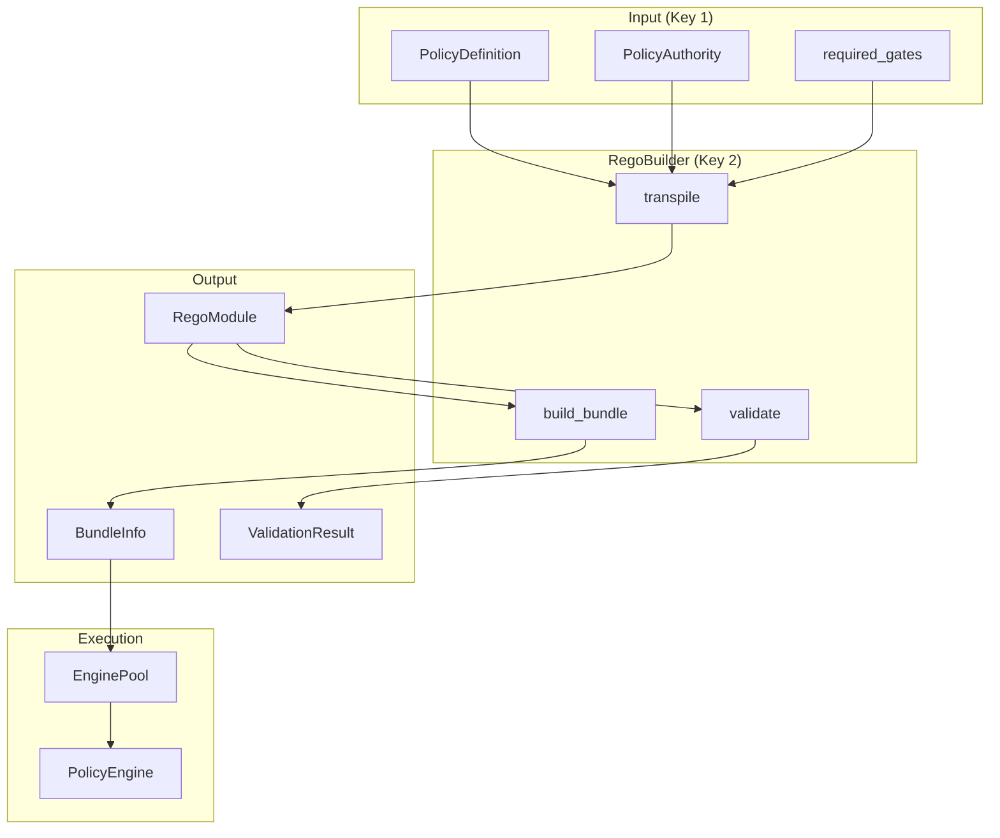
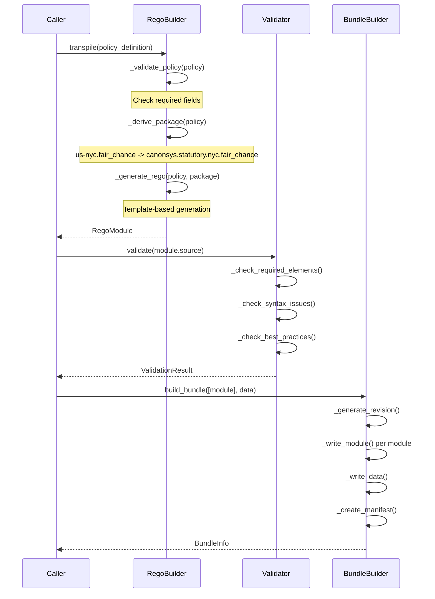

# Technical Design Specification: Rego Builder

## 1. Overview

### 1.1 Purpose

RegoBuilder **transpiles** PolicyDefinition to executable Rego source code, implementing Key 2 of
the Two-Key Model. Legal defines WHAT is required (PolicyDefinition), Engineering defines HOW
(RegoBuilder transpilation). Neither key alone can modify enforcement behavior.

### 1.2 Scope

This specification covers:

- PolicyDefinition to Rego transpilation
- Two-Key Model enforcement pattern
- Fail-closed default generation (`default allow := false`)
- OPA bundle building
- Rego validation
- Generated Rego structure and contracts

### 1.3 Design Principles

1. **Two-Key Model**: Legal's PolicyDefinition + Engineering's RegoBuilder = enforcement
2. **Transpile, Not Interpret**: Rego is generated at deploy time, not runtime
3. **Fail-Closed Default**: Generated Rego always includes `default allow := false`
4. **Structured Output**: Generated Rego produces evidence-grade output contracts

## 2. Architecture

### 2.1 Two-Key Model

```
┌─────────────────────────────────────────────────────────────────┐
│                      TWO-KEY MODEL                              │
├─────────────────────────────────────────────────────────────────┤
│                                                                 │
│   KEY 1: PolicyDefinition          KEY 2: RegoBuilder           │
│   (Legal Owns)                     (Engineering Owns)           │
│   ┌─────────────────┐              ┌─────────────────┐          │
│   │ • policy_id     │              │ • transpile()   │          │
│   │ • jurisdictions │      +       │ • validate()    │          │
│   │ • required_gates│              │ • build_bundle()│          │
│   │ • authority     │              │ • templates     │          │
│   └─────────────────┘              └─────────────────┘          │
│           │                                │                    │
│           └────────────┬───────────────────┘                    │
│                        ▼                                        │
│              ┌─────────────────┐                                │
│              │ Executable Rego │                                │
│              │ (Enforcement)   │                                │
│              └─────────────────┘                                │
│                                                                 │
│   Neither key alone can modify enforcement behavior.            │
│   Both must align for policy to be active.                      │
│                                                                 │
└─────────────────────────────────────────────────────────────────┘
```

### 2.2 Component Relationships



### 2.3 Module Structure

| Module                      | Purpose                             |
| --------------------------- | ----------------------------------- |
| `utils/opa/rego_builder.py` | RegoBuilder, RegoModule, BundleInfo |
| `utils/opa/engine.py`       | PolicyEngine, EnginePool            |
| `core/policy.py`            | PolicyDefinition (Key 1 input)      |

## 3. RegoBuilder Implementation

### 3.1 Core Interface

```python
class RegoBuilder:
    """Transpiles PolicyDefinition to Rego source code.

    The RegoBuilder translates PolicyDefinition (Legal's language) to
    Rego (Engineering's execution). Maintains the Two-Key Model where
    both Legal and Engineering must approve policy changes.
    """

    GENERATOR_VERSION = "canonsys.rego_builder.v1"
    REGO_IMPORT = "import rego.v1"

    def transpile(self, policy: PolicyDefinition) -> RegoModule:
        """Generate Rego module from PolicyDefinition."""

    def validate(self, rego_source: str) -> ValidationResult:
        """Validate Rego syntax and semantics."""

    def build_bundle(
        self,
        modules: list[RegoModule],
        data: dict[str, Any] | None = None,
        output_path: str | None = None,
    ) -> BundleInfo:
        """Build OPA bundle from modules and data."""
```

### 3.2 Transpilation Flow



## 4. Output Types

### 4.1 RegoModule

```python
@dataclass(frozen=True, slots=True)
class RegoModule:
    """Generated Rego module from PolicyDefinition."""

    package: str
    """Rego package name (e.g., 'canonsys.statutory.nyc.fair_chance')."""

    source: str
    """Rego source code."""

    policy_id: str
    """Source PolicyDefinition.policy_id."""

    version: str
    """Source PolicyDefinition.version."""

    generated_at: datetime
    """When module was generated."""

    metadata: dict[str, Any] = field(default_factory=dict)

    @property
    def filename(self) -> str:
        """Generate filename from package name.
        canonsys.statutory.nyc.fair_chance -> fair_chance.rego
        """

    @property
    def relative_path(self) -> str:
        """Generate relative path from package name.
        canonsys.statutory.nyc.fair_chance -> canonsys/statutory/nyc/fair_chance.rego
        """
```

### 4.2 ValidationResult

```python
@dataclass(frozen=True, slots=True)
class ValidationResult:
    """Result of Rego validation."""

    valid: bool
    """True if no errors (warnings OK)."""

    issues: tuple[ValidationIssue, ...] = field(default_factory=tuple)
    """Validation issues found."""

    parsed_at: datetime | None = None

    @property
    def errors(self) -> list[ValidationIssue]:
        """Get only error-level issues."""

    @property
    def warnings(self) -> list[ValidationIssue]:
        """Get only warning-level issues."""
```

### 4.3 BundleInfo

```python
@dataclass(frozen=True, slots=True)
class BundleInfo:
    """Information about a built policy bundle."""

    revision: str
    """Bundle revision string (e.g., '2026.01.15-a7f3c821')."""

    path: str
    """Path to bundle on disk."""

    loaded_at: datetime
    policy_count: int = 0
    roots: tuple[str, ...] = ("canonsys",)
    metadata: dict[str, Any] = field(default_factory=dict)

    @property
    def hash(self) -> str:
        """Policy library hash for evidence."""
        return f"sha256:{self.revision}"
```

## 5. Package Naming Convention

### 5.1 Derivation Rules

```python
def _derive_package(self, policy: PolicyDefinition) -> str:
    """Derive Rego package name from PolicyDefinition.

    Package naming convention:
        canonsys.statutory.{jurisdiction}.{domain}

    Examples:
        us-nyc.fair_chance.adverse_action -> canonsys.statutory.nyc.fair_chance
        us.fcra.background_check -> canonsys.statutory.us.fcra
    """
```

### 5.2 Transformation Rules

```
policy_id format: {jurisdiction}.{domain}.{rule}

Transformation:
1. jurisdiction: us-nyc -> nyc (take locality if present)
2. jurisdiction: us -> us (use as-is if no locality)
3. domain: normalize to snake_case
4. rule: dropped (not in package name)

Result: canonsys.statutory.{jurisdiction}.{domain}
```

### 5.3 Examples

| policy_id                           | package                               |
| ----------------------------------- | ------------------------------------- |
| `us-nyc.fair_chance.adverse_action` | `canonsys.statutory.nyc.fair_chance` |
| `us.fcra.background_check`          | `canonsys.statutory.us.fcra`         |
| `eu-de.gdpr.consent`                | `canonsys.statutory.de.gdpr`         |

## 6. Generated Rego Structure

### 6.1 Template Sections

The generated Rego follows a structured template:

```rego
# Generated from PolicyDefinition: {policy_id} v{version}
# Generated at: {timestamp}
# Generator: canonsys.rego_builder.v1
#
# DO NOT EDIT - This file is auto-generated from PolicyDefinition.
# Changes should be made to the PolicyDefinition entity.

package canonsys.statutory.{jurisdiction}.{domain}

import rego.v1

# =============================================================================
# Metadata (from PolicyDefinition)
# =============================================================================
metadata := { ... }

# =============================================================================
# Applicability (from scope, jurisdictions, action_types)
# =============================================================================
default applicable := false

applicable if { ... }

is_effective if { ... }

# =============================================================================
# Gate Requirements (from required_gates)
# =============================================================================
required_gates := [...]

# =============================================================================
# Main Evaluation
# =============================================================================
default allow := false

allow if {
    applicable
    gates_passed
    not deny
}

gates_passed if {
    every gate_id in required_gates {
        gate_result_passed(gate_id)
    }
}

gate_result_passed(gate_id) if {
    some result in input.gate_results
    result.gate == gate_id
    result.passed == true
}

# =============================================================================
# Deny Conditions (explicit blocks)
# =============================================================================
default deny := false

deny if { ... }

# =============================================================================
# Deny Reasons (for evidence)
# =============================================================================
deny_reasons contains reason if { ... }

# =============================================================================
# Structured Output (for Evidence integration)
# =============================================================================
gate_output := { ... }
```

### 6.2 Fail-Closed Default

**Critical**: All generated Rego includes fail-closed defaults:

```rego
default allow := false
default deny := false
default applicable := false
```

This ensures:

- Undefined input = deny
- Missing gate results = deny
- Parse errors = deny

### 6.3 Gate Composition in Rego

Gates are composed using Rego's `every` keyword:

```rego
gates_passed if {
    every gate_id in required_gates {
        gate_result_passed(gate_id)
    }
}

gate_result_passed(gate_id) if {
    some result in input.gate_results
    result.gate == gate_id
    result.passed == true
}
```

**Design decision**: Gate composition happens in Rego, not Python. This ensures consistent
enforcement regardless of calling code.

### 6.4 Structured Output Contract

```rego
gate_output := {
    "gate_id": concat(".", ["policy", metadata.policy_id]),
    "passed": allow,
    "message": output_message,
    "policy_id": metadata.policy_id,
    "policy_version": metadata.version,
    "jurisdiction": metadata.authority.jurisdiction_code,
    "regulation": metadata.authority.citation,
    "deny_reasons": deny_reasons,
    "gates_evaluated": required_gates,
    "applicable": applicable,
}
```

This structured output integrates directly with the Evidence system.

## 7. Validation

### 7.1 Required Elements (Errors)

```python
def _check_required_elements(self, source: str, lines: list[str]) -> list[ValidationIssue]:
    # Must have package declaration
    if not re.search(r"^\s*package\s+\S+", source, re.MULTILINE):
        issues.append(ValidationIssue(
            severity=ValidationSeverity.ERROR,
            message="Missing package declaration",
            rule="required-package",
        ))

    # Must have default allow (fail-closed)
    if "default allow" not in source:
        issues.append(ValidationIssue(
            severity=ValidationSeverity.ERROR,
            message="Missing 'default allow := false' - fail-closed semantics required",
            rule="fail-closed",
        ))
```

### 7.2 Best Practices (Warnings)

```python
def _check_best_practices(self, source: str, lines: list[str]) -> list[ValidationIssue]:
    # Should have metadata
    if "metadata :=" not in source:
        issues.append(ValidationIssue(
            severity=ValidationSeverity.WARNING,
            message="Missing metadata object - recommended for audit trail",
            rule="best-practice-metadata",
        ))

    # Should have deny_reasons
    if "deny_reasons" not in source:
        issues.append(ValidationIssue(
            severity=ValidationSeverity.WARNING,
            message="Missing deny_reasons - recommended for evidence generation",
            rule="best-practice-deny-reasons",
        ))

    # Should import rego.v1
    if "import rego.v1" not in source:
        issues.append(ValidationIssue(
            severity=ValidationSeverity.WARNING,
            message="Missing 'import rego.v1' - recommended for modern Rego syntax",
            rule="rego-v1",
        ))
```

### 7.3 Validation Result Handling

```python
validation = builder.validate(module.source)

if not validation.valid:
    # Errors present - cannot deploy
    for error in validation.errors:
        log.error(f"Rego error: {error.message} at line {error.line}")
    raise TranspilationError(policy.policy_id, "Validation failed")

if validation.warnings:
    # Warnings present - log but proceed
    for warning in validation.warnings:
        log.warning(f"Rego warning: {warning.message}")
```

## 8. Bundle Building

### 8.1 Bundle Structure

```
{output_path}/
├── .manifest
├── canonsys/
│   └── statutory/
│       ├── nyc/
│       │   └── fair_chance.rego
│       └── us/
│           └── fcra.rego
└── data/
    ├── holidays/
    │   ├── us.json
    │   └── nyc.json
    └── jurisdictions.json
```

### 8.2 Manifest Format

```json
{
  "revision": "2026.01.15-a7f3c821",
  "rego_version": 1,
  "roots": ["canonsys"],
  "metadata": {
    "policy_library_version": "1.0.0",
    "generated_at": "2026-01-15T14:30:00Z",
    "generator": "canonsys.rego_builder.v1",
    "policy_count": 5,
    "policies": [
      { "policy_id": "us-nyc.fair_chance.adverse_action", "version": "1.0.0" },
      { "policy_id": "us.fcra.background_check", "version": "2.1.0" }
    ]
  },
  "wasm": []
}
```

### 8.3 Revision Generation

```python
def _generate_revision(self, modules: list[RegoModule]) -> str:
    """Generate bundle revision from modules."""
    # Combine policy_ids and versions for deterministic hash
    content = ";".join(
        f"{m.policy_id}:{m.version}"
        for m in sorted(modules, key=lambda x: x.policy_id)
    )
    hash_suffix = compute_hash(content)[:8]
    date_prefix = now_utc().strftime("%Y.%m.%d")
    return f"{date_prefix}-{hash_suffix}"
```

**Determinism**: Same set of policies at same versions = same revision hash.

### 8.4 Data Files

Static data (holidays, jurisdictions) is embedded in the bundle:

```python
def build_bundle(
    self,
    modules: list[RegoModule],
    data: dict[str, Any] | None = None,
    output_path: str | None = None,
) -> BundleInfo:
    """Build OPA bundle from modules and data.

    Args:
        modules: List of Rego modules
        data: Static data (holidays, jurisdictions) - keys become filenames
        output_path: Where to write bundle (uses temp dir if None)
    """
```

## 9. Integration with PolicyEngine

### 9.1 Bundle Loading

```python
# Build bundle
bundle = builder.build_bundle(modules, data={"holidays": holidays_data})

# Load into engine pool
config = EnginePoolConfig(
    policies_path=Path(bundle.path),
    size=4,
    fail_closed=True,
)
pool = EnginePool(config)
pool.initialize()

# Create policy engine
engine = PolicyEngine(pool, fail_closed=True)
```

### 9.2 Policy Evaluation

```python
# Create resolved policy from bundle
resolved = ResolvedPolicy(
    policy_id="us-nyc.fair_chance.adverse_action",
    rego_package="canonsys.statutory.nyc.fair_chance",
    enforcement=EnforcementLevel.HARD_MANDATORY,
)

# Evaluate
result = await engine.evaluate_single(resolved, input_data)
```

## 10. Error Handling

### 10.1 TranspilationError

```python
class TranspilationError(CanonError):
    """Raised when PolicyDefinition cannot be transpiled to Rego."""

    def __init__(self, policy_id: str, reason: str):
        self.policy_id = policy_id
        self.reason = reason
        super().__init__(f"Failed to transpile {policy_id}: {reason}")
```

### 10.2 BundleError

```python
class BundleError(CanonError):
    """Raised when bundle building fails."""

    def __init__(self, path: str | None, reason: str):
        self.path = path
        self.reason = reason
        super().__init__(f"Failed to build bundle at {path}: {reason}")
```

### 10.3 Validation During Transpilation

```python
def _validate_policy(self, policy: PolicyDefinition) -> None:
    """Validate PolicyDefinition has required fields for transpilation."""
    if not policy.policy_id:
        raise TranspilationError("<unknown>", "policy_id is required")

    if not policy.version:
        raise TranspilationError(policy.policy_id, "version is required")

    if not policy.name:
        raise TranspilationError(policy.policy_id, "name is required")
```

## 11. Integration Points

### 11.1 Dependencies

| Component                           | Location            | Purpose                          |
| ----------------------------------- | ------------------- | -------------------------------- |
| `PolicyDefinition`                  | `core/policy.py`    | Source for transpilation (Key 1) |
| `compute_hash`                      | `utils/__init__.py` | Revision generation              |
| `TranspilationError`, `BundleError` | `exceptions.py`     | Error types                      |
| `kron.utils.now_utc`                | kron package        | Timestamp generation             |

### 11.2 Dependents

| Component               | Location              | Purpose                |
| ----------------------- | --------------------- | ---------------------- |
| `PolicyEngine`          | `utils/opa/engine.py` | Loads built bundles    |
| Policy release workflow | deployment scripts    | Transpiles and bundles |
| TDS-009-opa             | design docs           | Uses generated Rego    |

## 12. Anti-Patterns

### 12.1 Do NOT

- Edit generated Rego files directly (edit PolicyDefinition)
- Skip validation before bundle building
- Use non-deterministic revision generation
- Omit `default allow := false`
- Generate Rego without `import rego.v1`

### 12.2 Correct Patterns

- Always edit PolicyDefinition, regenerate Rego
- Validate all modules before bundling
- Use deterministic hash-based revisions
- Include fail-closed defaults in all templates
- Use modern Rego v1 syntax

## 13. Testing Requirements

| Test Category           | Coverage Target |
| ----------------------- | --------------- |
| Package derivation      | 100%            |
| Template generation     | 100%            |
| Validation rules        | 100%            |
| Bundle structure        | 100%            |
| Revision determinism    | 100%            |
| Error conditions        | 100%            |
| Two-Key Model integrity | 100%            |

## 14. Open Questions

1. **Full AST validation**: Should we use `opa check` or regorus parser for complete syntax
   validation instead of regex?

2. **Incremental updates**: Can bundles be updated incrementally or always full rebuild?

3. **WASM compilation**: Should bundles include WASM-compiled policies for performance?

4. **Hot reload**: How to reload policies without service restart?

5. **Multi-tenant bundles**: One bundle per tenant or shared bundle with tenant data injection?

## 15. Related Surfaces

The following control surfaces use patterns from this design:

| Surface                      | Key Integration                                                                                         |
| ---------------------------- | ------------------------------------------------------------------------------------------------------- |
| All Surfaces                 | RegoBuilder transpiles PolicyDefinition to executable Rego for every control surface's `policy_package` |
| PII Export Authorization     | `data.pii_export` package generated from PolicyDefinition with fail-closed defaults                     |
| Visa Sponsorship Termination | `hr.visa_sponsorship_termination` package includes deny-only rules and structured output                |
| Biometric Enrollment Bypass  | `identity.biometric_bypass` package with parameterized gates and config-driven thresholds               |

Note: RegoBuilder is infrastructure that generates Rego for ALL control surfaces. Every surface with
a `policy:` section in its registry entry uses RegoBuilder to transpile PolicyDefinition to
executable Rego.

## 16. References

- RegoBuilder: `libs/canon/src/canon/utils/opa/rego_builder.py`
- PolicyDefinition: `libs/canon/src/canon/entities/policy/definition.py`
- PolicyEngine: `libs/canon/src/canon/utils/opa/engine.py`
- PolicyResolver: `libs/canon/src/canon/utils/opa/resolver.py`
- OPAGate: `libs/canon/src/canon/utils/opa/gate.py`
- Related: TDS-009-opa (engine integration)
- Related: TDS-011-policy-resolution (creates ResolvedPolicy)
