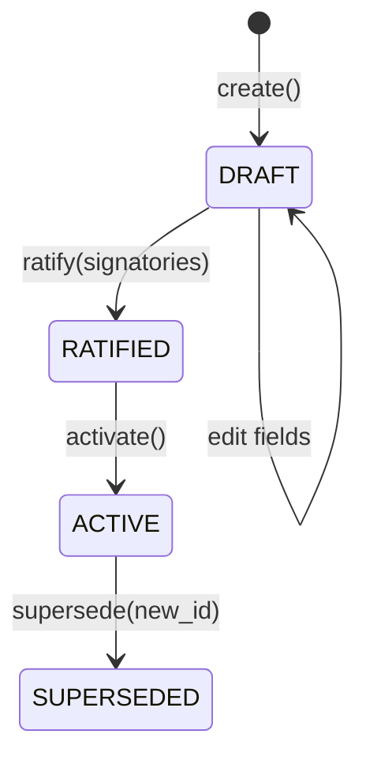

# ADR-025: Charter - Constraints Must Have Enforcement Binding

## Context

### Problem Statement

CanonSys uses a Charter entity to define tenant-scoped governance. The Charter establishes which
policies are active, who can perform which actions (roles), and what constraints must be enforced. A
critical question arises: **What makes a constraint a constraint?**

**Why This Matters**: In many governance systems, constraints are aspirational statements that sound
good but are unenforceable:

- "We will protect employee privacy"
- "All decisions will be fair and unbiased"
- "Due process will be followed"

When litigation occurs, opposing counsel asks: "How did your system enforce this constraint?" If the
answer is "we trusted people to follow it," the constraint has no legal value. CanonSys requires
constraints that are both documented AND enforced.

### Background

**Current State**: The Charter sits above individual policies, establishing:

- Which policies are active for the tenant (`policy_ids`)
- Who can perform which actions (`roles`)
- What constraints must be enforced (`constraints`)

**Driving Forces**:

- **Legal defensibility**: Constraints must be provable in court - not just documented, but enforced
- **Operational clarity**: Developers must know exactly what to enforce, not interpret vague
  statements
- **Audit completeness**: Auditors must trace constraint -> enforcement code -> execution evidence
- **No vaporware**: Governance document reflects actual system behavior

### Assumptions

1. Every meaningful constraint can be expressed as either a gate check or service method check
2. Aspirational statements belong in company policy documents, not technical governance
3. Charter immutability after ratification provides accountability chain

### Constraints

| Type        | Constraint                        | Impact                                        |
| ----------- | --------------------------------- | --------------------------------------------- |
| Technical   | Constraint must reference code    | gate_id OR service_check required             |
| Business    | Single active Charter per tenant  | No ambiguity about which rules apply          |
| Regulatory  | SOC2/SOX require control evidence | Constraint -> gate -> evidence chain          |
| Operational | Immutable after ratification      | Changes require new version + re-ratification |

---

## Decision

### Summary

**We will** require every CharterConstraint to reference either a `gate_id` OR a `service_check`,
make Charters immutable after ratification, enforce single-active-per-tenant invariant, and compute
ratification hash for tamper evidence.

### Rationale

**Key factors in the decision**:

1. **Enforcement binding**: "If there's no code enforcing it, it doesn't belong here"
2. **Accountability**: Signatories know exactly what they ratified via hash
3. **Determinism**: Single active Charter means unambiguous governance at any point in time

### Implementation Approach

**Constraint Enforcement Binding**:

```python
@dataclass(frozen=True, slots=True)
class CharterConstraint:
    """An enforceable constraint in the charter.

    CRITICAL: Every constraint MUST have gate_id OR service_check.
    If there's no code enforcing it, it doesn't belong here.
    """

    constraint_id: str
    description: str
    gate_id: str | None = None       # Gate that enforces this
    service_check: str | None = None  # Service method that enforces this

    def __post_init__(self) -> None:
        """Validate enforcement binding exists."""
        if not self.gate_id and not self.service_check:
            raise ValueError(
                f"Constraint '{self.constraint_id}' must have gate_id or service_check. "
                "If there's no code enforcing it, it doesn't belong here."
            )
```

**Lifecycle State Machine**:



**Ratification Hash**:

```python
def compute_ratification_hash(self) -> str:
    content = {
        "tenant_id": str(self.tenant_id),
        "version": self.version,
        "policy_release_id": self.policy_release_id,
        "policy_ids": self.policy_ids,
        "roles": self.roles,
        "constraints": self.constraints,
        "effective_from": self.effective_from.isoformat() if self.effective_from else None,
        "ratified_by": self.ratified_by,
    }
    return compute_hash(content)
```

### Alternatives Considered

#### Alternative 1: Aspirational Constraints

**Description**: Allow constraints without enforcement binding for policy documentation.

| Criterion         | Score (1-5) | Notes                               |
| ----------------- | ----------- | ----------------------------------- |
| Flexibility       | 5           | Any statement can be a constraint   |
| Legal value       | 1           | "We wrote it but didn't enforce it" |
| Developer clarity | 1           | Unclear what to implement           |
| Audit             | 1           | Auditors cannot verify compliance   |

**Why Not Chosen**: No legal value. Confuses developers. Auditors cannot verify.

#### Alternative 2: Mutable Charter

**Description**: Allow editing Charter without re-ratification.

| Criterion      | Score (1-5) | Notes                                     |
| -------------- | ----------- | ----------------------------------------- |
| Agility        | 5           | Quick changes without approval            |
| Accountability | 1           | Signatories don't know what they ratified |
| Audit trail    | 2           | What was active when?                     |
| Stability      | 2           | Rules can change without notice           |

**Why Not Chosen**: Signatories don't know what they ratified. No accountability.

#### Alternative 3: Multiple Active Charters

**Description**: Allow multiple active Charters for different domains.

| Criterion         | Score (1-5) | Notes                                 |
| ----------------- | ----------- | ------------------------------------- |
| Flexibility       | 5           | Different rules for different domains |
| Clarity           | 1           | Which rules apply to this action?     |
| Policy resolution | 1           | Which Charter wins on conflict?       |
| Audit             | 2           | Which Charter was active?             |

**Why Not Chosen**: Ambiguous which rules apply. Policy resolution becomes impossible.

#### Alternative 4: Constraint Categories (Hard vs Soft)

**Description**: Mark some constraints as advisory only.

| Criterion         | Score (1-5) | Notes                              |
| ----------------- | ----------- | ---------------------------------- |
| Flexibility       | 4           | Advisory for aspirational goals    |
| Legal value       | 2           | Advisory constraints don't hold up |
| Developer clarity | 2           | Which to implement?                |
| Culture           | 2           | Soft constraints get ignored       |

**Why Not Chosen**: Advisory constraints have no legal value and get ignored.

### Decision Matrix

| Criterion            | Weight | Aspirational | Mutable  | Multiple | Soft/Hard | Chosen (Enforcement) |
| -------------------- | ------ | ------------ | -------- | -------- | --------- | -------------------- |
| Legal defensibility  | 35%    | 1            | 2        | 2        | 2         | 5                    |
| Audit clarity        | 25%    | 1            | 2        | 2        | 2         | 5                    |
| Developer clarity    | 20%    | 1            | 3        | 1        | 2         | 5                    |
| Governance stability | 20%    | 3            | 1        | 2        | 3         | 5                    |
| **Weighted Total**   | 100%   | **1.40**     | **1.95** | **1.80** | **2.20**  | **5.00**             |

---

## Consequences

### Positive Consequences

1. **Enforceable governance**: Every constraint maps to code - "Gate X enforces constraint Y"
2. **Legal defensibility**: In litigation, can prove constraints were enforced, not just documented
3. **Audit clarity**: Trace constraint -> gate -> execution evidence
4. **Honest documentation**: Charter reflects actual system behavior, not aspirations
5. **Stable governance**: Immutability prevents drift; signatories accountable for what they
   ratified

### Negative Consequences

1. **Rigidity**: No aspirational constraints allowed
   - **Mitigation**: Put aspirations in company policy documents, not Charter
2. **Re-ratification burden**: Every change needs signatories
   - **Mitigation**: Version carefully; batch changes before ratification
3. **Upfront work**: Must implement enforcement before adding constraint
   - **Mitigation**: Good discipline - constraints are real commitments

### Neutral Consequences

1. **Two records**: Charter (governance) + Evidence (execution) work together

### Risks

| Risk                          | Likelihood | Impact | Mitigation                                  |
| ----------------------------- | ---------- | ------ | ------------------------------------------- |
| Constraint without gate ready | M          | M      | Block constraint addition until gate exists |
| Re-ratification fatigue       | M          | L      | Batch changes; clear versioning policy      |
| Signatory unavailable         | L          | M      | Designate backup signatories                |

### Dependencies Introduced

| Dependency     | Type     | Version | Stability | Notes                      |
| -------------- | -------- | ------- | --------- | -------------------------- |
| `compute_hash` | Internal | N/A     | Stable    | Used for ratification hash |

### Migration Impact

**Backwards Compatibility**: New system - no migration required

**Migration Steps**:

1. Define initial Charter with policy_ids, roles, constraints
2. Ratify with appropriate signatories
3. Activate Charter
4. Configure services to use Charter for policy resolution

**Rollback Plan**:

1. Supersede problematic Charter with corrected version
2. Re-ratify and activate corrected version

---

## Verification

### Success Criteria

- [ ] Every CharterConstraint construction validates gate_id OR service_check exists
- [ ] Charter.ratify() computes and stores ratification_hash
- [ ] Single active Charter per tenant enforced at database level
- [ ] PolicyResolver uses only policies from active Charter.policy_ids

### Metrics to Track

| Metric                   | Baseline | Target | Review Date |
| ------------------------ | -------- | ------ | ----------- |
| Constraints with binding | N/A      | 100%   | 2026-02-15  |
| Charter re-ratifications | N/A      | < 2/mo | 2026-02-15  |
| Signatory response time  | N/A      | < 48h  | 2026-02-15  |

### Review Schedule

- **Initial Review**: 2026-02-15 (30 days after activation)
- **Ongoing Reviews**: Quarterly
- **Review Owner**: alpha[architect]

---

## Related Artifacts

### Builds On

- `ADR-011-policy-resolution`: Uses Charter.policy_ids for policy resolution
- `ADR-012-single-enforcement`: Uses Charter for situational gates
- `ADR-015-jit-role`: Uses Charter.roles for JIT role elevation

### Impacts

- `TDS-025-charter`: Technical implementation specification
- All services using PolicyResolver (governance source)
- All services using role-based authorization

---

## Vocabulary Mapping

### Package Reference

**Primary Package**: `hub/foundation/packages/charter/`

### Vocabulary Phrases

| Phrase              | Pattern | Regulatory Basis                |
| ------------------- | ------- | ------------------------------- |
| `create_charter`    | action  | SOX 302/404 governance          |
| `activate_charter`  | action  | SOC 2 CC1.1 control environment |
| `ratify_charter`    | action  | Corporate governance            |
| `bind_surface`      | action  | Control surface activation      |
| `evaluate_decision` | action  | SOX 404 decision audit          |

### Control Surfaces

Charter is the **foundational governance layer**. Every control surface operates within boundaries
defined by the tenant's active Charter:

| Surface                    | Description                | Key Integration                                |
| -------------------------- | -------------------------- | ---------------------------------------------- |
| All                        | Tenant Governance          | Charter.policy_ids determines active policies  |
| Layoff RIF Inclusion       | Layoff RIF Inclusion       | Charter.roles defines required HR/Legal roles  |
| Privileged Role Escalation | Privileged Role Escalation | Charter.roles defines permitted_actions        |
| Break Glass Activation     | Break Glass Activation     | Charter.roles.break_glass_authority            |
| PII Export Authorization   | PII Export Authorization   | Charter.constraints bind DPO review to gate_id |
| Settlement Authority       | Settlement Authority       | Charter defines signatory requirements         |

---

## References

- TDS: `docs-shared/canonsys/01_design/025-charter/TDS-025-charter.md`
- Charter: `libs/canon/src/canon/entities/charter/charter.py`
- RequestContext: `libs/canon/src/canon/enforcement/types.py`
- PolicyResolver: `libs/canon/src/canon/utils/opa/resolver.py`
- SOC 2 Type II: Control environment requirements
- SOX Section 302/404: Internal control requirements
