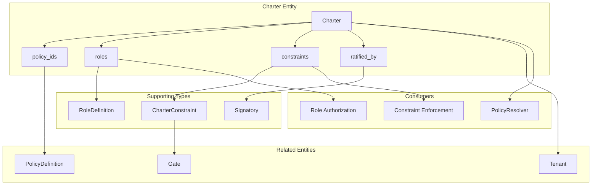
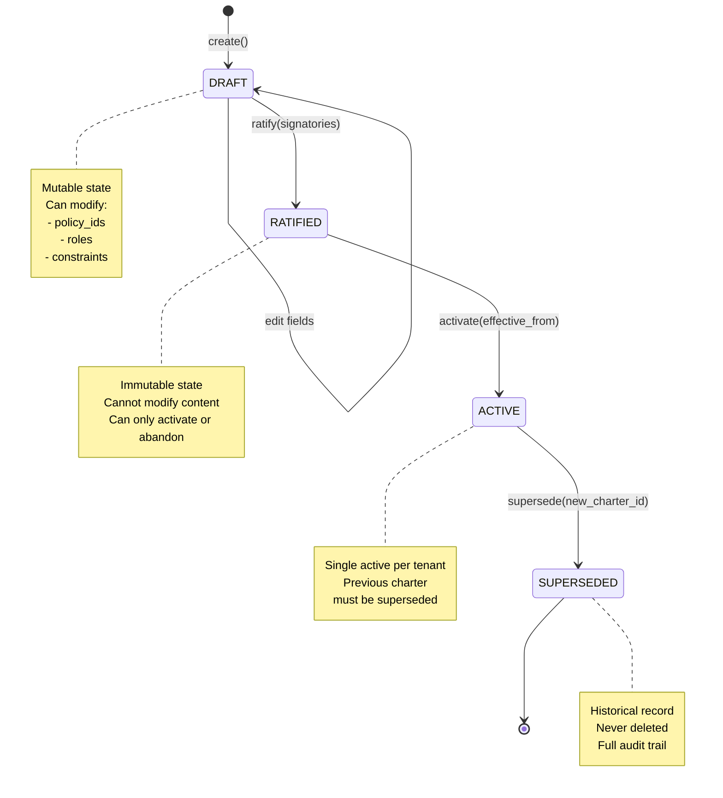

# Technical Design Specification: Tenant Charter

## 1. Overview

### 1.1 Purpose

The Charter (formerly Constitution) is a **tenant-scoped governance document** that defines the
rules all parties agree to. It sits above individual PolicyDefinitions and PolicyAdapters,
establishing the governance framework for a tenant. The Charter is not configuration - it is a legal
document with ratification requirements.

### 1.2 Scope

This specification covers:

- Charter entity structure
- Ratification lifecycle (DRAFT -> RATIFIED -> ACTIVE -> SUPERSEDED)
- Policy activation gating via `policy_ids`
- Role governance with `RoleDefinition`
- Constraint binding with `CharterConstraint`
- Signatory accountability with `Signatory`

### 1.3 Design Principles

1. **Single Active Charter**: Each tenant has exactly one active Charter
2. **Immutable After Ratification**: Changes require new version + re-ratification
3. **Constraint Enforcement Binding**: Every constraint MUST reference enforcement code
4. **Accountability Chain**: Signatories create legal accountability for governance

## 2. Architecture

### 2.1 Charter in the System

```
+---------------------------------------------------------------------+
|                    TENANT GOVERNANCE                                 |
+---------------------------------------------------------------------+
|                                                                      |
|   +----------------------------------------------------------+      |
|   |                 CHARTER                                   |      |
|   |   (Tenant-scoped governance document)                     |      |
|   |                                                           |      |
|   |   +-------------+  +-------------+  +---------------+     |      |
|   |   | policy_ids  |  |   roles     |  |  constraints  |     |      |
|   |   | (active     |  | (who can    |  | (with gate_id |     |      |
|   |   |  policies)  |  |  act)       |  |  enforcement) |     |      |
|   |   +-------------+  +-------------+  +---------------+     |      |
|   |                                                           |      |
|   |   +---------------------------------------------------+   |      |
|   |   |               RATIFICATION                        |   |      |
|   |   |   signatories + hash = legal accountability       |   |      |
|   |   +---------------------------------------------------+   |      |
|   +----------------------------------------------------------+      |
|                           |                                          |
|                           v                                          |
|   +----------------------------------------------------------+      |
|   |                 PolicyDefinitions                         |      |
|   |   (Selected by Charter.policy_ids)                        |      |
|   +----------------------------------------------------------+      |
|                                                                      |
+---------------------------------------------------------------------+
```

### 2.2 Component Relationships



### 2.3 Module Structure

| Module                  | Purpose                                               |
| ----------------------- | ----------------------------------------------------- |
| `core/charter.py`       | Charter, Signatory, RoleDefinition, CharterConstraint |
| `enforcement/types.py`  | RequestContext references active Charter              |
| `utils/opa/resolver.py` | PolicyResolver uses Charter.policy_ids                |

## 3. Charter Entity

### 3.1 Entity Structure

```python
class CharterContent(ContentModel):
    """Tenant governance document with enforcement-bound constraints.

    Defines:
    - WHO can act (roles)
    - WHAT policies are active (policy_ids from a release)
    - WHAT constraints apply (with gate_id/service_check enforcement)

    Invariants:
    - Single active Charter per tenant at any time
    - Immutable after ratification (changes require new version)
    - Every constraint MUST have enforcement binding

    Lifecycle: DRAFT -> RATIFIED -> ACTIVE -> SUPERSEDED
    """

    # Identity
    tenant_id: FK[Tenant]
    version: str  # Semantic version

    # Policy activation
    policy_release_id: str | None = None  # e.g., "2026.01"
    policy_ids: list[str] = Field(default_factory=list)

    # Role governance (JSONB - RoleDefinition.to_dict())
    roles: list[dict] = Field(default_factory=list)

    # Constraints (JSONB - CharterConstraint.to_dict())
    # Every constraint MUST have gate_id or service_check
    constraints: list[dict] = Field(default_factory=list)

    # Lifecycle
    status: str = "draft"  # draft, ratified, active, superseded
    effective_from: datetime | None = None
    superseded_at: datetime | None = None
    superseded_by_id: FK["Charter"] | None = None

    # Ratification (REQUIRED for activation)
    ratified_by: list[dict] = Field(default_factory=list)  # Signatory.to_dict()
    ratified_at: datetime | None = None
    ratification_hash: str | None = None

    notes: str | None = None


# Entity is created via create_entity factory
Charter = create_entity("Charter", CharterContent, table_name="charters")
```

### 3.2 Key Methods

```python
def compute_ratification_hash(self) -> str:
    """Compute hash over ratifiable content for tamper evidence."""
    content = {
        "tenant_id": str(self.tenant_id),
        "version": self.version,
        "policy_release_id": self.policy_release_id,
        "policy_ids": self.policy_ids,
        "roles": self.roles,
        "constraints": self.constraints,
        "effective_from": (self.effective_from.isoformat() if self.effective_from else None),
        "ratified_by": self.ratified_by,
    }
    return compute_hash(content)

def ratify(self, signatories: list[dict]) -> None:
    """Ratify this charter with signatories."""

def activate(self, effective_from: datetime | None = None) -> None:
    """Activate this charter (requires prior ratification)."""

def supersede(self, replacement_id: Any) -> None:
    """Mark this charter as superseded."""

def is_effective(self, as_of: datetime | None = None) -> bool:
    """Check if this Charter is currently effective."""

def is_ratified(self) -> bool:
    """Check if Charter has required ratification."""
```

## 4. Lifecycle State Machine

### 4.1 State Diagram



### 4.2 State Transitions

| From     | To         | Method                      | Requirements            |
| -------- | ---------- | --------------------------- | ----------------------- |
| -        | DRAFT      | `create()`                  | None                    |
| DRAFT    | DRAFT      | field edits                 | status == "draft"       |
| DRAFT    | RATIFIED   | `ratify(signatories)`       | signatories.length >= 1 |
| RATIFIED | ACTIVE     | `activate(effective_from)`  | status == "ratified"    |
| ACTIVE   | SUPERSEDED | `supersede(replacement_id)` | new Charter exists      |

### 4.3 Transition Implementations

```python
def ratify(self, signatories: list[dict]) -> None:
    """Ratify this charter with signatories.

    Args:
        signatories: List of Signatory.to_dict() records

    Raises:
        ValueError: If no signatories provided or already ratified
    """
    if not signatories:
        raise ValueError("Charter requires at least one signatory")
    if self.status != "draft":
        raise ValueError(f"Cannot ratify charter in status '{self.status}'")

    self.ratified_by = signatories
    self.ratified_at = ln.now_utc()
    self.ratification_hash = self.compute_ratification_hash()
    self.status = "ratified"


def activate(self, effective_from: datetime | None = None) -> None:
    """Activate this charter.

    Args:
        effective_from: When charter becomes effective (default: now)

    Raises:
        ValueError: If not ratified
    """
    if self.status != "ratified":
        raise ValueError("Charter must be ratified before activation")

    self.effective_from = effective_from or ln.now_utc()
    self.status = "active"


def supersede(self, replacement_id: Any) -> None:
    """Mark this charter as superseded.

    Args:
        replacement_id: ID of the new Charter
    """
    self.superseded_at = ln.now_utc()
    self.superseded_by_id = replacement_id
    self.status = "superseded"
```

## 5. Policy Activation Gating

### 5.1 policy_ids Field

```python
policy_ids: list[str] = Field(default_factory=list)
"""Active PolicyDefinition IDs for this tenant (selected from release)."""
```

**Purpose**: Charter determines which policies are active for the tenant by listing their
`policy_id` values. This enables:

- Selective policy adoption (not all policies apply to all tenants)
- Version-locked policy activation (tied to policy_release_id)
- Audit trail of which policies were active when

### 5.2 Policy Resolution Integration

```python
# In PolicyResolver
def resolve_for_context(
    self,
    charter: Charter,
    action: str,
    jurisdictions: tuple[str, ...],
) -> list[ResolvedPolicy]:
    """Resolve policies applicable to context.

    Only returns policies in charter.content.policy_ids.
    """
    active_policy_ids = set(charter.content.policy_ids)

    resolved = []
    for policy_def in self._index.get_by_jurisdictions(jurisdictions):
        if policy_def.policy_id in active_policy_ids:
            if action in policy_def.action_types or not policy_def.action_types:
                resolved.append(self._to_resolved(policy_def))

    return resolved
```

### 5.3 Situational Gate Resolution

Charter drives situational gate activation:

```python
# In CanonService._gate_hook()
if ctx.charter and service_gates.situational:
    active_policies = set(ctx.charter.content.policy_ids)
    for gate_id in service_gates.situational:
        # Only activate gate if referenced policy is in Charter
        if gate_id in active_policies:
            gate = create_gate(gate_id)
            if gate:
                gates_to_run.append(gate)
```

## 6. Role Governance

### 6.1 RoleDefinition

```python
@dataclass(frozen=True, slots=True)
class RoleDefinition:
    """Role-based permission definition.

    Charter defines WHO can act. Roles map to permitted actions.
    """

    role_id: str
    """Unique role identifier."""

    name: str
    """Human-readable role name."""

    permitted_actions: tuple[str, ...]
    """Action types this role can perform."""

    break_glass_authority: bool = False
    """If True, role can invoke break-glass protocol."""

    requires_mfa: bool = True
    """If True, MFA required for actions in this role."""

    def to_dict(self) -> dict[str, Any]:
        """Serialize for storage."""
        return {
            "role_id": self.role_id,
            "name": self.name,
            "permitted_actions": list(self.permitted_actions),
            "break_glass_authority": self.break_glass_authority,
            "requires_mfa": self.requires_mfa,
        }
```

### 6.2 Role Usage

```python
# Example roles in Charter
roles = [
    {
        "role_id": "hiring_manager",
        "name": "Hiring Manager",
        "permitted_actions": ["VIEW_CANDIDATE", "SCHEDULE_INTERVIEW", "SUBMIT_FEEDBACK"],
        "break_glass_authority": False,
        "requires_mfa": True,
    },
    {
        "role_id": "compliance_officer",
        "name": "Compliance Officer",
        "permitted_actions": ["VIEW_ALL", "APPROVE_ADVERSE_ACTION", "AUDIT_DECISIONS"],
        "break_glass_authority": True,
        "requires_mfa": True,
    },
]
```

### 6.3 Role Authorization Check

```python
def check_role_permission(
    charter: Charter,
    actor_role: str,
    action: str,
) -> bool:
    """Check if role has permission for action."""
    for role_dict in charter.content.roles:
        if role_dict["role_id"] == actor_role:
            return action in role_dict["permitted_actions"]
    return False
```

## 7. Constraint Binding

### 7.1 CharterConstraint

```python
@dataclass(frozen=True, slots=True)
class CharterConstraint:
    """An enforceable constraint in the charter.

    CRITICAL: Every constraint MUST have gate_id OR service_check.
    If there's no code enforcing it, it doesn't belong here.
    """

    constraint_id: str
    """Unique identifier for this constraint."""

    description: str
    """What this constraint requires."""

    gate_id: str | None = None
    """Gate that enforces this constraint, if applicable."""

    service_check: str | None = None
    """Service method that enforces this, if applicable."""

    def __post_init__(self) -> None:
        """Validate enforcement binding exists."""
        if not self.gate_id and not self.service_check:
            raise ValueError(
                f"Constraint '{self.constraint_id}' must have gate_id or service_check. "
                "If there's no code enforcing it, it doesn't belong here."
            )

    def to_dict(self) -> dict[str, Any]:
        """Serialize for storage."""
        return {
            "constraint_id": self.constraint_id,
            "description": self.description,
            "gate_id": self.gate_id,
            "service_check": self.service_check,
        }
```

### 7.2 Enforcement Binding Rule

**Critical Design Decision**: Every constraint MUST reference either `gate_id` OR `service_check`.
This enforces the principle:

> "If there's no code enforcing it, it doesn't belong here."

The `__post_init__` validation ensures this at construction time.

### 7.3 Example Constraints

```python
constraints = [
    {
        "constraint_id": "fcra_consent_required",
        "description": "Candidate must provide FCRA consent before background check",
        "gate_id": "consent.fcra_background_check",
        "service_check": None,
    },
    {
        "constraint_id": "waiting_period_enforced",
        "description": "Pre-adverse action notice waiting period must elapse",
        "gate_id": "waiting_period.pre_adverse_notice",
        "service_check": None,
    },
    {
        "constraint_id": "dual_approval_termination",
        "description": "Termination requires two approvers",
        "gate_id": None,
        "service_check": "approval_service.check_dual_approval",
    },
]
```

## 8. Ratification and Accountability

### 8.1 Signatory

```python
@dataclass(frozen=True, slots=True)
class Signatory:
    """Record of who ratified a charter.

    Creates accountability chain for governance decisions.
    """

    name: str  # Full name
    title: str  # "General Counsel", "VP People Operations"
    organization: str
    signed_at: datetime

    signature_hash: str | None = None  # Digital signature if available

    def to_dict(self) -> dict[str, Any]:
        """Serialize for JSONB storage."""
        return {
            "name": self.name,
            "title": self.title,
            "organization": self.organization,
            "signed_at": self.signed_at.isoformat(),
            "signature_hash": self.signature_hash,
        }
```

### 8.2 Ratification Hash

```python
def compute_ratification_hash(self) -> str:
    """Compute hash over ratifiable content for tamper evidence.

    Includes all governance content plus signatory records.
    Provides tamper evidence for the entire Charter.
    """
    content = {
        "tenant_id": str(self.tenant_id),
        "version": self.version,
        "policy_release_id": self.policy_release_id,
        "policy_ids": self.policy_ids,
        "roles": self.roles,
        "constraints": self.constraints,
        "effective_from": (self.effective_from.isoformat() if self.effective_from else None),
        "ratified_by": self.ratified_by,
    }
    return compute_hash(content)
```

### 8.3 Accountability Chain

```
Charter Accountability:

1. DRAFT phase:
   - Legal/Compliance draft governance document
   - Define policy_ids, roles, constraints

2. RATIFICATION:
   - Authorized signatories review and sign
   - Signatures recorded with timestamp
   - Hash computed over entire content

3. ACTIVATION:
   - Charter becomes legally binding
   - All operations governed by this Charter

4. AUDIT:
   - ratification_hash proves content unchanged
   - ratified_by proves accountability
   - effective_from proves timing
```

## 9. Effectiveness Check

### 9.1 is_effective() Method

```python
def is_effective(self, as_of: datetime | None = None) -> bool:
    """Check if this Charter is currently effective."""
    if self.status != "active":
        return False

    check_time = as_of or ln.now_utc()

    # Not effective before effective_from
    if self.effective_from and check_time < self.effective_from:
        return False

    # Not effective after superseded_at
    if self.superseded_at and check_time >= self.superseded_at:
        return False

    return True
```

### 9.2 Historical Query

```python
def get_charter_at(tenant_id: UUID, as_of: datetime) -> Charter | None:
    """Get the Charter that was effective at a specific time.

    For audit purposes - what governance was in effect when a decision was made?
    """
    return (
        Charter.query()
        .filter(tenant_id=tenant_id)
        .filter(status__in=["active", "superseded"])
        .filter(effective_from__lte=as_of)
        .filter(Q(superseded_at__isnull=True) | Q(superseded_at__gt=as_of))
        .first()
    )
```

## 10. Version Transition

### 10.1 Creating New Version

```python
def create_new_version(
    current: Charter,
    changes: dict[str, Any],
    new_version: str,
) -> Charter:
    """Create a new draft Charter version from current.

    Does NOT supersede current - that happens at activation.
    """
    new_charter = Charter(
        tenant_id=current.content.tenant_id,
        version=new_version,
        policy_release_id=changes.get("policy_release_id", current.content.policy_release_id),
        policy_ids=changes.get("policy_ids", current.content.policy_ids.copy()),
        roles=changes.get("roles", [r.copy() for r in current.content.roles]),
        constraints=changes.get("constraints", [c.copy() for c in current.content.constraints]),
        status="draft",
        notes=changes.get("notes"),
    )
    return new_charter
```

### 10.2 Activation with Supersession

```python
async def activate_new_charter(
    new_charter: Charter,
    signatories: list[Signatory],
) -> None:
    """Ratify, activate new Charter and supersede current."""

    # 1. Find current active Charter
    current = await Charter.get_active_for_tenant(new_charter.content.tenant_id)

    # 2. Ratify new Charter
    new_charter.content.ratify([s.to_dict() for s in signatories])
    await new_charter.save()

    # 3. Activate new Charter
    new_charter.content.activate()
    await new_charter.save()

    # 4. Supersede old Charter (if exists)
    if current:
        current.content.supersede(new_charter.id)
        await current.save()
```

## 11. Integration Points

### 11.1 Dependencies

| Component       | Purpose                     |
| --------------- | --------------------------- |
| `ContentModel`  | Base class with persistence |
| `create_entity` | Entity factory              |
| `FK[Entity]`    | Type-safe foreign keys      |
| `compute_hash`  | Ratification hash           |
| `Tenant`        | Foreign key reference       |

### 11.2 Dependents

| Component              | Purpose                             |
| ---------------------- | ----------------------------------- |
| `PolicyResolver`       | Uses policy_ids for resolution      |
| `RequestContext`       | Carries active Charter              |
| `CanonService`         | Resolves situational gates          |
| Role authorization     | Uses roles for permission checks    |
| Constraint enforcement | Uses constraints for gate selection |

## 12. Anti-Patterns

### 12.1 Do NOT

- Modify Charter after ratification (immutable)
- Add constraints without gate_id or service_check (unenforceable)
- Delete Charters (supersede instead)
- Activate without ratification
- Have multiple active Charters per tenant

### 12.2 Correct Patterns

- Create new version for changes, re-ratify
- Every constraint references enforcement mechanism
- Supersede old Charter, keep for audit
- Two-phase activation: ratify, then activate
- Single active Charter per tenant at any time

## 13. Testing Requirements

| Test Category           | Coverage Target |
| ----------------------- | --------------- |
| Lifecycle transitions   | 100%            |
| Ratification flow       | 100%            |
| Activation requirements | 100%            |
| Supersession            | 100%            |
| Effectiveness check     | 100%            |
| Ratification hash       | 100%            |
| Constraint validation   | 100%            |
| Single-active invariant | 100%            |

## 14. Open Questions

1. **Multi-signatory requirements**: Should Charter require minimum number of signatories? (e.g.,
   "requires 2 legal signatories")

2. **Constraint evaluation order**: When multiple constraints apply, what's the evaluation order?

3. **Role hierarchy**: Can roles inherit from other roles, or are they flat?

4. **Amendment process**: How to make minor amendments without full re-ratification?

5. **Effective date transitions**: What happens to in-flight operations when Charter changes?

6. **Cross-tenant constraints**: Can a parent organization impose constraints on child tenants?

## 15. Related Surfaces

The following control surfaces use patterns from this design:

| Surface                    | Description                | Key Integration                                                                                       |
| -------------------------- | -------------------------- | ----------------------------------------------------------------------------------------------------- |
| All Surfaces               | Tenant Governance          | Charter.policy_ids determines which policies are active; Charter.constraints bind enforcement to code |
| Layoff RIF Inclusion       | Layoff RIF Inclusion       | Charter defines required_roles (HR, Legal) and constraints for layoff decisions                       |
| Privileged Role Escalation | Privileged Role Escalation | Charter.roles defines which roles exist and their permitted_actions                                   |
| Break Glass Activation     | Break Glass Activation     | Charter.roles.break_glass_authority determines who can invoke emergency protocols                     |
| PII Export Authorization   | PII Export Authorization   | Charter.constraints bind DPO review requirement to gate_id enforcement                                |
| Settlement Authority       | Settlement Authority       | Charter defines signatory requirements for high-value decisions                                       |

Note: Charter is the foundational governance layer. Every control surface operates within the
boundaries defined by the tenant's active Charter. The Charter.policy_ids list determines which
surface policies are enforceable, and Charter.constraints ensure every governance rule has a
corresponding gate_id or service_check.

## 16. References

- Charter: `libs/canon/src/canon/entities/charter/charter.py`
- RequestContext: `libs/canon/src/canon/enforcement/types.py`
- CanonService: `libs/canon/src/canon/enforcement/service.py`
- PolicyResolver: `libs/canon/src/canon/utils/opa/resolver.py`
- Related: TDS-011-policy-resolution (uses Charter.policy_ids)
- Related: TDS-012-single-enforcement (uses Charter for situational gates)
- Related: TDS-015-jit-role (uses Charter.roles)
