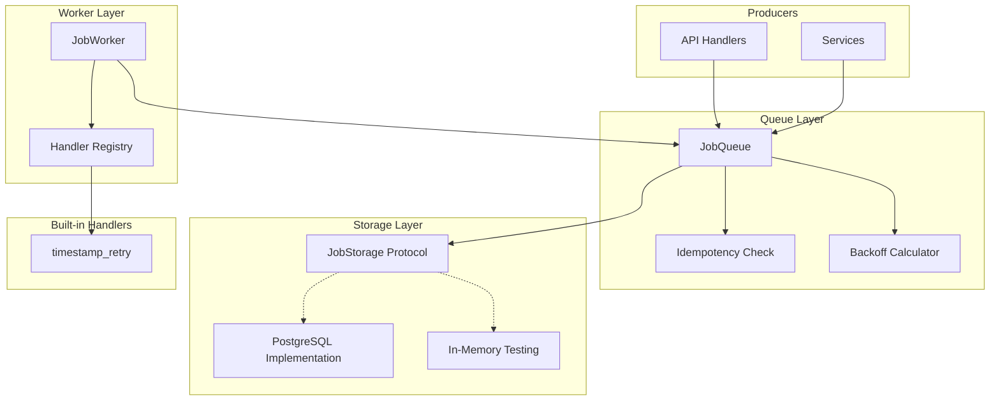
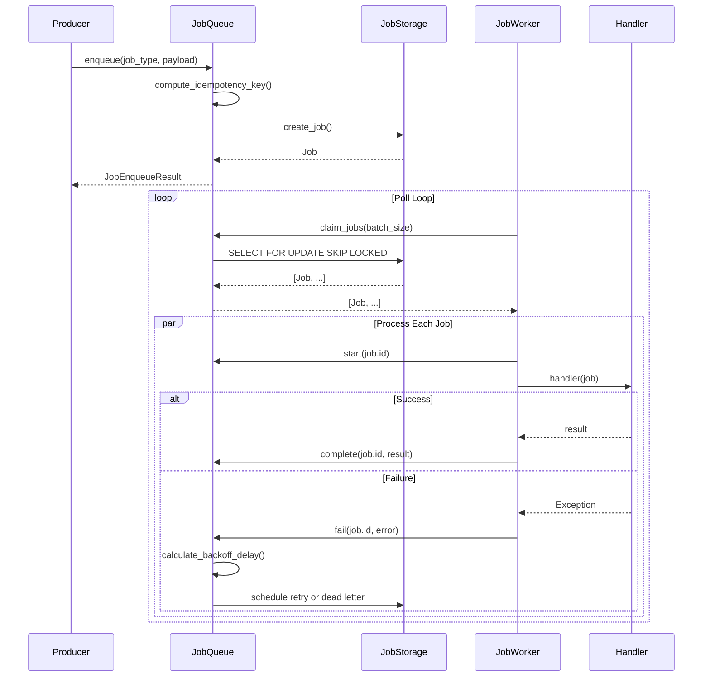
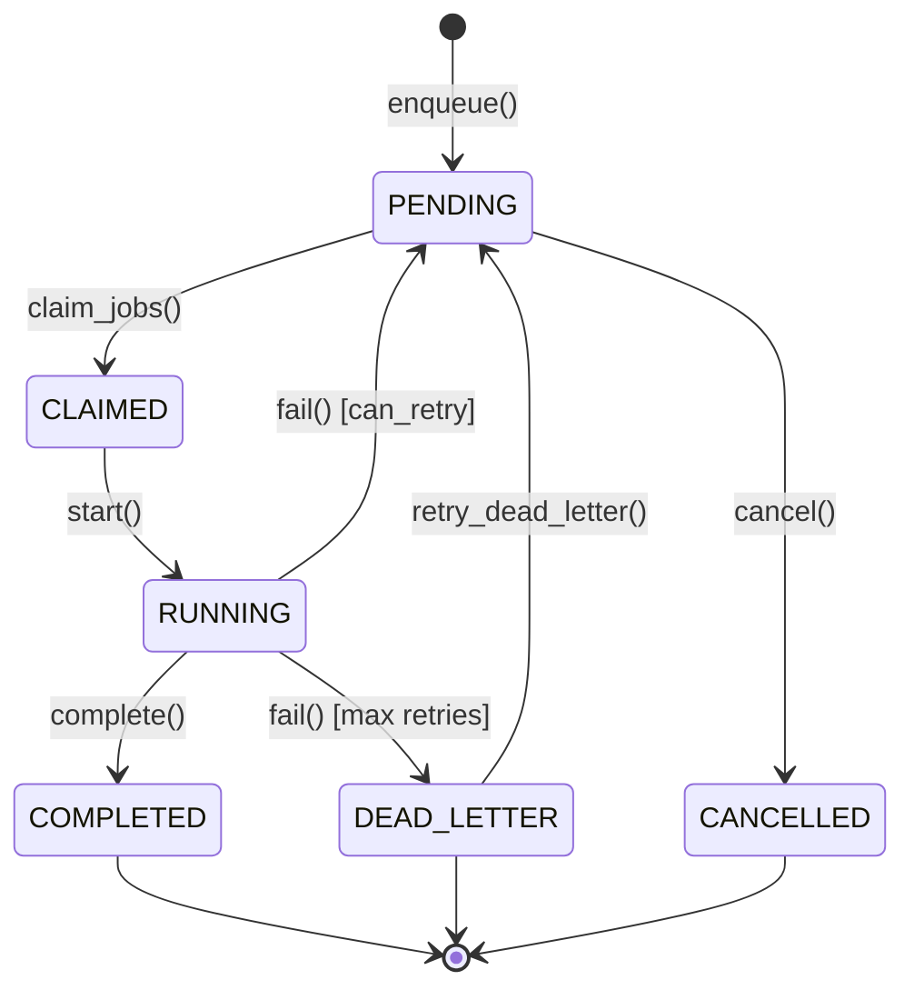

## 1. Overview

### 1.1 Purpose

The Background Job Queue provides a **storage-agnostic infrastructure** for reliable async task
processing in CanonSys. It enables background operations that must survive server restarts, handle
transient failures, and maintain multi-tenant isolation.

Critical use cases:

- **TSA Timestamp Retry**: Retry pending RFC 3161 timestamps when TSA is temporarily unavailable
- **Evidence Processing**: Background validation and enrichment of compliance evidence
- **Notification Delivery**: Async delivery of adverse action notices and alerts
- **Report Generation**: Long-running compliance reports and audit exports

### 1.2 Scope

**In Scope**:

- Job storage protocol (storage-agnostic)
- JobQueue API (enqueue, claim, complete, fail, cancel)
- JobWorker pattern (handler registration, graceful shutdown)
- Exponential backoff retry with jitter
- Dead letter queue for failed jobs
- Built-in timestamp retry handler

**Out of Scope**:

- Storage implementations (PostgreSQL, Redis) - defined by protocol
- Job scheduling (cron-like) - future work
- Distributed worker coordination - single-node for now

### 1.3 Background

**Research References**:

- `ADR-026-job-queue`: Architecture decision for job queue pattern

### 1.4 Design Goals

| Priority | Goal                   | Rationale                                  |
| -------- | ---------------------- | ------------------------------------------ |
| P0       | Durability             | Jobs survive server restarts               |
| P0       | Multi-tenant isolation | Tenants cannot affect each other           |
| P1       | Storage agnostic       | Swap PostgreSQL/Redis without code changes |
| P1       | Reliable retry         | Transient failures handled automatically   |
| P2       | Observable             | Job lifecycle visible via metrics          |

### 1.5 Key Constraints

**Technical Constraints**:

- Storage must provide atomic claim (e.g., SELECT FOR UPDATE SKIP LOCKED)
- Worker process must handle graceful shutdown
- Job payload must be JSON-serializable

**Business Constraints**:

- No additional infrastructure beyond PostgreSQL
- Job execution must be auditable

---

## 2. Architecture

### 2.1 Component Diagram



### 2.2 Dependencies

**Internal Dependencies**:

| Component          | Purpose            | Version |
| ------------------ | ------------------ | ------- |
| `canon.utils` | canonicalize, hash | -       |

**External Dependencies**:

| Library | Purpose         | Version |
| ------- | --------------- | ------- |
| asyncio | Async execution | 3.11+   |

### 2.3 Data Flow



---

## 3. Interface Definitions

### 3.1 JobStorage Protocol

```python
class JobStorage(Protocol):
    """Protocol for job persistence.

    Implementations must provide atomic operations for job claiming
    to prevent race conditions in distributed worker scenarios.
    """

    async def create_job(
        self,
        job_id: str,
        job_type: str,
        tenant_id: UUID,
        payload: dict[str, Any],
        *,
        priority: JobPriority = JobPriority.NORMAL,
        max_retries: int = 3,
        scheduled_at: datetime | None = None,
        idempotency_key: str | None = None,
    ) -> Job:
        """Create a new job in storage."""
        ...

    async def claim_jobs(
        self,
        tenant_id: UUID,
        worker_id: str,
        batch_size: int = 10,
        job_types: list[str] | None = None,
    ) -> list[Job]:
        """Atomically claim pending jobs for processing."""
        ...

    async def update_job_status(
        self,
        id: UUID,
        status: JobStatus,
        *,
        error_message: str | None = None,
        result: dict[str, Any] | None = None,
        scheduled_at: datetime | None = None,
        increment_attempt: bool = False,
    ) -> Job | None:
        """Update job status and related fields."""
        ...

    async def get_stats(self, tenant_id: UUID) -> QueueStats:
        """Get queue statistics."""
        ...
```

### 3.2 JobQueue API

```python
class JobQueue:
    """Storage-agnostic job queue with retry and dead letter support."""

    async def enqueue(
        self,
        job_type: str,
        payload: dict[str, Any],
        *,
        priority: JobPriority = JobPriority.NORMAL,
        max_retries: int = 3,
        delay_seconds: float = 0,
        idempotency_key: str | None = None,
    ) -> JobEnqueueResult:
        """Add a job to the queue. Deduplicates by idempotency key."""

    async def claim_jobs(
        self,
        worker_id: str,
        batch_size: int = 10,
        job_types: list[str] | None = None,
    ) -> list[Job]:
        """Claim pending jobs for processing."""

    async def complete(
        self,
        job_id: UUID,
        result: dict[str, Any] | None = None,
    ) -> Job | None:
        """Mark a job as successfully completed."""

    async def fail(
        self,
        job_id: UUID,
        error: str,
        *,
        retry: bool = True,
    ) -> Job | None:
        """Mark as failed, schedule retry or move to dead letter."""

    async def get_dead_letter_jobs(
        self,
        job_type: str | None = None,
        limit: int = 50,
    ) -> list[Job]:
        """Get jobs from the dead letter queue."""

    async def retry_dead_letter(self, job_id: UUID) -> Job | None:
        """Manually retry a job from dead letter queue."""
```

---

## 4. Data Models

### 4.1 Job

```python
@dataclass
class Job:
    """Background job data model."""

    id: UUID
    job_id: str              # Human-readable (e.g., "job_abc123")
    job_type: str            # Handler routing key
    tenant_id: UUID          # Multi-tenant isolation
    status: JobStatus        # PENDING, CLAIMED, RUNNING, etc.
    priority: JobPriority    # LOW, NORMAL, HIGH, CRITICAL
    payload: dict[str, Any]  # Job input data
    result: dict[str, Any] | None  # Output after completion
    error_message: str | None
    attempt: int             # Current attempt number
    max_retries: int         # Maximum retry attempts
    scheduled_at: datetime   # When eligible for processing
    started_at: datetime | None
    completed_at: datetime | None
    created_at: datetime
    updated_at: datetime
    worker_id: str | None    # Worker processing this job
    idempotency_key: str | None  # SHA-256 for deduplication

    @property
    def is_terminal(self) -> bool:
        """In terminal state (COMPLETED, DEAD_LETTER, CANCELLED)."""

    @property
    def can_retry(self) -> bool:
        """Has retries remaining and not terminal."""
```

### 4.2 Enums

```python
class JobStatus(str, Enum):
    PENDING = "pending"         # Waiting to be processed
    CLAIMED = "claimed"         # Worker has taken ownership
    RUNNING = "running"         # Handler is executing
    COMPLETED = "completed"     # Successfully finished (terminal)
    FAILED = "failed"           # Error occurred, may retry
    DEAD_LETTER = "dead_letter" # Exceeded max retries (terminal)
    CANCELLED = "cancelled"     # Manually cancelled (terminal)

class JobPriority(int, Enum):
    LOW = 0         # Batch jobs, reports
    NORMAL = 10     # Default for most jobs
    HIGH = 20       # User-facing operations
    CRITICAL = 30   # Compliance deadlines, urgent
```

---

## 5. Behavior

### 5.1 Job Lifecycle



### 5.2 Exponential Backoff

```python
def calculate_backoff_delay(
    attempt: int,
    base_delay: float = 60.0,
    max_delay: float = 3600.0,
    multiplier: float = 2.0,
    jitter_factor: float = 0.1,
) -> float:
    """
    Calculate delay: min(base * multiplier^(attempt-1), max) +/- jitter

    Example schedule:
        attempt 1: ~60s
        attempt 2: ~120s
        attempt 3: ~240s
        attempt 4+: capped at 3600s
    """
```

### 5.3 Idempotency

```python
def compute_idempotency_key(job_type: str, payload: dict) -> str:
    """SHA-256 hash of job_type + canonicalized payload."""
    content = f"{job_type}:{canonicalize(payload)}"
    return hashlib.sha256(content.encode()).hexdigest()
```

### 5.4 Error Handling

| Error Condition     | Behavior                                      |
| ------------------- | --------------------------------------------- |
| Handler exception   | Job fails, retry scheduled if attempts remain |
| Timeout exceeded    | Job fails, retry scheduled                    |
| Max retries reached | Job moves to DEAD_LETTER                      |
| Storage error       | Logged, operation retried                     |
| Duplicate job       | Returns existing job ID, duplicate flag set   |

---

## 6. Built-in Handlers

### 6.1 Timestamp Retry Handler

```python
TIMESTAMP_RETRY_JOB_TYPE = "timestamp_retry"
MAX_ATTESTATION_RETRIES = 10

def create_timestamp_retry_handler(
    tsa_service: ExternalTSAService,
    dsn: str | None = None,
) -> JobHandler:
    """Create handler for retrying pending timestamp attestations."""

async def enqueue_timestamp_retry(
    queue: JobQueue,
    attestation_id: UUID,
    *,
    delay_seconds: float = 0,
) -> str:
    """Enqueue a timestamp retry job."""

# Auto-enqueue wrappers
async def timestamp_evidence(evidence, tsa_service, queue, dsn) -> TimestampAttestation
async def timestamp_chain(chain, tsa_service, queue, dsn) -> TimestampAttestation
async def timestamp_decision_certificate(cert, tsa_service, queue, dsn) -> TimestampAttestation
async def timestamp_cep(cep, tsa_service, queue, dsn) -> TimestampAttestation
```

---

## 7. Security Considerations

### 7.1 Multi-Tenant Isolation

All operations scoped by `tenant_id`:

```python
queue = JobQueue(storage, tenant_id=tenant_id)
# All operations automatically filter by tenant
```

### 7.2 Idempotency Protection

Jobs deduplicated by idempotency key:

```python
result1 = await queue.enqueue("send_email", {"to": "user@example.com"})
result2 = await queue.enqueue("send_email", {"to": "user@example.com"})
assert result1.job_id == result2.job_id
assert result2.duplicate is True
```

### 7.3 Error Message Handling

Error messages truncated to 4000 characters to prevent storage issues.

---

## 8. Testing Strategy

### 8.1 Test Coverage

| Component                | Target |
| ------------------------ | ------ |
| Job lifecycle states     | 100%   |
| Retry/backoff logic      | 100%   |
| Idempotency              | 100%   |
| Dead letter handling     | 100%   |
| Worker graceful shutdown | 100%   |
| Multi-tenant isolation   | 100%   |
| Timestamp retry handler  | 100%   |

### 8.2 In-Memory Storage

```python
class InMemoryJobStorage:
    """In-memory storage for testing."""

    def __init__(self):
        self._jobs: dict[UUID, Job] = {}
        self._lock = asyncio.Lock()

    async def claim_jobs(self, tenant_id, worker_id, batch_size, job_types):
        async with self._lock:
            # Atomic claim simulation
            ...
```

---

## 9. Module Structure

| Module                       | Purpose                     |
| ---------------------------- | --------------------------- |
| `jobs/enums.py`              | Status and priority enums   |
| `jobs/models.py`             | Job data models             |
| `jobs/protocols.py`          | Storage protocol definition |
| `jobs/queue.py`              | JobQueue implementation     |
| `jobs/worker.py`             | JobWorker implementation    |
| `jobs/handlers/timestamp.py` | RFC 3161 timestamp retry    |

---

## 10. Open Questions

| # | Question                       | Impact     | Proposed Resolution        | Status |
| - | ------------------------------ | ---------- | -------------------------- | ------ |
| 1 | Prometheus metrics integration | Visibility | Add in future iteration    | Open   |
| 2 | Rate limiting per job type     | Stability  | Add throttle configuration | Open   |
| 3 | Priority per tenant for SLA    | Fairness   | Tenant-level configuration | Open   |

---

## 11. Vocabulary Mapping

### Package

- **Package**: `workflow` (planned)
- **Location**: `hub/foundation/packages/workflow/`

### Integration Points

| Component             | Integration                     |
| --------------------- | ------------------------------- |
| Timestamp attestation | Uses `timestamp_retry` job type |
| Notification service  | Async delivery with retry       |
| Report generation     | Long-running background jobs    |
| Evidence processing   | Async validation and enrichment |

### Control Surfaces

| Surface                  | Description              | Key Integration                                    |
| ------------------------ | ------------------------ | -------------------------------------------------- |
| PII Export Authorization | PII Export Authorization | Large export jobs via JobQueue                     |
| Disaster Recovery Test   | Disaster Recovery Test   | Long-running DR test jobs                          |
| AI Incident Disclosure   | AI Incident Disclosure   | Async notification delivery                        |
| All                      | Timestamp Retry          | RFC 3161 timestamps acquired even after TSA outage |

---

## 12. References

- Implementation: `libs/canon-services/src/canon_services/jobs/`
- Related: ADR-026-job-queue (architectural decision)
- Related: TDS-020-timestamp-tsa (timestamp retry handler consumer)
- Related: TDS-006-evidence-chain-cep (evidence timestamping)
