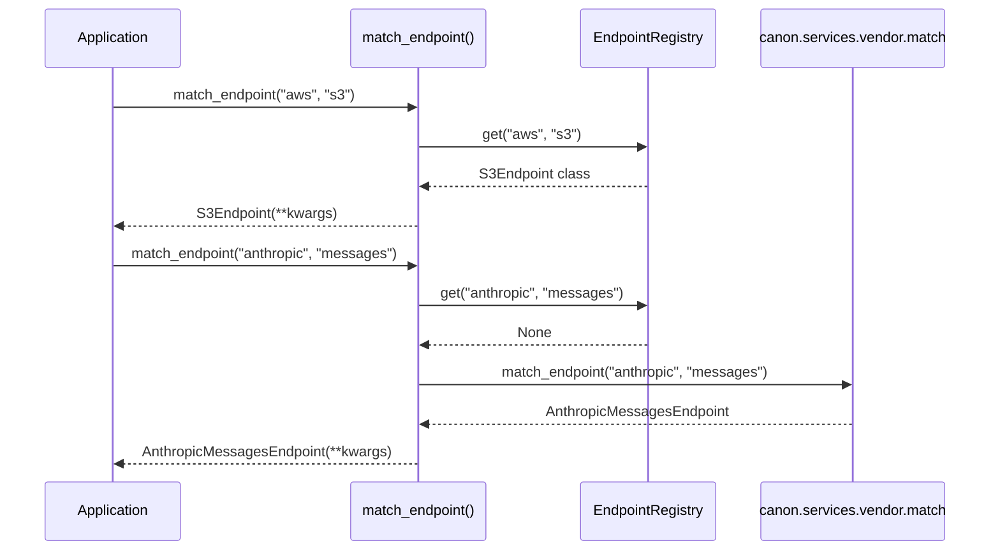

## 1. Overview

### 1.1 Purpose

The Vendor Endpoint Registry provides a **decorator-based registration system** for external service
endpoints in canon-services. It enables:

1. **Scattered endpoint definitions**: Endpoints live in their respective service folders (embed,
   market, vendor) rather than a centralized location
2. **Unified resolution**: Single `match_endpoint()` function resolves any provider/endpoint
   combination
3. **Kron integration**: Native LLM providers fall through to kron seamlessly

### 1.2 Scope

**In Scope**:

- Decorator-based endpoint registration (`@register_endpoint`)
- Endpoint resolution with fallback to kron
- Provider/endpoint enumeration for discovery
- Custom endpoints for non-LLM services (S3, Twilio, Resend, etc.)

**Out of Scope**:

- Endpoint implementation (each service owns its endpoint class)
- Authentication/credential management (handled by VendorService)
- Rate limiting/quota management

### 1.3 Background

Previously, all endpoint classes were centralized in `vendor/providers/`, creating duplication:

- `embed/endpoints/openai.py` duplicated by `vendor/providers/embed/`
- `market/endpoints/perplexity.py` duplicated by `vendor/providers/market/perplexity/`

The registry pattern allows endpoints to be **scattered** across service folders while remaining
**discoverable** through a common interface.

### 1.4 Design Goals

| Priority | Goal                    | Rationale                                      |
| -------- | ----------------------- | ---------------------------------------------- |
| P0       | Single resolution path  | `match_endpoint()` works for all providers     |
| P0       | Kron compatibility      | LLM providers use battle-tested kron code      |
| P1       | Scattered definitions   | Endpoints live near their service logic        |
| P1       | No duplicate code       | Remove `vendor/providers/` duplicates          |
| P2       | Discovery support       | List all registered/supported providers        |

### 1.5 Key Constraints

**Technical Constraints**:

- Must work with kron's existing `Endpoint` base class
- Registration must happen at import time (decorator pattern)
- Case-insensitive provider/endpoint matching

**Business Constraints**:

- Must support all existing canon-services integrations
- Must not break VendorService workflows

---

## 2. Architecture

### 2.1 Component Diagram

```mermaid
graph TD
    A[Application Code] --> B[match_endpoint]
    B --> C{Custom Registered?}
    C -->|Yes| D[Canon Endpoint Class]
    C -->|No| E[canon.services.vendor.match]
    E --> F[Kron Endpoint]

    G[@register_endpoint] --> H[EndpointRegistry]
    H --> C

    subgraph canon-core
        D
        G
        H
    end

    subgraph kron
        E
        F
    end
```

### 2.2 Resolution Flow



### 2.3 Dependencies

**Internal Dependencies**:

| Component                  | Purpose           | Version |
| -------------------------- | ----------------- | ------- |
| canon.utils.endpoints | Registry location | -       |

**External Dependencies**:

| Library   | Purpose               | Version    |
| --------- | --------------------- | ---------- |
| kron      | LLM endpoint fallback | >= 1.0.0   |

---

## 3. Interface Definitions

### 3.1 Public API

**Module**: `canon.utils.endpoints`

#### `register_endpoint(provider, endpoint, *, override=False)`

```python
def register_endpoint(
    provider: str,
    endpoint: str = "default",
    *,
    override: bool = False,
) -> type[Endpoint]:
    """Decorator to register an endpoint class.

    Args:
        provider: Provider name (e.g., "openai", "aws", "apify")
        endpoint: Endpoint type (e.g., "chat/completions", "embeddings", "s3")
        override: Allow overriding existing registration

    Returns:
        Decorator that registers the class

    Raises:
        ValueError: If endpoint already registered and override=False
    """
```

#### `match_endpoint(provider, endpoint, **kwargs)`

```python
def match_endpoint(
    provider: str,
    endpoint: str = "chat/completions",
    **kwargs: Any,
) -> Endpoint:
    """Match provider and endpoint to appropriate Endpoint instance.

    Resolution order:
    1. Check canon-core registry for custom endpoints
    2. Fall back to kron's match_endpoint for LLM providers

    Args:
        provider: Provider name
        endpoint: Endpoint name
        **kwargs: Additional kwargs passed to Endpoint constructor

    Returns:
        Endpoint instance configured for the provider
    """
```

#### `list_all_providers()`

```python
def list_all_providers() -> dict[str, list[str]]:
    """List all supported providers and their endpoints.

    Returns:
        Dict mapping provider names to list of supported endpoints.
        Includes both custom registered and kron native providers.
    """
```

---

## 4. Data Models

### 4.1 Registry Storage

```python
# Global endpoint registry: {(provider, endpoint): endpoint_class}
_ENDPOINT_REGISTRY: dict[tuple[str, str], type[Endpoint]] = {}
```

**Key Format**:

- Keys are `(provider.lower(), endpoint.lower())` tuples for case-insensitive lookup
- Values are endpoint classes (not instances)

### 4.2 EndpointRegistry Class

```python
class EndpointRegistry:
    """Registry for endpoint classes."""

    @staticmethod
    def register(provider: str, endpoint: str, *, override: bool) -> type[Endpoint]: ...

    @staticmethod
    def get(provider: str, endpoint: str) -> type[Endpoint] | None: ...

    @staticmethod
    def list_all() -> list[tuple[str, str, type[Endpoint]]]: ...

    @staticmethod
    def clear() -> None: ...  # For testing
```

---

## 5. Behavior

### 5.1 Registration Behavior

1. Decorator captures `(provider, endpoint)` at decoration time
2. Key is normalized to lowercase
3. If key exists and `override=False`, raises `ValueError`
4. Class is stored in `_ENDPOINT_REGISTRY[key]`
5. Original class is returned (unchanged)

### 5.2 Resolution Behavior

1. Normalize provider and endpoint to lowercase
2. Check `_ENDPOINT_REGISTRY` for exact match
3. If found: instantiate and return
4. If not found: delegate to `canon.services.vendor.match()`
5. Kron handles known LLM providers + OpenAI-compatible fallback

### 5.3 Error Handling

| Error            | Condition                                      | Resolution                                             |
| ---------------- | ---------------------------------------------- | ------------------------------------------------------ |
| `ValueError`     | Duplicate registration without `override=True` | Use `override=True` or choose different key            |
| Import error     | Kron not installed                             | Canon-services requires kron as dependency             |
| Unknown provider | Provider not in registry or kron               | Kron uses OpenAI-compatible fallback with warning      |

---

## 6. Registered Endpoints

### 6.1 Current Registrations

| Provider     | Endpoint           | Class                     | Location                                                        |
| ------------ | ------------------ | ------------------------- | --------------------------------------------------------------- |
| `openai`     | `embeddings`       | `OpenAIEmbeddingEndpoint` | `canon_services/embed/endpoints/openai.py`                      |
| `perplexity` | `chat/completions` | `PerplexityEndpoint`      | `canon_services/market/endpoints/perplexity.py`                 |
| `exa`        | `search`           | `ExaEndpoint`             | `canon_services/market/endpoints/exa.py`                        |
| `h1b`        | `salary`           | `H1BEndpoint`             | `canon_services/market/endpoints/h1b.py`                        |
| `aws`        | `s3`               | `S3Endpoint`              | `libs/canon/src/canon/services/vendor/providers/storage/s3_endpoint.py`   |
| `resend`     | `emails`           | `ResendEndpoint`          | `hub/domains/governance/packages/notice/endpoints/resend_endpoint.py`       |
| `twilio`     | `messages`         | `TwilioEndpoint`          | `hub/domains/governance/packages/notice/endpoints/twilio_endpoint.py`       |
| `apify`      | `actors`           | `ApifyEndpoint`           | `libs/canon/src/canon/services/vendor/providers/market/apify/endpoint.py` |

### 6.2 Kron Native Providers

| Provider      | Endpoints                      | Endpoint Class              |
| ------------- | ------------------------------ | --------------------------- |
| `anthropic`   | `messages`, `chat/completions` | `AnthropicMessagesEndpoint` |
| `openai`      | `chat/completions`             | `OAIChatEndpoint`           |
| `groq`        | `chat/completions`             | `OAIChatEndpoint`           |
| `openrouter`  | `chat/completions`             | `OAIChatEndpoint`           |
| `nvidia_nim`  | `chat/completions`             | `OAIChatEndpoint`           |
| `claude_code` | `query_cli`                    | `ClaudeCodeEndpoint`        |
| `gemini_code` | `query_cli`                    | `GeminiCodeEndpoint`        |

---

## 7. Testing Strategy

### 7.1 Test Coverage

| Component              | Target |
| ---------------------- | ------ |
| Registration decorator | 100%   |
| Duplicate handling     | 100%   |
| Override behavior      | 100%   |
| Case-insensitivity     | 100%   |
| Kron fallback          | 100%   |

---

## 8. Vocabulary Mapping

### Package

- **Package**: `core`
- **Location**: `hub/foundation/packages/core/`

### Control Surfaces

| Surface                   | Description               | Key Integration                                                   |
| ------------------------- | ------------------------- | ----------------------------------------------------------------- |
| Vendor Integration        | Vendor Integration        | Endpoint resolution for external vendor calls                     |
| Integration System Link   | Integration System Link   | Vendor endpoint resolution for external system integrations       |
| Model Deployment Override | Model Deployment Override | LLM provider endpoints (Anthropic, OpenAI) via kron fallback      |
| AI Incident Disclosure    | AI Incident Disclosure    | Resend endpoint for notification delivery                         |
| Dataset External Publish  | Dataset External Publish  | S3 endpoint for external data storage                             |

---

## 9. References

- Implementation: `libs/canon/src/canon/utils/endpoints.py`
- Kron: `libs/kron/src/kron/services/providers/match.py`
- ADR: ADR-027-vendor-endpoints
