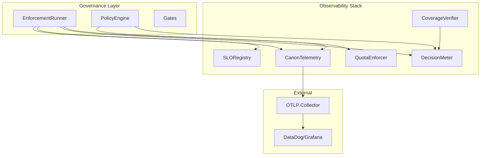
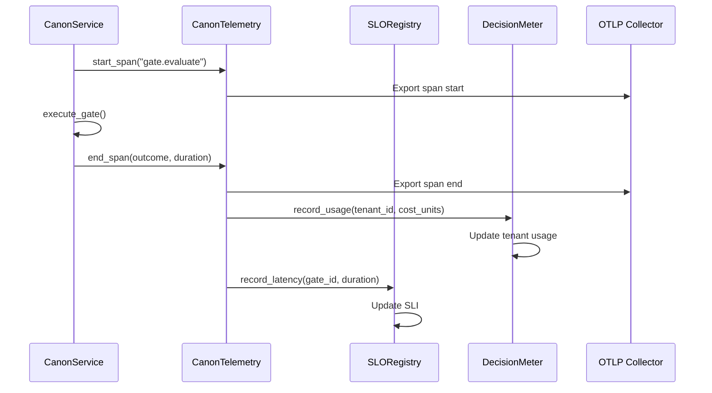

## 1. Overview

### 1.1 Purpose

The Observability Stack provides **enterprise-grade visibility** into CanonSys governance
operations. It fulfills three enterprise-ilities from the enterprise-ilities constraints:

- **Observability** (Section 7): Governance visible in standard APM tools
- **Performability** (Section 6): Declared latency budgets with SLO tracking
- **Frugality** (Section 9): Cost attribution and tenant quotas

### 1.2 Scope

This specification covers:

- **Telemetry Module**: OpenTelemetry spans and Prometheus-compatible metrics
- **SLO Registry**: Service Level Objectives for governance operations
- **Frugality System**: DecisionMeter for cost attribution, QuotaEnforcer for limits
- **Coverage Verification**: Vocabulary phrases for logging completeness

### 1.3 Design Principles

1. **Optional Dependencies**: OTEL libraries are optional; graceful degradation when absent
2. **Fail-Open for Metrics**: Metrics failures never block governance operations
3. **Structured Events**: Every decision emits structured telemetry
4. **Tenant Attribution**: All metrics tagged with tenant_id for multi-tenant visibility
5. **SLO-First**: Performance budgets declared upfront, tracked continuously

---

## 2. Architecture

### 2.1 Component Relationships



### 2.2 Module Structure

| Module                            | Purpose                               |
| --------------------------------- | ------------------------------------- |
| `utils/telemetry.py`              | CanonTelemetry, spans, metrics        |
| `utils/slo.py`                    | SLO, SLI, SLOBudget, SLORegistry      |
| `services/metering/__init__.py`   | Public API for metering/quotas        |
| `services/metering/actions/`      | DecisionMeter, QuotaEnforcer          |
| `services/metering/types/`        | UsageRecord, TenantUsage, QuotaConfig |
| `services/metering/exceptions.py` | QuotaExceededError                    |

### 2.3 Data Flow



---

## 3. Technical Specification

### 3.1 CanonTelemetry

**Purpose**: Fail-open telemetry wrapper for OTEL integration.

**Key Features**:

- Graceful degradation when OTEL not installed
- Fail-open: telemetry errors never block governance
- Structured labels for multi-dimensional analysis

```python
class CanonTelemetry:
    """Fail-open telemetry for governance operations."""

    def __init__(self, service_name: str = "canon"):
        self._tracer = self._get_tracer(service_name)
        self._meter = self._get_meter(service_name)
        self._metrics = self._setup_metrics()

    @contextmanager
    def span(self, name: str, attributes: dict | None = None):
        """Context manager for tracing spans."""
        if self._tracer:
            with self._tracer.start_as_current_span(name, attributes=attributes) as span:
                yield span
        else:
            yield None

    def record_gate_evaluation(
        self,
        gate_id: str,
        tenant_id: str,
        outcome: str,
        duration_ms: float,
    ) -> None:
        """Record gate evaluation metrics."""
        try:
            self._metrics["gate_evaluation_total"].add(
                1,
                {"gate_id": gate_id, "tenant_id": tenant_id, "outcome": outcome}
            )
            self._metrics["gate_evaluation_duration"].record(
                duration_ms / 1000,
                {"gate_id": gate_id, "tenant_id": tenant_id}
            )
        except Exception:
            logger.warning("Telemetry emission failed, continuing")
```

### 3.2 SLO Registry

**Purpose**: Define and track Service Level Objectives.

**Key Types**:

```python
@dataclass(frozen=True)
class SLO:
    """Service Level Objective definition."""
    name: str
    target: float           # e.g., 0.999 for 99.9%
    indicator: str          # "latency_p99" or "availability"
    threshold_ms: float     # For latency SLOs
    window_hours: int = 720 # 30-day rolling window

@dataclass
class SLOBudget:
    """Error budget state for an SLO."""
    slo: SLO
    remaining_budget: float
    burn_rate: float
    forecast_exhaustion: datetime | None
```

**Default SLOs**:

| SLO Name         | Target | Indicator    | Threshold | Window |
| ---------------- | ------ | ------------ | --------- | ------ |
| gate_latency     | 99.9%  | latency_p99  | 100ms     | 30d    |
| policy_latency   | 99.5%  | latency_p99  | 200ms     | 30d    |
| governance_avail | 99.99% | availability | N/A       | 30d    |

### 3.3 DecisionMeter

**Purpose**: Cost attribution by tenant and decision class.

```python
class DecisionMeter:
    """Tracks governance cost by tenant."""

    COST_UNITS = {
        "gate_hard": 1,
        "gate_situational": 2,
        "policy_opa": 5,
        "policy_remote": 10,
    }

    async def record_decision(
        self,
        tenant_id: UUID,
        decision_type: str,
        ctx: RequestContext,
        *,
        conn: Any | None = None,
    ) -> UsageRecord:
        """Record a governance decision and its cost."""
        cost = self.COST_UNITS.get(decision_type, 1)
        return await self._record(tenant_id, decision_type, cost, ctx, conn=conn)
```

### 3.4 QuotaEnforcer

**Purpose**: Enforce tenant governance quotas.

```python
@dataclass(frozen=True)
class QuotaConfig:
    """Tenant quota configuration."""
    tenant_id: UUID
    daily_limit: int           # Max decisions per day
    monthly_limit: int         # Max decisions per month
    cost_unit_limit: int       # Max cost units per month
    burst_limit: int           # Max decisions per minute
    enforcement: str = "soft"  # "soft" (warn) or "hard" (block)

class QuotaEnforcer:
    """Enforces tenant quotas with soft/hard enforcement."""

    async def check_quota(
        self,
        tenant_id: UUID,
        decision_type: str,
        ctx: RequestContext,
        *,
        conn: Any | None = None,
    ) -> QuotaCheckResult:
        """Check if operation is within quota."""
```

### 3.5 Coverage Verification Phrases

**Purpose**: Vocabulary phrases for logging completeness verification.

```python
# derive_logging_coverage: Compute coverage for a scope
async def derive_logging_coverage(
    scope: str,
    ctx: RequestContext,
    *,
    conn: Any | None = None,
) -> CoverageResult:
    """
    Derive logging coverage for a scope.

    Returns:
        CoverageResult with coverage_percent, logged_count, total_required
    """

# assess_coverage: Evaluate coverage against threshold
async def assess_coverage(
    scope: str,
    threshold: float,  # e.g., 0.95 for 95%
    ctx: RequestContext,
    *,
    conn: Any | None = None,
) -> AssessmentResult:
    """
    Assess if logging coverage meets threshold.

    Returns:
        AssessmentResult with passed: bool, coverage: float, threshold: float
    """
```

---

## 4. Metrics Reference

### 4.1 Counter Metrics

| Metric                      | Labels                        | Description              |
| --------------------------- | ----------------------------- | ------------------------ |
| `gate_evaluation_total`     | gate_id, tenant_id, outcome   | Gate evaluations count   |
| `policy_evaluation_total`   | policy_id, tenant_id, outcome | Policy evaluations count |
| `decision_cost_units_total` | tenant_id, decision_type      | Cost units consumed      |
| `quota_exceeded_total`      | tenant_id, quota_type         | Quota violations         |

### 4.2 Histogram Metrics

| Metric                               | Labels               | Buckets (ms)                          |
| ------------------------------------ | -------------------- | ------------------------------------- |
| `gate_evaluation_duration_seconds`   | gate_id, tenant_id   | 5, 10, 25, 50, 100, 250, 500, 1000    |
| `policy_evaluation_duration_seconds` | policy_id, tenant_id | 10, 25, 50, 100, 200, 500, 1000, 2000 |

### 4.3 Gauge Metrics

| Metric                 | Labels    | Description                     |
| ---------------------- | --------- | ------------------------------- |
| `slo_budget_remaining` | slo_name  | Remaining error budget (0-1)    |
| `slo_burn_rate`        | slo_name  | Current burn rate (1x = normal) |
| `tenant_quota_usage`   | tenant_id | Current quota usage percentage  |

---

## 5. Configuration

### 5.1 Environment Variables

| Variable                  | Type   | Default        | Description             |
| ------------------------- | ------ | -------------- | ----------------------- |
| `CANON_OTEL_ENABLED`      | bool   | true           | Enable OTEL telemetry   |
| `CANON_OTEL_ENDPOINT`     | string | localhost:4317 | OTLP collector endpoint |
| `CANON_OTEL_SERVICE_NAME` | string | canon          | Service name in traces  |
| `CANON_METRICS_PORT`      | int    | 9090           | Prometheus metrics port |
| `CANON_SLO_ENABLED`       | bool   | true           | Enable SLO tracking     |

---

## 6. Testing Strategy

### 6.1 Test Coverage

| Component          | Target |
| ------------------ | ------ |
| CanonTelemetry     | 100%   |
| SLORegistry        | 100%   |
| DecisionMeter      | 100%   |
| QuotaEnforcer      | 100%   |
| Coverage phrases   | 100%   |
| Fail-open behavior | 100%   |

---

## 7. Vocabulary Mapping

### Package

- **Package**: `controls`
- **Location**: `hub/foundation/packages/controls/`

### Phrases

| Phrase                    | Type   | Description                           |
| ------------------------- | ------ | ------------------------------------- |
| `derive_logging_coverage` | derive | Compute logging coverage for a scope  |
| `assess_coverage`         | assess | Evaluate coverage against a threshold |

### Control Surfaces

| Surface                | Description            | Key Integration                                 |
| ---------------------- | ---------------------- | ----------------------------------------------- |
| Disable Audit Logging  | Disable Audit Logging  | Coverage verification for compensating controls |
| Disable DLP            | Disable DLP            | Coverage derivation for security controls       |
| Remove from Monitoring | Remove from Monitoring | Coverage assessment for monitoring exemptions   |

---

## 8. References

- Implementation: `libs/canon/src/canon/utils/telemetry.py`
- Implementation: `libs/canon/src/canon/utils/slo.py`
- Implementation: `libs/canon/src/canon/services/metering/`
- ADR: ADR-028-observability
- OTEL: https://opentelemetry.io/docs/python/
- CONSTRAINTS-001: Enterprise-ilities framework
