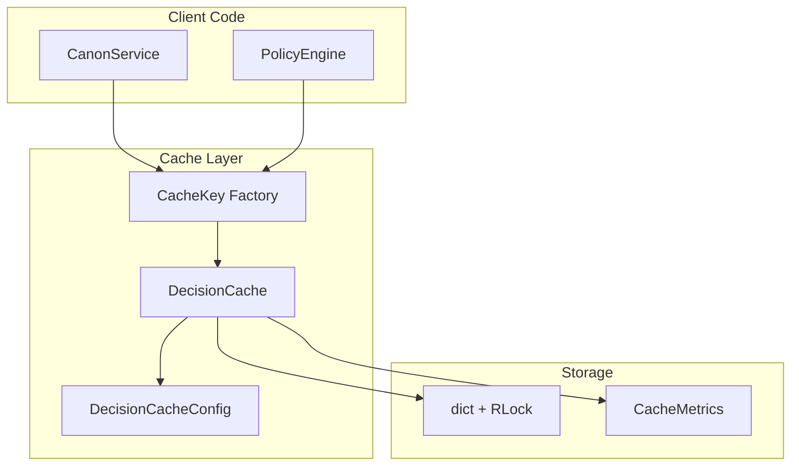
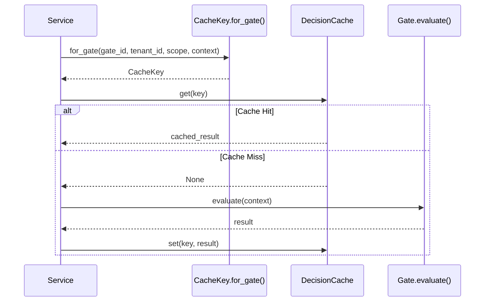

## 1. Overview

### 1.1 Purpose

This TDS specifies the decision-scope caching mechanism that enables CanonSys to satisfy the
Scalability enterprise-ility (CONSTRAINTS-001 Section 5). The cache amortizes governance evaluation
costs across scopes, time windows, and decision classes.

### 1.2 Scope

**In Scope**:

- Thread-safe TTL cache for gate and policy results
- Cache key generation with context hashing
- Invalidation strategies (TTL, prefix, tenant)
- Cache metrics and observability
- Configuration via environment variables

**Out of Scope**:

- Distributed caching (future work)
- Persistent cache across restarts

### 1.3 Terminology

| Term           | Definition                                                       |
| -------------- | ---------------------------------------------------------------- |
| Decision-scope | Logical boundary for caching (e.g., "adverse_action", "consent") |
| Cache key      | Composite identifier: kind + id + tenant + scope + context_hash  |
| TTL            | Time-to-live in seconds before automatic expiration              |
| Hit rate       | Ratio of cache hits to total lookups                             |
| Volatile field | Context fields excluded from hashing (timestamps, request_ids)   |

### 1.4 Design Goals

| Priority | Goal              | Rationale                                      |
| -------- | ----------------- | ---------------------------------------------- |
| P0       | Sub-millisecond   | Cache lookups must not add meaningful latency  |
| P0       | Tenant isolation  | Tenants cannot access each other's cached data |
| P1       | Bounded memory    | Cache cannot grow unbounded                    |
| P1       | Observable        | Hit rates and sizes must be measurable         |
| P2       | Configurable TTLs | Different freshness for gates vs policies      |

---

## 2. Architecture

### 2.1 Component Diagram



### 2.2 Module Structure

| Module           | Purpose                         |
| ---------------- | ------------------------------- |
| `utils/cache.py` | Complete caching implementation |

**Public API**:

- `CacheKey` - Immutable cache key with factory methods
- `CacheEntry` - Entry with value, expiration, hit count
- `DecisionCacheConfig` - Configuration dataclass
- `DecisionCache` - Thread-safe TTL cache
- `get_decision_cache()` - Singleton accessor
- `configure_decision_cache()` - Configuration entry point

---

## 3. Technical Specification

### 3.1 CacheKey

```python
@dataclass(frozen=True)
class CacheKey:
    """Immutable cache key for governance decisions."""

    kind: str           # "gate" or "policy"
    id: str             # gate_id or policy_id
    tenant_id: str      # Tenant isolation
    scope: str          # Decision scope (e.g., "adverse_action")
    context_hash: str   # SHA-256 hash of stable context fields

    @classmethod
    def for_gate(
        cls,
        gate_id: str,
        tenant_id: UUID,
        scope: str,
        context: dict[str, Any],
    ) -> CacheKey:
        """Create cache key for gate evaluation."""

    @classmethod
    def for_policy(
        cls,
        policy_id: str,
        tenant_id: UUID,
        scope: str,
        input_data: dict[str, Any],
    ) -> CacheKey:
        """Create cache key for policy evaluation."""
```

### 3.2 Context Hashing

```python
def _hash_context(context: dict[str, Any]) -> str:
    """Create deterministic hash of stable context fields.

    1. Exclude volatile fields (timestamp, request_id, correlation_id, etc.)
    2. Sort keys for determinism
    3. JSON serialize with sort_keys=True
    4. SHA-256 hash truncated to 16 chars
    """
    VOLATILE_KEYS = {"timestamp", "request_id", "correlation_id", "created_at", "updated_at"}

    stable_context = {
        k: v for k, v in sorted(context.items())
        if k not in VOLATILE_KEYS and v is not None
    }

    serialized = json.dumps(stable_context, sort_keys=True, default=str)
    return hashlib.sha256(serialized.encode()).hexdigest()[:16]
```

### 3.3 DecisionCache

```python
class DecisionCache:
    """Thread-safe TTL cache for governance decisions."""

    def __init__(self, config: DecisionCacheConfig):
        self._config = config
        self._entries: dict[CacheKey, CacheEntry] = {}
        self._lock = threading.RLock()

    def get(self, key: CacheKey) -> Any | None:
        """Get cached value. Returns None if missing or expired."""

    def set(
        self,
        key: CacheKey,
        value: Any,
        ttl: float | None = None,
    ) -> None:
        """Cache value with TTL. Uses gate_ttl or policy_ttl by default."""

    def invalidate(self, key: CacheKey) -> bool:
        """Remove specific entry. Returns True if found."""

    def invalidate_by_prefix(self, prefix: str) -> int:
        """Remove all entries with matching key prefix."""

    def invalidate_by_tenant(self, tenant_id: str) -> int:
        """Remove all entries for a tenant."""

    def cleanup_expired(self) -> int:
        """Remove expired entries. Returns count removed."""

    @property
    def metrics(self) -> CacheMetrics:
        """Get cache statistics."""
```

### 3.4 Configuration

```python
@dataclass
class DecisionCacheConfig:
    """Cache configuration."""

    max_size: int = 10_000      # Maximum entries
    gate_ttl: float = 60.0      # Gates: 60s TTL
    policy_ttl: float = 300.0   # Policies: 300s TTL
    default_ttl: float = 300.0  # Fallback TTL
    enabled: bool = True        # Kill switch
```

**Environment Variables**:

| Variable                 | Type  | Default | Description           |
| ------------------------ | ----- | ------- | --------------------- |
| `CANON_CACHE_ENABLED`    | bool  | true    | Enable/disable cache  |
| `CANON_CACHE_MAX_SIZE`   | int   | 10000   | Maximum entries       |
| `CANON_CACHE_GATE_TTL`   | float | 60.0    | Gate result TTL (s)   |
| `CANON_CACHE_POLICY_TTL` | float | 300.0   | Policy result TTL (s) |

---

## 4. Behavior

### 4.1 Cache Lookup Flow



### 4.2 Eviction Policy

When `max_size` is reached:

1. Sort entries by creation time
2. Remove oldest 10% of entries
3. Continue with set operation

### 4.3 Metrics

```python
@dataclass
class CacheMetrics:
    """Cache statistics."""

    size: int           # Current entry count
    hits: int           # Total cache hits
    misses: int         # Total cache misses
    evictions: int      # Total evictions
    hit_rate: float     # hits / (hits + misses)
    oldest_entry_age: float  # Age of oldest entry (seconds)
```

---

## 5. Usage Examples

### 5.1 Gate Caching

```python
from canon.utils.cache import get_decision_cache, CacheKey

cache = get_decision_cache()

# Check cache first
key = CacheKey.for_gate(
    gate_id="consent.check",
    tenant_id=context.tenant_id,
    scope="adverse_action",
    context=context.to_dict(),
)

if cached := cache.get(key):
    return cached  # Cache hit

# Evaluate fresh
result = await gate.evaluate(context)

# Cache for future requests
if gate.cacheable:
    cache.set(key, result)  # Uses gate_ttl (60s)

return result
```

### 5.2 Policy Caching

```python
key = CacheKey.for_policy(
    policy_id="nyc_fair_chance",
    tenant_id=context.tenant_id,
    scope="hiring_decision",
    input_data=policy_input,
)

if cached := cache.get(key):
    return cached

result = await policy_engine.evaluate(policy_id, policy_input)
cache.set(key, result)  # Uses policy_ttl (300s)
return result
```

### 5.3 Invalidation

```python
# Invalidate specific entry
cache.invalidate(key)

# Invalidate all gate results for a gate
cache.invalidate_by_prefix("gate:consent.check:")

# Invalidate all cache for a tenant (e.g., on break-glass)
cache.invalidate_by_tenant(str(tenant_id))
```

---

## 6. Testing Strategy

### 6.1 Test Coverage

| Component           | Target |
| ------------------- | ------ |
| CacheKey generation | 100%   |
| Context hashing     | 100%   |
| TTL expiration      | 100%   |
| Thread safety       | 100%   |
| Eviction            | 100%   |
| Invalidation        | 100%   |
| Metrics accuracy    | 100%   |

### 6.2 Performance Tests

| Scenario                | Target       |
| ----------------------- | ------------ |
| Cache hit latency       | < 1us        |
| Cache miss overhead     | < 10us       |
| 10k concurrent lookups  | < 10ms total |
| Eviction under pressure | No deadlock  |

---

## 7. Vocabulary Mapping

### Package

- **Package**: `core`
- **Location**: `hub/foundation/packages/core/`

### Integration Points

| Consumer          | Cache Key Factory     | Purpose                   |
| ----------------- | --------------------- | ------------------------- |
| CanonService      | `CacheKey.for_gate`   | Gate evaluation caching   |
| PolicyEngine      | `CacheKey.for_policy` | Policy evaluation caching |
| EnforcementRunner | Both                  | Governance checks         |

---

## 8. References

- Implementation: `libs/canon/src/canon/utils/cache.py`
- ADR: ADR-029-caching-mechanism
- CONSTRAINTS-001: Enterprise-ilities framework (Section 5 Scalability)
